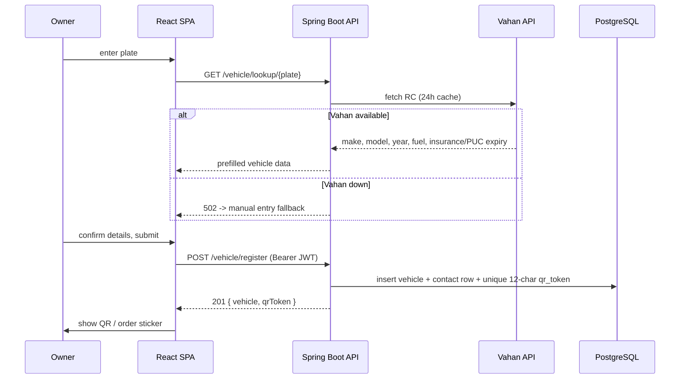
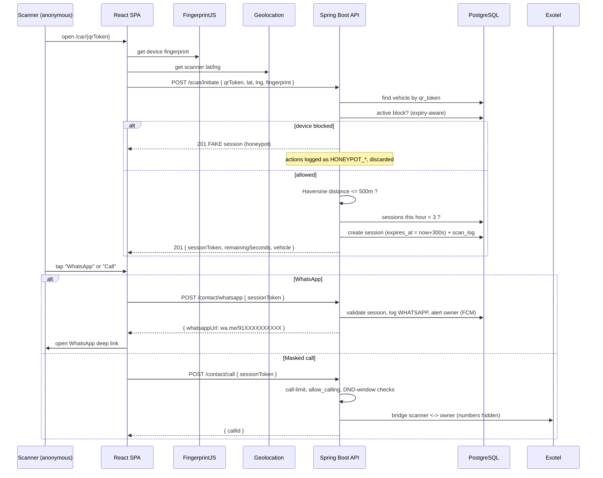
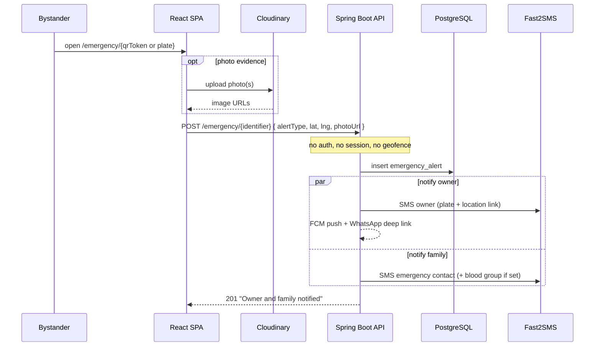
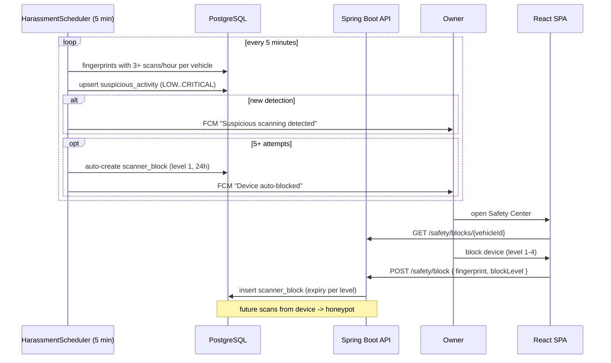
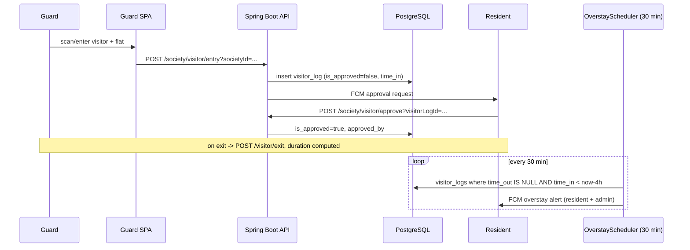

# CarTag — Key Flows

Sequence diagrams for the platform's most important paths. Actors: **SPA** (React client), **API** (Spring Boot), **DB** (PostgreSQL), and external services.

## 1. OTP Authentication

```mermaid
sequenceDiagram
    participant U as Owner
    participant SPA as React SPA
    participant API as Spring Boot API
    participant OTP as OtpService (in-memory)
    participant F2S as Fast2SMS
    participant DB as PostgreSQL

    U->>SPA: enter phone (^[6-9]\d{9}$)
    SPA->>API: POST /auth/send-otp
    API->>OTP: rate-check (<=3/hour), generate 6-digit
    OTP->>F2S: send SMS (OTP route)
    F2S-->>U: SMS code
    API-->>SPA: 200 (dev profile echoes code)
    U->>SPA: enter OTP
    SPA->>API: POST /auth/verify-otp
    API->>OTP: verifyOtp(phone, otp)
    API->>DB: upsert user (create if first login)
    API->>API: JwtUtil.generateToken(sub, phone, role)
    API-->>SPA: 200 { token, expiresIn, user.isNewUser }
    SPA->>SPA: store JWT; new user -> /register
```

**Walkthrough.** The phone is regex-validated client- and server-side. `OtpService` enforces 3 OTPs/phone/hour, generates a `SecureRandom` 6-digit code with a 10-minute TTL, and sends via Fast2SMS (the dev profile returns the code inline to ease testing). On verify, the user is upserted — first-time phones create an `OWNER` and the response's `isNewUser` flag drives redirect to registration. A stateless HMAC JWT (`sub`/`phone`/`role`) is returned. *Production hardening pending:* Redis-backed OTP store and per-OTP brute-force lockout.

## 2. Vehicle Registration with Vahan RC Auto-Fetch



**Walkthrough.** Registration starts with a public Vahan lookup that pre-fills make/model/year/fuel and document expiries, cached 24h. If Vahan fails the UI degrades to manual entry (502 with a friendly message) — the auto-fetch is a convenience, never a hard dependency. On submit, the API creates the `vehicle`, its paired `contacts` (privacy) row, and a unique 12-character `qr_token` that becomes the permanent public identifier. A duplicate plate returns 409.

## 3. Core Flow — QR Scan to Masked Contact



**Walkthrough.** This is the product. A scanner is anonymous — identity is a FingerprintJS hash plus a browser geolocation reading. `/scan/initiate` runs three gates in order: **block check** (a blocked fingerprint silently receives a convincing fake honeypot session that never persists), **geofence** (Haversine ≤ 500m from the vehicle's parked location, with a per-vehicle override), and **rate limit** (≤ 3 sessions/hour per fingerprint per vehicle). A valid scan yields a 5-minute session and an audit `scan_log`. Contact is always brokered: WhatsApp returns a `wa.me` deep link (number resolved server-side, owner FCM-alerted); calling bridges through Exotel so neither party sees the other's number, subject to a 1-call-per-session cap, the owner's `allow_calling` flag, and a DND time window. The owner's real phone number never crosses the wire.

## 4. Emergency / Hit-and-Run Report



**Walkthrough.** Emergencies deliberately bypass every gate — no auth, no active session, no proximity check — because the safety mission outweighs abuse-hardening here. The identifier can be the QR token *or* the plate. The alert is persisted to `emergency_alerts` and fans out on multiple channels: FCM + SMS + WhatsApp to the owner, and SMS to the registered emergency contact (including blood group when available, for medical response). The hit-and-run variant attaches Cloudinary-hosted photo evidence with location and timestamp for insurance claims. *Note:* FCM and server-side WhatsApp delivery are currently typed stubs pending Firebase Admin SDK / WhatsApp Business API wiring.

## 5. Safety Blocking & Harassment Auto-Detection



**Walkthrough.** Two layers cooperate. **Automatic:** the harassment scheduler mines the immutable `scan_logs` every 5 minutes, scoring repeat scanners into `suspicious_activity` (severity LOW→CRITICAL) and alerting the owner *only on new detections* (a deliberate de-dup fix); at 5+ attempts it auto-applies a 24-hour level-1 block. **Manual:** from the Safety Center an owner can block a fingerprint at level 1–4 (24h / 7d / 30d / permanent), with expiry enforced by expiry-aware queries so timed blocks lapse on their own. Either way, a blocked device is thereafter routed to the honeypot on every scan — it sees "success" and learns nothing.

## 6. Society Visitor Entry (Phase 2, optional)



**Walkthrough.** Phase 2 reuses the same identity/notification spine for gated communities. A guard logs a visitor against a flat; the resident receives an FCM approval prompt and confirms. Exit computes a duration and flags overstays. The overstay scheduler independently sweeps every 30 minutes for visitors inside longer than 4 hours and alerts both the resident and the society admin — the same "background job turns raw logs into proactive alerts" pattern used for harassment detection.
