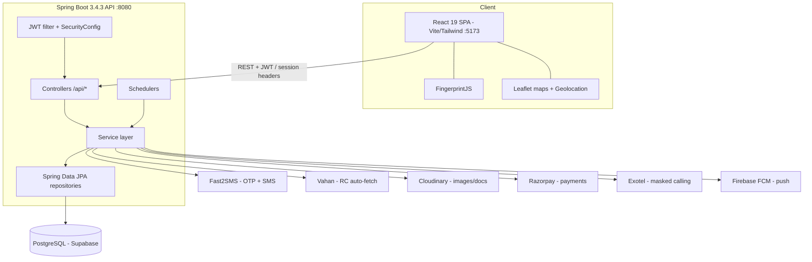

# CarTag — High-Level Design

## Context & Goals

CarTag is a consumer safety platform for Indian vehicle owners. The product problem: an owner often *needs* to be reachable at their parked car (blocking a driveway, lights left on, an accident) but must *not* broadcast their personal phone number on a public sticker. CarTag resolves this tension by making the QR sticker a stable public identifier and brokering every contact through the backend.

Design goals:

- **Privacy invariant** — the owner's phone number is never exposed to a scanner, on any code path.
- **Proximity + time bounded access** — a scan grants a short-lived, location-gated session, not standing access.
- **Abuse resistance** — fingerprinting, rate limiting, multi-level blocking, and a honeypot for known-bad devices.
- **Emergency override** — accident / hit-and-run reporting must always succeed, even with no session and no auth.
- **Extensibility** — the same identity + safety core powers Phase 2 society management and FasTag without a rewrite.

## Architecture Diagram

## Components & Responsibilities

| Layer | Package | Responsibility |
|-------|---------|----------------|
| Controllers | `in.cartag.controller` | 15 REST controllers (Auth, Vehicle, Scan, Contact, Emergency, Safety, Order, Document, FasTag, Dealer, Service, Society, Health…); request validation, DTO mapping, HTTP status. |
| Services | `in.cartag.service` | 21 services holding all business logic — ScanService (session engine), ContactService, EmergencyService, SafetyService, plus integration adapters (Otp/Sms, Vahan, Exotel, Cloudinary, Razorpay, Fcm). |
| Repositories | `in.cartag.repository` | 18 Spring Data JPA repositories with derived + JPQL queries (e.g. expiry-aware active-block lookups, hourly session counts). |
| Schedulers | `in.cartag.scheduler` | 4 `@Scheduled` background jobs: document reminders, FasTag balance, harassment detection, visitor overstay. |
| Security | `in.cartag.security` | `JwtUtil` (HMAC sign/verify) + `JwtFilter` (per-request bearer auth); `config.SecurityConfig` wires public vs. protected routes. |
| Model | `in.cartag.model.{entity,dto,enums}` | 18 JPA entities, request/response DTOs, enum-like status codes (persisted as CHECK-constrained strings). |
| Util | `in.cartag.util` | `GeoUtil` — stateless Haversine distance in meters over `BigDecimal` coordinates. |
| Config / Exception | `in.cartag.config`, `in.cartag.exception` | CORS + security config; a `GlobalExceptionHandler` mapping 9 typed exceptions to the stable error-code contract. |

## Data Stores

- **PostgreSQL (Supabase target)** — single relational store, 18 tables. All PKs are UUID (`gen_random_uuid()`), all timestamps `TIMESTAMPTZ` (UTC), all money in paise. Soft deletes via `is_active`. Extensive B-tree and *partial* indexing on boolean flags (`is_active`, `is_expired`, `owner_seen`) and hot composite lookups (`vehicle_id, device_fingerprint, created_at`). Schema is version-controlled through Flyway (`flyway-core` + `flyway-database-postgresql`), an 18-migration set plus a repeatable seed for message templates. An `updated_at` trigger is applied across mutable tables.
- **In-memory (process-local)** — OTP + OTP-rate state and the blocked-device honeypot session map live in `ConcurrentHashMap`s today. This is a deliberate MVP shortcut with a documented path to Redis (see blockers).
- **Cloudinary** — vehicle photos, hit-and-run evidence, and documents; images compressed on upload.

## External Integrations

| Service | Purpose | Notes |
|---------|---------|-------|
| Fast2SMS | OTP delivery + emergency/reminder SMS | OTP route; dev profile short-circuits delivery and returns the code for testing. |
| Vahan | RC auto-fetch on registration | `GET /api/vehicle/lookup/{plate}`; 24h cache; graceful fallback to manual entry on failure (502). |
| Exotel | Masked voice calling | Scanner → Exotel → owner; neither party sees the other's number. Guarded by call limit + DND window. |
| Cloudinary | Media storage/CDN | Photos, evidence, documents. |
| Razorpay | Sticker order payments | Server creates order, verifies HMAC-SHA256 payment signature on callback. |
| Firebase FCM | Owner push notifications | 9 typed notification methods; currently stubbed pending Admin SDK wiring. |

Secrets for all providers are injected via environment variables / Spring profiles — never committed.

## Cross-Cutting Concerns

- **Authentication** — stateless JWT. `JwtUtil` HMAC-signs tokens carrying `sub` (userId), `phone`, and `role`; expiry is config-driven (`cartag.jwt.expiration-ms`, ~30 days per the API contract). `JwtFilter` validates the bearer token on protected routes; scanner/emergency routes are intentionally public.
- **Geofencing** — `GeoUtil.distanceMeters()` implements the Haversine formula (Earth radius 6,371,000 m) over `BigDecimal` lat/lng. The 500m gate is the default; a per-vehicle `max_contact_distance` override wins when set. Null coordinates fail safe (treated as infinite distance).
- **Rate limiting** — layered: 3 OTPs/phone/hour, and 3 scan sessions/hour per device-fingerprint per vehicle, plus a 1-call-per-session cap on masked calling.
- **Device fingerprinting** — the client sends a FingerprintJS hash with every scan; it is the primary identity for rate limiting, blocking, and harassment detection (no login required for scanners).
- **Privacy / masked contact** — the public vehicle projection returns only safe fields and honors `show_owner_name`, `contact_mode`, `allow_calling`, and `safety_mode`. Contact numbers are resolved server-side and only ever leave the server as a `wa.me` deep link or an Exotel call SID.
- **Background schedulers** — (1) document reminders daily 09:00 IST at 30/15/7/1-day thresholds with idempotent sent-flags; (2) hourly FasTag balance check with auto-recharge; (3) harassment detection every 5 min; (4) visitor overstay every 30 min.
- **Auditability** — `scan_logs` is an append-only trail of every scan and contact action (including honeypot attempts recorded as `HONEYPOT_*`), which is also the raw feed for harassment analytics.

## Key Design Decisions & Trade-offs

- **Honeypot over hard rejection.** Blocked devices receive a normal-looking session that is never persisted; all their actions return 200 OK and are silently logged. This denies attackers the signal a `403` would give them, at the cost of some in-memory bookkeeping.
- **Fingerprint-as-identity for scanners.** Keeping the scanner flow anonymous removes login friction in the exact moment it matters (someone standing at a car), but fingerprints are spoofable — hence the *defense-in-depth* stack rather than reliance on any single control.
- **Stateless JWT, no server session store.** Simple and horizontally scalable, but logout/refresh are client-side only for now (documented as a future sprint).
- **In-memory OTP + honeypot.** Fast to build and correct on a single instance; explicitly flagged as blocking multi-instance production deploys, with Redis as the migration target.
- **Emergencies bypass all gates.** No auth, no geofence, no session required — correctness of the safety mission is prioritized over abuse-hardening on that specific path.
- **Single Postgres, aggressive indexing.** Chosen over premature service decomposition; partial and composite indexes keep the hot scan/session/log paths fast while the schema stays one deployable unit.

## Deployment & Operations

- **Backend → Railway.** Containerized (a `Dockerfile` plus `railway.toml` using the Nixpacks builder). Health is exposed at `/actuator/health`, wired as Railway's healthcheck path, with an on-failure restart policy (max 3 retries). Runs on port 8080 (`${PORT:8080}`), configuration split across `application-{dev,prod,test}.yml` Spring profiles so environment-specific behavior (e.g. dev's inline OTP echo) is profile-gated rather than branched in code.
- **Frontend → Vercel.** Static Vite build (`vercel.json`), talking to the API over HTTPS; Axios interceptors attach the JWT and centralize 401 handling while deliberately skipping redirect on public scanner/emergency routes.
- **Database → Supabase Postgres.** Schema evolves through Flyway migrations executed on startup; UUID keys and UTC `TIMESTAMPTZ` throughout keep the data portable across environments.
- **Secrets & config.** All provider credentials and the JWT secret are injected via environment variables per profile — none are committed to source control.

## Scalability Notes

The stateless-JWT API is horizontally scalable, and Postgres carries the relational load with targeted indexing on the hottest paths (scan sessions, logs, blocks). The two current obstacles to multi-instance scale-out are explicitly known and localized: the in-memory OTP store and the in-memory honeypot map both assume a single process, with Redis identified as the shared-state target. Media is offloaded to Cloudinary's CDN, keeping large binaries out of both the app tier and the database.
