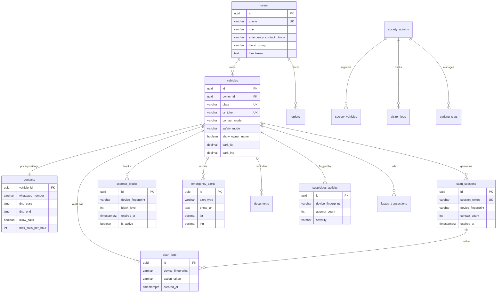

# CarTag — Low-Level Design

## Module / Package Breakdown

Root package `in.cartag` (Maven artifact `cartag-api`, Spring Boot 3.4.3, Java 17):

```
in.cartag
├── controller     # 15 REST controllers, thin — validate + delegate
├── service        # 21 services: domain logic + integration adapters
├── repository     # 18 Spring Data JPA repositories
├── model
│   ├── entity     # 18 JPA @Entity classes (Lombok @Data/@Builder)
│   ├── dto
│   │   ├── request   # validated inbound DTOs (jakarta.validation)
│   │   └── response  # ApiResponse<T> envelopes + projections
│   └── enums      # status/type constants (persisted as CHECK strings)
├── security       # JwtUtil (HMAC), JwtFilter (OncePerRequestFilter)
├── scheduler      # 4 @Scheduled background jobs
├── config         # SecurityConfig, CorsConfig
├── exception      # 9 typed exceptions + GlobalExceptionHandler
└── util           # GeoUtil (Haversine)
```

Every response is wrapped in a uniform envelope: `{ success, data, message?, error?, timestamp }`, with `error.code` drawn from a fixed catalogue so the frontend can branch on codes rather than strings.

## Key API Endpoints

Base path `/api`. Bearer = owner JWT; Public = no auth (scanner/emergency).

| Method | Path | Auth | Purpose |
|--------|------|------|---------|
| POST | `/auth/send-otp` | Public | Send OTP via Fast2SMS; 3/phone/hour |
| POST | `/auth/verify-otp` | Public | Verify OTP, upsert user, return JWT |
| GET | `/vehicle/lookup/{plate}` | Public | Vahan RC auto-fetch (24h cache) |
| POST | `/vehicle/register` | Bearer | Create vehicle + contact + 12-char QR token |
| GET | `/vehicle/my` | Bearer | List owner's vehicles |
| GET | `/vehicle/{plate}` | Public | Privacy-filtered public profile |
| PUT | `/vehicle/{id}/status` | Bearer | Update contact mode, safety mode, privacy, auto-reply |
| PUT | `/vehicle/{id}/park-location` | Bearer | Save parking GPS (geofence anchor) |
| POST | `/vehicle/{id}/regenerate-qr` | Bearer | Rotate QR token |
| POST | `/scan/initiate` | Public | Create scan session (block → geofence → rate-limit gates) |
| POST | `/scan/validate` | Public | Check session validity + remaining seconds |
| POST | `/scan/log` | Public | Append contact action to audit trail |
| POST | `/contact/whatsapp` | Session | Log + return `wa.me` deep link, alert owner |
| POST | `/contact/call` | Session | Exotel masked call (call limit + DND checks) |
| POST | `/emergency/{identifier}` | Public | SOS alert → owner + emergency contact |
| POST | `/emergency/hitandrun/{identifier}` | Public | Hit-and-run report with photo evidence |
| POST | `/safety/block` | Bearer | Block a device (level 1–4) |
| GET | `/safety/blocks/{vehicleId}` | Bearer | List active blocks |
| DELETE | `/safety/block/{id}` | Bearer | Unblock a device |
| POST | `/order/create` · `/order/verify` | Bearer | Razorpay order + signature verify |
| POST | `/society/register` · `/society/vehicle/add` | Bearer | Society admin + resident vehicles |
| POST | `/society/visitor/entry` · `/approve` · `/exit` | Bearer | Visitor lifecycle |
| POST | `/fastag/recharge` · GET `/fastag/balance/{id}` | Bearer | BBPS recharge + balance |
| GET | `/actuator/health` | Public | Liveness (Railway healthcheck) |

## Core Data Model

18 tables; the safety-critical core and its Phase-2 extensions:



Also present: `message_board`, `orders`, `fastag_transactions`, `service_records`, `society_vehicles`.

## Key Logic

- **500m geofence gate** — on `/scan/initiate`, if the vehicle has a parked location, `GeoUtil.distanceMeters(scannerLat, scannerLng, parkLat, parkLng)` must be ≤ the effective max distance (per-vehicle override, else the 500m default) or a `LocationNotAllowedException` (403) is thrown. Missing coordinates return `Double.MAX_VALUE`, failing closed.
- **5-minute session expiry** — a session stores `expires_at = now + 300s` (config `cartag.scan.session-ttl-seconds`). Validation checks both `now > expires_at` and an `is_expired` flag; expired sessions block all contact actions.
- **Multi-level blocking** — `scanner_blocks.block_level` 1→4 maps to 24h / 7d / 30d / permanent. Active-block lookup is expiry-aware JPQL (`is_active = true AND (expires_at IS NULL OR expires_at > now)`), so timed blocks self-expire without a cleanup job. A partial unique index prevents duplicate active blocks per (vehicle, fingerprint).
- **Honeypot + rate-limit** — a blocked device gets a *fake* session (random token, never persisted, held in an in-memory map) and a normal-looking response; its actions log as `HONEYPOT_*` and are discarded. Independently, more than 3 real sessions/hour per (fingerprint, vehicle) → `ScanRateLimitException` (429).
- **Harassment auto-detection** — the scheduler (every 5 min) scans `scan_logs` for fingerprints with 3+ scan initiations on a vehicle in the last hour, upserts a `suspicious_activity` row scored LOW→CRITICAL, and — only for *new* detections — pushes an owner alert (a fix for an earlier duplicate-alert bug). At 5+ attempts it auto-creates a level-1 (24h) block.
- **QR token generation** — registration mints a unique 12-character token (`qr_token`, uniquely indexed) that is the vehicle's permanent public handle; `regenerate-qr` rotates it and clears the cached QR image.

## Security Design

- **JWT** — `JwtUtil` builds tokens with jjwt 0.12.6, HMAC-signed via `Keys.hmacShaKeyFor(secret)`; claims are `sub`/`phone`/`role`, expiry config-driven (~30 days per contract). `JwtFilter` extracts and verifies the bearer token per request and populates the security context; invalid/expired tokens fall through to an anonymous context. `SecurityConfig` marks scanner, emergency, dealer, and health routes public.
- **OTP flow** — 6-digit code, 10-minute expiry, generated with `SecureRandom`, sent through Fast2SMS (OTP route). Dev profile returns the code inline for testing and skips real delivery. *Known gap:* no per-OTP attempt lockout yet, and the store is in-memory (both tracked as blockers).
- **Payment integrity** — Razorpay callbacks are verified server-side with an HMAC-SHA256 signature check before an order is marked PAID/CONFIRMED.
- **Least-exposure projections** — public DTOs never carry owner phone, engine/chassis numbers, or emergency-contact details.

## Notable Patterns

- **Layered architecture** with constructor injection (Lombok `@RequiredArgsConstructor`) — controllers stay thin, logic lives in services, persistence behind repositories.
- **Uniform API envelope + centralized error handling** — one `GlobalExceptionHandler` translates 9 domain exceptions into stable HTTP codes and `error.code` strings.
- **Adapter services** for every third party (Otp/Sms, Vahan, Exotel, Cloudinary, Razorpay, Fcm) so integrations are swappable and dev-mode-friendly.
- **Builder pattern** across entities and response DTOs for readable, immutable-ish construction.
- **Config-driven thresholds** (`@Value` for TTL, max distance, rate limits) — safety knobs tune without redeploying code changes.
- **Fail-closed defaults** — null coordinates, missing sessions, and unknown tokens all resolve to the safe/denied branch.
