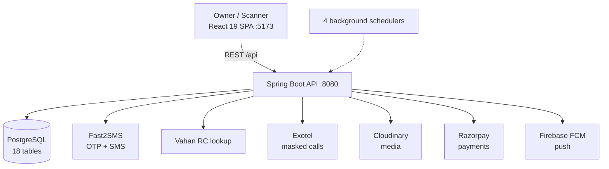

# CarTag

> A privacy-first vehicle QR sticker platform — let anyone reach a vehicle owner without ever exposing the owner's phone number.

## Overview

CarTag gives every vehicle a permanent physical QR sticker. When someone scans it, they can contact the owner (WhatsApp deep link or Exotel masked call) through controlled, time-limited access — the owner's real number is never revealed. Every contact path is safety-gated: the scanner must be physically near the vehicle, sessions self-destruct after five minutes, and abusive devices are silently trapped. Phase 2 extends the same identity + safety core into gated-community management (guards, visitors, parking) and FasTag toll recharge.

## Key Features

- **Anonymous owner contact** — WhatsApp deep links and Exotel masked calling; the scanner and owner never see each other's number.
- **500m geofence gate** — Haversine distance check blocks contact unless the scanner is near the parked vehicle.
- **Ephemeral scan sessions** — 5-minute TTL, max 3 sessions/hour per device per vehicle, enforced server-side.
- **Device fingerprinting + honeypot blocking** — FingerprintJS identities feed a 4-level blocking system; blocked devices receive a convincing *fake* session and are silently logged.
- **Emergency & hit-and-run reporting** — no-auth SOS path that fans out to owner + emergency contact over FCM, SMS, and WhatsApp with photo evidence.
- **Women-safety modes** — per-vehicle privacy modes up to STEALTH (vehicle reports as "not found" to scanners).
- **Automated safety intelligence** — a background scheduler detects harassment patterns and auto-blocks repeat offenders.
- **Owner utilities** — Vahan RC auto-fetch on registration, document-expiry reminders (Insurance/PUC), Razorpay sticker ordering, scan-activity dashboard.
- **Phase 2 — Society & FasTag** — visitor entry/exit, parking-slot maps, overstay detection, and BBPS FasTag recharge with auto-recharge.

## Tech Stack

| Layer | Technology |
|-------|-----------|
| Frontend | React 19, Vite 8, Tailwind CSS 4, React Router 7 |
| State / Data | TanStack Query 5, Zustand 5, react-hook-form 7 + Zod 4, Axios |
| Maps / Identity | Leaflet + react-leaflet, FingerprintJS 5 |
| Backend | Java 17, Spring Boot 3.4.3 (Web, Data JPA, Security, Validation, Actuator) |
| Auth | JWT (jjwt 0.12.6, HMAC-signed) |
| Database | PostgreSQL (Supabase target), Flyway migrations, HikariCP |
| QR / Media | ZXing 3.5.3, Cloudinary 1.38 |
| External APIs | Fast2SMS (OTP/SMS), Vahan (RC data), Exotel (masked calls), Razorpay (payments), FCM (push) |
| Deploy | Railway (backend, Docker/Nixpacks), Vercel (frontend) |

## Architecture at a Glance



## Status

**Built (Phase 1 + Phase 2 core):** OTP auth with JWT, vehicle registration with Vahan auto-fetch, QR scan-session engine (geofence + TTL + rate-limit + honeypot), WhatsApp/Exotel contact, emergency + hit-and-run reporting, 4-level blocking, harassment-detection scheduler, document reminders, Razorpay sticker orders, society admin/visitor/parking, FasTag recharge. Roughly 138 Java files: 15 controllers, 21 services, 18 repositories, 18 entities, 4 schedulers.

**Known open blockers (5):** tracked transparently in the repo — FCM push is a typed stub pending Firebase Admin SDK wiring; OTP store is in-memory (needs Redis/DB for multi-instance + restart durability); server-side WhatsApp notification uses deep links only (Business API pending); a frontend photo-upload wiring gap; and OTP verification lacks brute-force lockout. These are scoped, documented, and represent the production-hardening backlog rather than architectural gaps.

**Planned:** Phase 3 (trust score, carpool, DigiLocker, medical/emergency info) and Phase 4 (GPS/IoT tracking, fleet, WhatsApp Business API).

## Highlights

- **Privacy as a hard invariant** — no endpoint ever returns the owner's phone; contact is always brokered server-side through deep links or masked calling.
- **Defense-in-depth against abuse** — geofence + rate limit + fingerprint blocking + a honeypot that wastes an attacker's time instead of tipping them off, all backed by an immutable `scan_logs` audit trail.
- **Autonomous safety loop** — the harassment scheduler turns raw scan logs into severity-scored suspicious-activity records and auto-blocks, with de-duplicated owner alerts.
- **Clean layered Spring architecture** — controller → service → repository with typed DTOs, a global exception handler mapping to a stable error-code contract, and config-driven safety thresholds.

## Repository Layout

```
cartag/
├── backend/            # Spring Boot API (Java 17, Maven)
│   └── src/main/java/in/cartag/
│       ├── controller/ service/ repository/
│       ├── model/{entity,dto,enums}/
│       ├── security/ scheduler/ config/ exception/ util/
│   ├── Dockerfile · railway.toml       # Railway deploy
│   └── src/main/resources/             # profiles + Flyway migrations
├── frontend/           # React 19 + Vite SPA
│   └── src/{pages,components,services,context,utils}/
│       └── vercel.json                 # Vercel deploy
└── contracts/          # API + DB single-source-of-truth specs
```

The `contracts/` directory holds an API contract and DB schema that act as the shared source of truth between the backend and frontend, keeping endpoint shapes and error codes in lockstep across the stack.

## Deployment

- **Backend** — Railway, containerized (Dockerfile + Nixpacks), port 8080, healthcheck at `/actuator/health`, config via Spring profiles (`dev`/`prod`/`test`).
- **Frontend** — Vercel static build; Axios attaches the JWT and centralizes 401 handling while skipping public scanner routes.
- **Database** — Supabase PostgreSQL, schema managed by Flyway migrations run on startup.

## Docs

- [High-Level Design](./HLD.md) — context, architecture, components, cross-cutting concerns, deployment
- [Low-Level Design](./LLD.md) — packages, endpoints, data model (ER diagram), key algorithms
- [Flows](./FLOWS.md) — sequence diagrams for auth, registration, scan-to-contact, emergency, blocking, society
