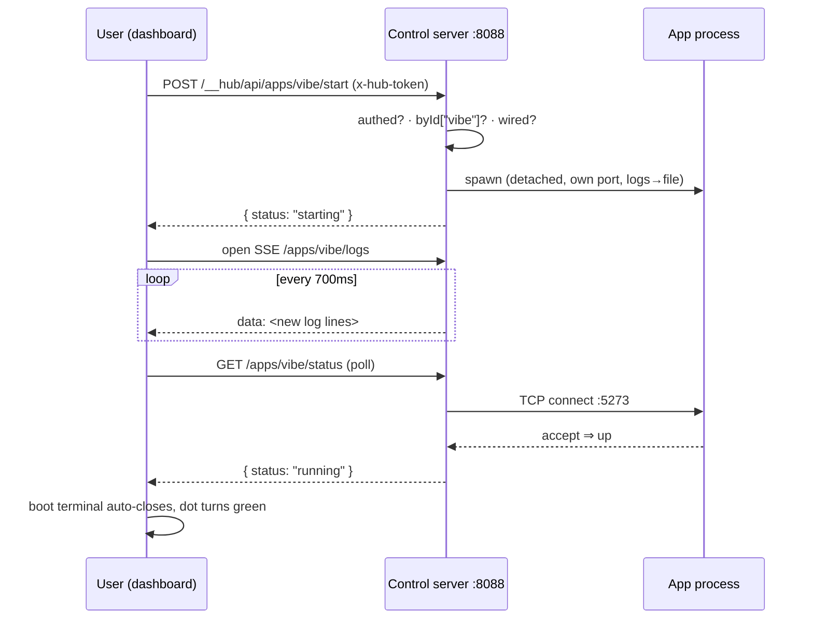
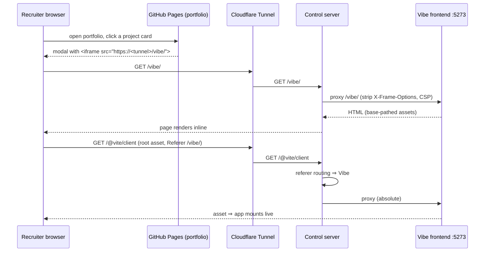
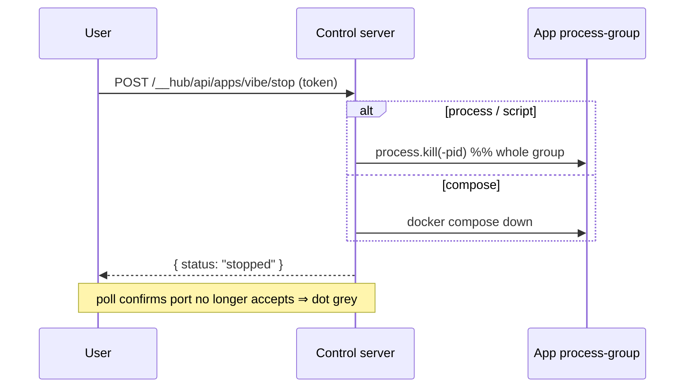
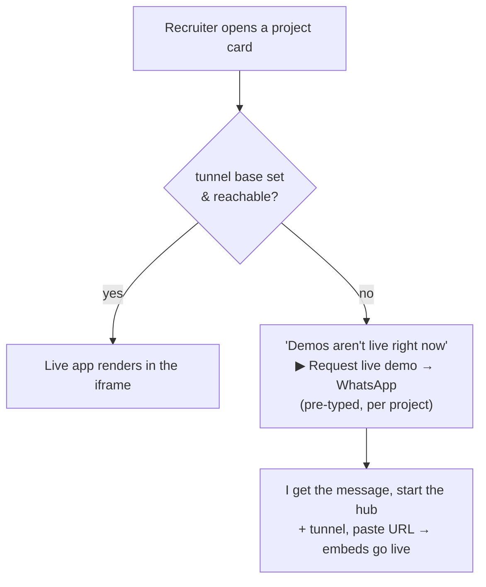

# Mission Control — Flows

## 1. Start an app from the dashboard



## 2. Live embed reaches a recruiter



## 3. Stop an app



## 4. Graceful fallback when nothing is running



## 5. Bringing the whole portfolio up for a demo

```bash
# 1. start the control server
cd hub && HUB_TOKEN="" node server.js         # :8088

# 2. expose it publicly (no interstitial)
cloudflared tunnel --url http://localhost:8088   # → https://<name>.trycloudflare.com

# 3. from the dashboard, toggle on the apps to demo
#    (each boots on its own port; watch the SSE terminal)

# 4. paste the tunnel URL into the portfolio's "connect live demo"
#    → every project card now embeds its running app
```
