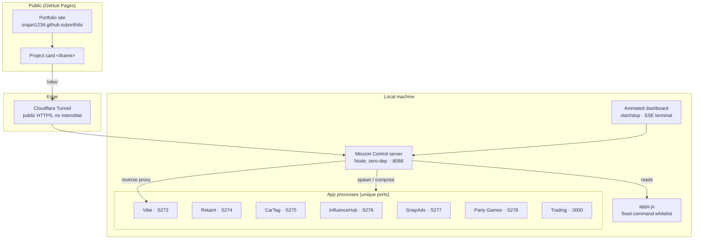

# Mission Control — High-Level Design

## Purpose

Run and demo an entire multi-stack project portfolio **from one machine, on demand**, and stream any app live into the public portfolio site — without paying for always-on cloud infrastructure.

## Architecture

## Components

### 1. Control server (`server.js`)
A single zero-dependency Node process on port **8088**. Responsibilities:
- Serve the dashboard (`public/index.html`).
- Expose a small JSON API: list apps, start, stop, status.
- Reverse-proxy `/{subpath}/*` to each running app's local port.
- Stream per-app logs over SSE.
- Enforce a token on all state-changing (start/stop) calls.

### 2. App registry (`apps.js`)
A static array — the **only** commands the server will ever run. Each entry declares:
`id, name, port, subpath, start command (process | script | compose), stripPrefix, boot time, metadata`.
The network can trigger *these* and nothing else.

### 3. Dashboard (`public/index.html`)
Animated "Mission Control" UI: a card per app with a start/stop toggle, a live status dot (stopped / starting / running), and a boot terminal that streams the app's logs until it's up.

### 4. Edge (Cloudflare Tunnel)
`cloudflared` publishes `localhost:8088` at a public HTTPS URL with **no interstitial page**, which is what makes iframe embedding work (ngrok's free interstitial sets a third-party cookie that iframes block).

## Key design decisions

| Decision | Why |
|---|---|
| **Zero dependencies** | Portable, auditable, nothing to install or break; core `http` is enough. |
| **Fixed command whitelist** | The server is reachable over a tunnel — it must never exec arbitrary input. |
| **Unique port per app** | All apps can run at once; status is a reliable port check. |
| **Reverse proxy + header strip** | One origin, clean subpaths, and apps become iframe-embeddable. |
| **Base-pathed frontends** | SPA absolute assets resolve correctly behind `/vibe`, `/retaint`, … |
| **Cloudflare over ngrok** | No interstitial → iframes load; stable enough for a live demo. |
| **Token-gated control** | Visitors can *view* demos but can't start/stop processes on my machine. |

## Non-goals
- Not a production orchestrator (no scaling, health-based restart, or multi-host).
- Not a general remote shell — only whitelisted commands.
- Not always-on — it runs while I demo, then stops.
