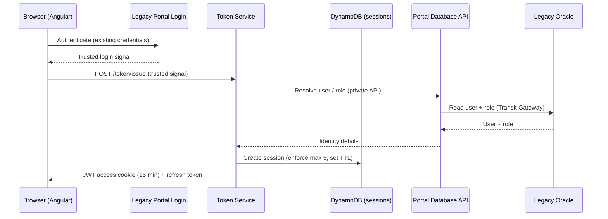
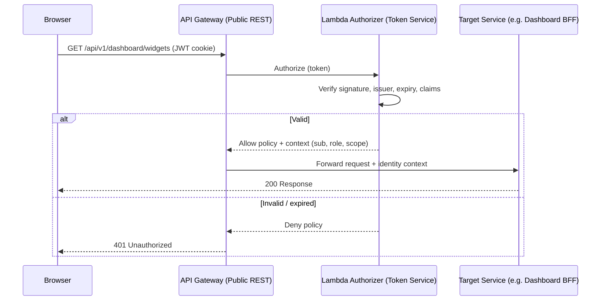
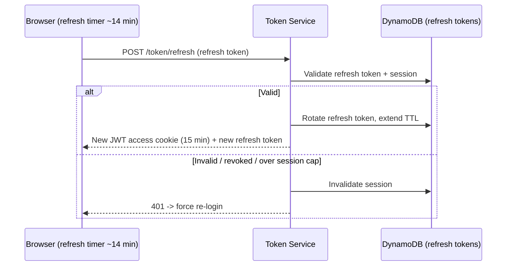
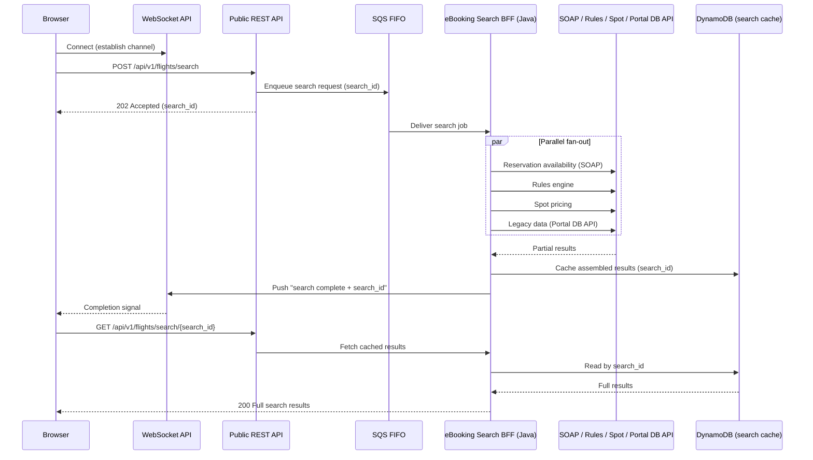
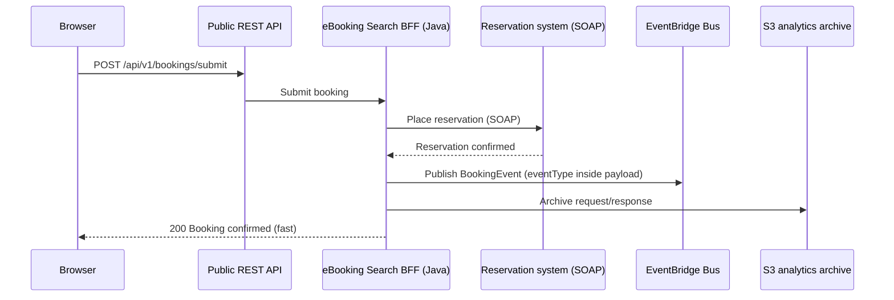
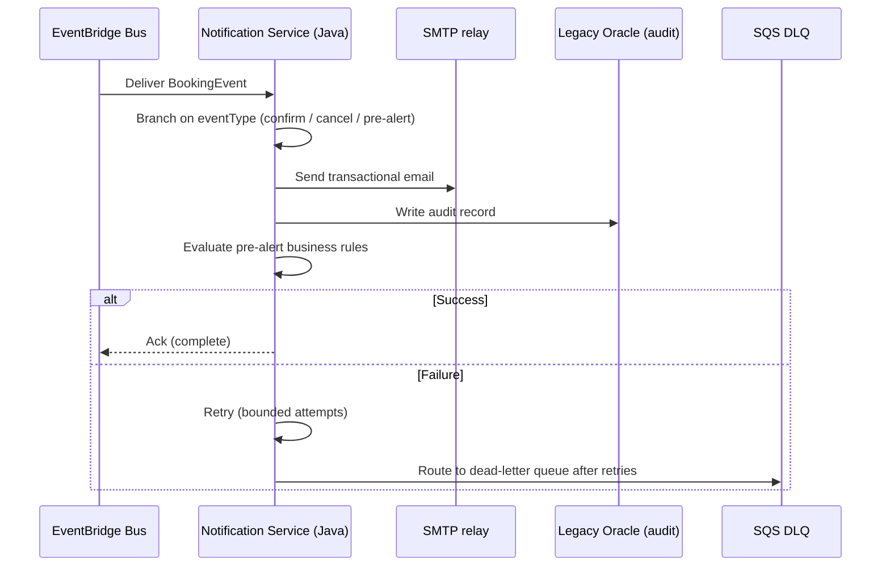

# Flows — IAG Cargo Portal

> **Sanitized architecture case study — internal identifiers, account IDs and schema omitted.**

Six representative end-to-end flows, each with a sequence diagram and short explanation.

---

## 1. SSO Bridge Login → JWT Issue

The user authenticates through the legacy portal login. Rather than continue with a container cookie session, the platform exchanges that trusted signal for a first-class JWT minted by the Token Service.

The Token Service resolves user and role from Oracle via the private abstraction service, creates a session in DynamoDB (evicting the oldest if the 5-session cap is exceeded), and returns a 15-minute access JWT plus a refresh token.

---

## 2. Per-Request Auth via Lambda Authorizer

Every protected request is authorized statelessly before it reaches a business Lambda.

The authorizer verifies the JWT independently and returns an **Allow** or **Deny** IAM policy. On Allow it passes an identity context (subject, role, scope) to the target service; on Deny the request is rejected at the gateway.

---

## 3. Token Refresh (~14 min)

The SPA refreshes silently before the 15-minute access token expires, keeping the session alive without a re-login.

Refresh **rotates** the refresh token and issues a fresh access JWT. If the refresh token is invalid, revoked, or the session is no longer valid, the user is forced back to login.

---

## 4. Asynchronous Flight Search

Flight search fans out to several slow backends and routinely exceeds the API Gateway ~29s HTTP timeout, so it runs out-of-band. A WebSocket carries only a small "complete + search_id" signal; the full result is fetched over REST from a DynamoDB cache.

The REST call returns immediately (202 + `search_id`) after enqueuing to SQS FIFO. The Search BFF fans out in parallel, assembles and caches results in DynamoDB, then signals completion over the WebSocket. The browser fetches the full payload via REST — no HTTP timeout, and the socket stays lightweight.

---

## 5. Booking Submit → EventBridge Event Publish

A booking submit responds as soon as the reservation is placed; all side effects are published as an event and handled asynchronously.

Once the reservation is confirmed, the Search BFF publishes a single `BookingEvent` (with the routing key inside the payload) to EventBridge and returns immediately. Confirmation email, audit and pre-alert evaluation happen downstream — the response never waits on them.

---

## 6. Event-Driven Notification with Retry → DLQ

The Notification Service consumes booking events and performs the deferred side effects, with automatic retry and a dead-letter queue for poison messages.

The consumer branches on the payload's `eventType`, sends the transactional email over SMTP, writes an audit record to Oracle, and evaluates pre-alert rules. Transient failures are retried a bounded number of times; anything still failing is routed to the SQS DLQ for inspection and replay, so no booking event is silently lost.
