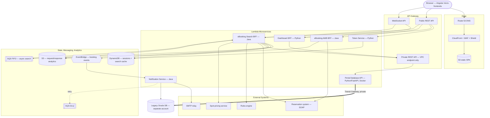

# High-Level Design — IAG Cargo Portal

> **Sanitized architecture case study — internal identifiers, account IDs and schema omitted.**

---

## Context & Goals

The legacy customer portal was a Java 8 monolithic WAR on WebLogic (Spring 3, ~41 JSP portlets) with direct Oracle 11g access. It was re-architected into a serverless AWS microservices platform with an Angular micro-frontend. The **Dashboard** and **eBooking** journeys were migrated first.

Design goals:

- **No data migration.** The new platform reads and writes the *same* legacy Oracle database, reached over cross-account **private** networking.
- **Independent deployability.** Each business capability is its own Lambda service and its own CloudFormation stack; each front-end journey is its own Module Federation remote.
- **Elastic, pay-per-use scaling** in place of a single vertically-scaled WebLogic node.
- **Beat the API Gateway ~29s HTTP timeout** for the long-running flight search that fans out to several slow external systems.
- **Decouple side effects** (email, audit, pre-alerts) from the request path so booking responses stay fast.
- **Security & governance by default** — WAF/Shield at the edge, JWT with an independently-verifying authorizer, private-only access to the data layer, and quality/security gates in CI.

---

## Architecture

The public REST API and WebSocket API face the browser (behind CloudFront/WAF). The private REST API is reachable only from inside the VPC via a VPC endpoint, and it fronts the single service allowed to touch Oracle — the **Portal Database API**. All other services obtain legacy data by calling that private API, never the database directly.

---

## Component Responsibilities

| Component | Language / Runtime | Trigger | Responsibility |
|---|---|---|---|
| **Token Service** | Python 3.12 | Public REST + Lambda Authorizer | Issues, refreshes and invalidates JWTs; verifies the JWT on every request; SSO bridge from legacy login; sessions & refresh tokens in DynamoDB. |
| **Dashboard BFF** | Python 3.12 | Public REST + WebSocket | Aggregates widget, booking-search, reference-data and search-result APIs for the dashboard; inbound WebSocket handler; token refresh. |
| **Portal Database API** | Python 3.12, FastAPI, Docker Lambda | Private REST (VPC only) | The **only** service that talks to legacy Oracle; ships the Oracle thick client; reached cross-account via Transit Gateway. |
| **eBooking AWB BFF** | Java 21 | Public REST | Air Waybill reservation lifecycle — get-next / lock / unlock — over SOAP to the reservation system. |
| **eBooking Search BFF** | Java 21 | SQS (search) + Public REST (booking) | Flight availability search and booking submit/cancel; fans out to SOAP/rules/spot/Portal DB API; caches in DynamoDB; publishes booking events; pushes progress over WebSocket. |
| **Notification Service** | Java 21 | EventBridge | Consumes booking events; sends transactional email (SMTP); writes audit to Oracle; evaluates pre-alert rules; retry then DLQ. |

---

## Data Stores

| Store | Purpose | Why |
|---|---|---|
| **DynamoDB** | Refresh tokens & active sessions (with TTL); flight-search result cache keyed by search id. | Millisecond, horizontally-scalable key/value access with native TTL — ideal for session state and short-lived search results; no server to manage. |
| **Legacy Oracle** (via Portal Database API) | System of record for users, bookings, agents and reference data; audit records. | No data migration mandate — the existing business data and integrations stay in Oracle; access is centralized behind one abstraction service. |
| **S3 (SPA)** | Hosts the compiled Angular micro-frontends. | Cheap, durable static hosting fronted by CloudFront; per-remote deploys with cache invalidation. |
| **S3 (analytics archive)** | Full request/response capture for the eBooking services. | Durable, queryable audit/debug trail for complex booking and search interactions, decoupled from the hot path. |

---

## Cross-Account Networking

The legacy Oracle database lives in a separate AWS account and remains on private networking — it is never exposed publicly. The serverless platform reaches it as follows (described conceptually; no CIDRs or addresses):

- The **Portal Database API** Lambda runs inside private subnets of the platform VPC.
- An **AWS Transit Gateway** attachment routes traffic from the platform account to the account/network hosting Oracle, entirely over private address space.
- Only the private subnets hosting the abstraction service have a route toward the database; nothing else in the platform can reach it.
- The **Private REST API Gateway** is exposed through a VPC endpoint, so even the API that fronts the database is unreachable from the public internet.

This gives a single, auditable choke point for all legacy data access, and lets the rest of the estate scale as pure serverless while honoring the "same database, no migration" constraint.

---

## Old vs New

| Concern | Legacy | Modernized |
|---|---|---|
| UI | JSP portlets on WebLogic | Angular micro-frontends on S3 + CloudFront |
| Backend | Monolithic Spring 3 WAR | ~15 independent Lambda services |
| Auth | Cookie sessions in the container | JWT + Lambda Authorizer + DynamoDB sessions |
| Flight search | Synchronous, in-process | Async SQS FIFO + DynamoDB + WebSocket |
| Email / side effects | In-process, on the request thread | Event-driven EventBridge + dedicated Lambda |
| Infrastructure | Manual / scripted | Terraform + SAM (infrastructure-as-code) |
| Scaling | Vertical (bigger node) | Horizontal auto-scaling (per-function) |
| Observability | App log files | CloudWatch structured logs + X-Ray tracing |
| Data | Direct Oracle 11g access | Same Oracle DB via a private abstraction service over Transit Gateway |

---

## Key Architectural Decisions & Trade-offs

1. **Keep the legacy Oracle DB; add an abstraction service.**
   *Rationale:* a full data migration was out of scope and high-risk. A single FastAPI service owns all Oracle access, so the schema can later evolve or migrate behind a stable internal contract.

2. **Docker-packaged Lambda for the data service.**
   *Rationale:* the Oracle thick client and its native libraries exceed the zip-based Lambda constraints and are awkward as a layer. A container image ships the client cleanly and reproducibly. *Trade-off:* slightly slower cold starts, mitigated with provisioned concurrency where needed.

3. **Cross-account access via Transit Gateway, not public endpoints or migration.**
   *Rationale:* private-only connectivity satisfies security requirements and avoids exposing the database. *Trade-off:* more network plumbing and account coordination than a simple public endpoint.

4. **BFF pattern per journey (Dashboard, eBooking).**
   *Rationale:* each front-end journey gets an API shaped exactly for its screens, aggregating multiple backends server-side and keeping the browser payloads lean.

5. **SSO bridge into an independently-verified JWT.**
   *Rationale:* users still authenticate via the legacy login, but every downstream request is authorized by a stateless Lambda Authorizer that verifies a JWT — decoupling request authorization from the legacy session and enabling a clean, testable trust boundary.

6. **Asynchronous flight search over SQS + DynamoDB + WebSocket.**
   *Rationale:* the search fans out to several slow systems and routinely exceeds the API Gateway ~29s HTTP timeout. The request is queued (SQS FIFO), processed out-of-band, cached in DynamoDB, and the client is signalled over WebSocket with a small "complete + search_id" message; the browser then fetches the full result via REST. *Trade-off:* more moving parts and eventual-consistency UX, offset by reliability and no timeouts.

7. **Event-driven notifications via EventBridge with retry + DLQ.**
   *Rationale:* email, audit writes and pre-alert evaluation must never block or fail a booking response. Booking events are published to EventBridge; the Notification Service consumes them asynchronously, with automatic retries and a dead-letter queue for poison messages.

8. **Dual-trigger Search BFF (SQS for search, API Gateway for booking).**
   *Rationale:* the same domain service handles both the async search workload and synchronous booking submit/cancel, sharing domain logic while matching each operation to the right invocation model.

9. **Provisioned concurrency on user-facing functions.**
   *Rationale:* cold starts on interactive APIs (auth, dashboard, booking) hurt perceived performance; provisioned concurrency keeps them warm. *Trade-off:* a baseline cost in exchange for predictable latency.

10. **Infrastructure-as-code split: SAM per service, Terraform for shared infra.**
    *Rationale:* SAM keeps each service's Lambda/API definition co-located and independently deployable, while Terraform owns cross-cutting, longer-lived infrastructure (VPC, Transit Gateway attachment, EventBridge, SQS, DynamoDB, S3, SSM, IAM OIDC). Separate AWS accounts per environment (Dev / UAT / Prod) plus a DR region isolate blast radius.
