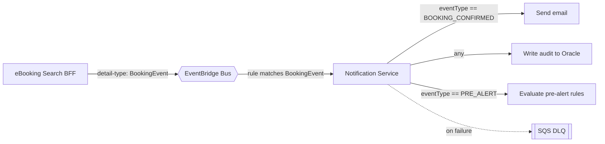

# Low-Level Design — IAG Cargo Portal

> **Sanitized architecture case study — internal identifiers, account IDs and schema omitted.**

---

## Service-by-Service Breakdown

### Token Service (Python 3.12)

- **Triggers:** Public REST API (issue / refresh / invalidate) and a Lambda Authorizer attached to protected APIs.
- **Role:** the identity boundary. Issues short-lived JWTs, rotates refresh tokens, invalidates sessions, and — as an authorizer — verifies the JWT on *every* protected request. Acts as the **SSO bridge**: it accepts a trusted signal from the legacy portal login and mints a first-class JWT for the new platform.
- **State:** DynamoDB holds refresh tokens and active sessions with TTL; a per-user cap of **max 5 active sessions**.
- **Downstream:** DynamoDB; the Portal Database API when it needs to resolve legacy user/role details.

### Dashboard BFF (Python 3.12)

- **Triggers:** Public REST API and WebSocket (inbound handler).
- **Role:** back-end-for-frontend for the dashboard journey — aggregates widget data, booking search, reference data and search-result lookups into screen-shaped responses; also performs token refresh on behalf of the dashboard.
- **Downstream:** Portal Database API (via the private API) for all legacy data.

### Portal Database API (Python 3.12, FastAPI, Docker-based Lambda)

- **Trigger:** Private REST API only (VPC endpoint).
- **Role:** the sole gateway to the legacy Oracle database, exposing a clean internal REST contract over legacy Oracle tables for users, bookings, agents and reference data. Ships the **Oracle thick client** inside a container image.
- **Downstream:** legacy Oracle, reached cross-account over **Transit Gateway** from private subnets.

### eBooking AWB BFF (Java 21)

- **Trigger:** Public REST API.
- **Role:** manages the Air Waybill (AWB) reservation lifecycle — **get-next**, **lock**, **unlock** — coordinating with the reservation system over **SOAP**.
- **Downstream:** reservation system (SOAP); S3 analytics archive.

### eBooking Search BFF (Java 21) — largest & most complex

- **Triggers:** **dual** — SQS (asynchronous flight search) and Public REST API (booking submit/cancel).
- **Role:** runs the flight availability search by **fanning out in parallel** to the reservation system (SOAP), the rules engine, the spot-pricing service and the Portal Database API; **caches** assembled results in DynamoDB; **publishes** booking events to EventBridge; **pushes** progress and completion to the client over WebSocket.
- **Downstream:** SOAP reservation system, rules engine, spot-pricing service, Portal Database API, DynamoDB, EventBridge, WebSocket callback API, S3 analytics archive.

### Notification Service (Java 21)

- **Trigger:** EventBridge (booking events).
- **Role:** consumes booking events and performs the side effects that must not block a booking response — sends transactional email over **SMTP**, writes **audit** records to Oracle, and evaluates **pre-alert** business rules.
- **Resilience:** failures are retried, then routed to an **SQS dead-letter queue** for inspection/replay.
- **Downstream:** SMTP relay; legacy Oracle (audit, via the abstraction service).

---

## Representative API Surface

Clean, illustrative paths (internal routing and versions generalized):

| Method | Path | Service | Purpose |
|---|---|---|---|
| POST | `/token/issue` | Token Service | Mint a JWT from a trusted legacy-login signal (SSO bridge). |
| POST | `/token/refresh` | Token Service | Rotate the refresh token and issue a new access token. |
| POST | `/token/invalidate` | Token Service | Revoke a session / logout. |
| (authorizer) | — | Token Service | Verify JWT on every protected request; return Allow/Deny policy. |
| GET | `/api/v1/dashboard/widgets` | Dashboard BFF | Aggregated dashboard widget data. |
| GET | `/api/v1/bookings/search` | Dashboard BFF | Search existing bookings. |
| GET | `/api/v1/reference-data/{type}` | Dashboard BFF | Reference/lookup data. |
| POST | `/api/v1/awb/next` | eBooking AWB BFF | Get next available Air Waybill number. |
| POST | `/api/v1/awb/lock` | eBooking AWB BFF | Lock an AWB for a reservation. |
| POST | `/api/v1/awb/unlock` | eBooking AWB BFF | Release a locked AWB. |
| POST | `/api/v1/flights/search` | eBooking Search BFF | Enqueue an asynchronous flight availability search. |
| GET | `/api/v1/flights/search/{search_id}` | eBooking Search BFF | Fetch cached full search results by id. |
| POST | `/api/v1/bookings/submit` | eBooking Search BFF | Submit a booking. |
| POST | `/api/v1/bookings/cancel` | eBooking Search BFF | Cancel a booking. |
| WS | `search` (route) | Dashboard / Search BFF | Client receives `search complete + search_id` progress signals. |
| — (internal) | `/internal/v1/bookings/{id}` | Portal Database API | Private-only legacy data access (VPC endpoint). |

---

## JWT / Session Design

**Access token:** short-lived JWT (15-minute expiry), carried as a cookie. Claims (conceptual):

| Claim | Meaning |
|---|---|
| `sub` (subject) | The authenticated user/agent identity. |
| `sid` (session) | Session identifier, tying the token to a DynamoDB session record. |
| `iss` (issuer) | The Token Service, so verifiers can trust provenance. |
| `exp` (expiry) | 15-minute lifetime. |
| `role` | Coarse-grained role for authorization. |
| `scope` | Fine-grained permissions for specific operations. |

**Refresh:** refresh tokens live in DynamoDB with a TTL; the client silently refreshes roughly every ~14 minutes (before the 15-minute access token expires). Refresh **rotates** the token. A per-user cap of **5 active sessions** is enforced; the oldest is evicted beyond the cap.

**Lambda Authorizer:** on every protected request, the authorizer verifies the JWT signature and claims and returns an IAM policy of **Allow** or **Deny**, plus a `context` object carrying identity/role/scope downstream to the target Lambda. Because verification is stateless and independent, request authorization does not depend on the legacy session.

---

## EventBridge Event Model

Booking side effects flow through a single, simple event contract:

- **One `detail-type`** for booking events (e.g. `BookingEvent`) on the platform event bus.
- The **routing key lives inside the event payload** (`detail.eventType`, e.g. `BOOKING_CONFIRMED`, `BOOKING_CANCELLED`, `PRE_ALERT`) — the **consumer** decides how to branch on it rather than fanning the taxonomy across many rule/type names.
- The payload carries the booking identifiers and the minimal context the consumer needs (booking reference, agent, timestamps, correlation id).
- This keeps EventBridge rules stable while letting the Notification Service evolve its handling (email vs audit vs pre-alert) independently. Retries are automatic; exhausted messages go to the SQS DLQ.

---

## Observability Model

| Signal | Mechanism |
|---|---|
| Logs (Python) | Structured JSON via AWS Lambda Powertools. |
| Logs (Java) | Log4j / Logback structured logging. |
| Distributed tracing | AWS X-Ray across API Gateway → Lambda → downstream calls, with correlation ids. |
| Request/response analytics | Full capture archived to S3 for the eBooking services. |
| Operational state | DynamoDB for search cache + sessions; Oracle for business audit. |
| Metrics/alarms | CloudWatch metrics and alarms per function. |

---

## Notable Patterns

- **BFF per journey** — screen-shaped APIs, aggregation server-side.
- **SSO bridge** — legacy login exchanged for an independently-verified JWT.
- **Async-over-WebSocket** — small "complete + id" signal on the socket, full payload over REST, decoupled by SQS FIFO + DynamoDB.
- **Event-driven side effects** — EventBridge + dedicated consumer + auto-retry + DLQ.
- **Single data choke point** — one Dockerized, private-only Oracle abstraction service.
- **Dual-trigger service** — one domain service, two invocation models (SQS + REST).
- **Provisioned concurrency** — warm user-facing functions.
- **IaC split** — SAM per service, Terraform for shared infrastructure.
