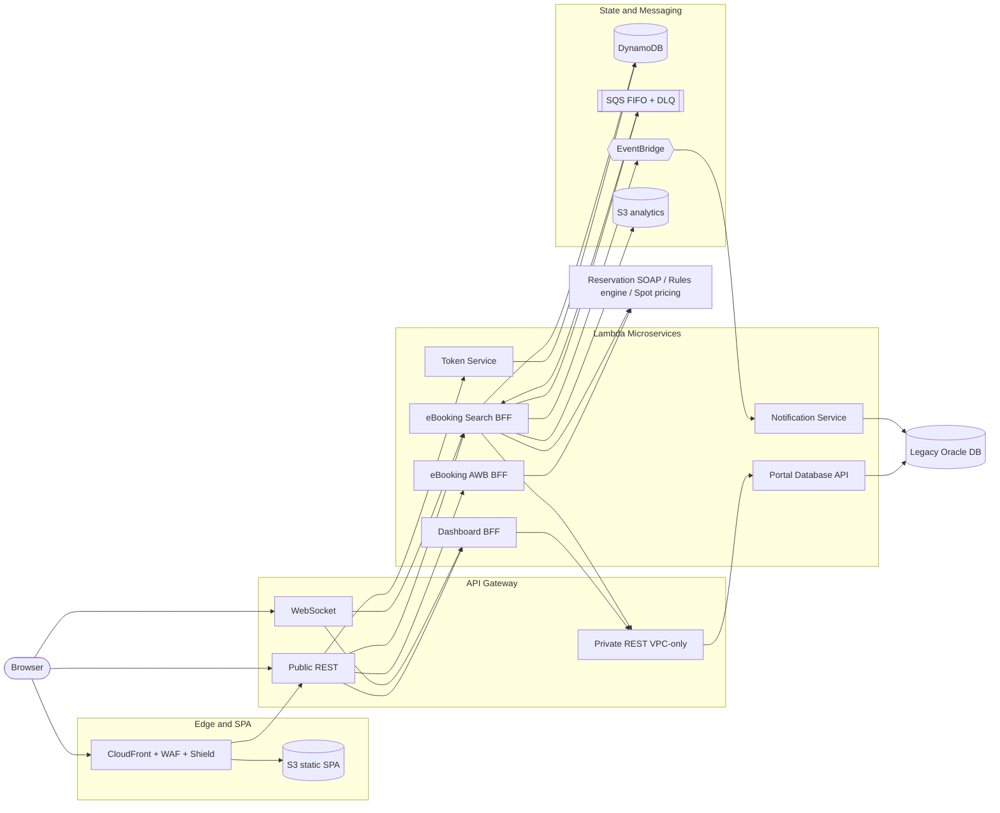

# IAG Cargo Portal — Legacy-to-Serverless Modernization

> Re-architecting a Java monolith customer portal into a serverless AWS microservices platform with an Angular micro-frontend — without migrating a single row of the legacy database.

> **Sanitized architecture case study — internal identifiers, account IDs and schema omitted.**

---

## Context

The starting point was a classic enterprise monolith: a Java 8 WAR running on WebLogic, built on Spring 3, rendering roughly 41 JSP portlets, and talking directly to an Oracle 11g database. It worked, but it was expensive to change, slow to scale (vertical only), risky to deploy as a single unit, and increasingly hard to staff.

The modernization goal was to move to a serverless, horizontally-scaling, independently-deployable microservices platform on AWS, fronted by an Angular micro-frontend — while continuing to read and write the **same legacy Oracle database**. There was no data migration: the new platform reaches the existing database over cross-account **private** networking (AWS Transit Gateway) through a single abstraction service. The **Dashboard** and **eBooking** journeys were migrated first as the proving ground for the pattern.

---

## Role

**Kumar Srajan — Senior Software Engineer @ Coforge (client: IAG Cargo).**

Architected and built the backend microservices for booking, tracking and pricing — including the JWT/SSO token layer, the back-end-for-frontend aggregation services, the Oracle abstraction service, and the asynchronous flight-search and event-driven notification pipelines — with full JUnit / unit-test coverage and the supporting CI/CD and infrastructure-as-code.

---

## Highlights

- **~15 AWS Lambda microservices** (Python 3.12 + Java 21) behind a public REST, a private REST, and a WebSocket API Gateway.
- **SSO bridge** from the legacy portal login into an independently-verified JWT world, with a Lambda Authorizer validating every request.
- **Asynchronous flight search** that fans out to several slow backends and beats the API Gateway ~29s HTTP timeout using SQS FIFO + DynamoDB + WebSocket signalling.
- **Event-driven notifications** via EventBridge — a booking response never waits on email or audit writes; failures auto-retry then land in a dead-letter queue.
- **Zero data migration** — the legacy Oracle DB is reached cross-account over Transit Gateway through a single Dockerized abstraction service shipping the Oracle thick client.
- **Angular micro-frontends** via Nx + Module Federation — a host shell plus independently deployable `dashboard` and `ebooking` remotes.
- **Full IaC & CI/CD** — AWS SAM per service, Terraform for shared infrastructure, GitHub Actions with SonarCloud and Snyk gates, separate accounts per environment plus a DR region.

---

## High-Level Architecture

---

## Tech Stack

| Layer | Technology |
|---|---|
| Frontend | Angular 21, TypeScript, Nx monorepo, Module Federation, PrimeNG |
| Frontend hosting | S3 static SPA, CloudFront, AWS WAF + Shield, Route 53 |
| Compute | AWS Lambda (Python 3.12, Java 21), Docker-based Lambda for the Oracle client |
| API | API Gateway — public REST, private REST (VPC endpoint), WebSocket |
| Auth | JWT (cookie), Lambda Authorizer, DynamoDB-backed sessions/refresh tokens |
| State & messaging | DynamoDB, SQS FIFO + DLQ, EventBridge, S3 |
| Legacy data | Oracle (via a private abstraction service, FastAPI + Oracle thick client) |
| External systems | Reservation system (SOAP), rules engine, spot-pricing service |
| Networking | VPC, private subnets, AWS Transit Gateway (cross-account) |
| Observability | CloudWatch (structured JSON via Powertools; Log4j/Logback), X-Ray, S3 analytics archive |
| CI/CD & IaC | GitHub Actions, AWS SAM, Terraform, SonarCloud, Snyk |

---

## Documentation

- [High-Level Design (HLD.md)](./HLD.md) — architecture, data stores, networking, old-vs-new, key decisions.
- [Low-Level Design (LLD.md)](./LLD.md) — service-by-service breakdown, API surface, JWT/session design, event model.
- [Flows (FLOWS.md)](./FLOWS.md) — sequence diagrams for login, auth, refresh, async search, booking and notifications.
