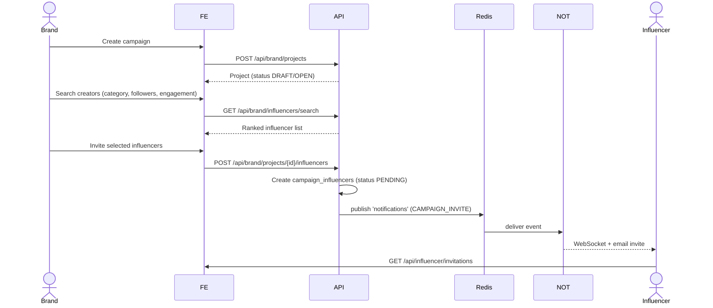
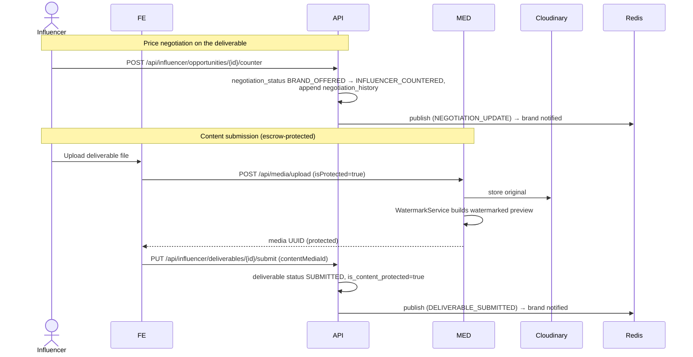
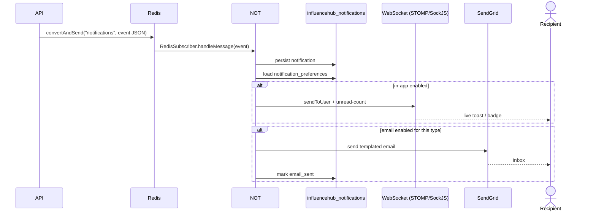

# InfluenceHub — Key Flows

Sequence diagrams and walkthroughs for the platform's core journeys. Participants are
abbreviated: **FE** (React SPA), **API** (Main API :8080), **MED** (Media Service :8081),
**NOT** (Notification Service :8082), **Redis**, **Cloudinary**, **SendGrid**.

## 1. Register & Login (JWT)

```mermaid
sequenceDiagram
    actor User
    participant FE
    participant API
    participant DB as influencehub_db
    User->>FE: Fill signup (brand / influencer)
    FE->>API: POST /api/auth/signup
    API->>DB: Insert user (BCrypt password) + profile
    API-->>FE: 201 Created
    User->>FE: Login
    FE->>API: POST /api/auth/login
    API->>DB: Load user, verify BCrypt hash
    API-->>FE: 200 + signed JWT (role, TTL)
    FE->>FE: Store token; attach as Bearer on every call
    FE->>API: GET /api/user/me (Bearer)
    API->>API: JwtAuthenticationFilter validates, builds UserPrincipal
    API-->>FE: Current user + role
```

**Walkthrough.** Signup creates a `users` row (password BCrypt-hashed) plus the matching
brand or influencer profile. Login verifies the hash and returns a stateless JWT signed
with the shared secret. The SPA stores it and sends it as a Bearer token; every service
validates the token independently via its `JwtAuthenticationFilter`, so there is no
session lookup. Role claims drive which routes (brand, influencer, admin) are authorized.

## 2. Campaign Creation + Influencer Discovery & Invitation



**Walkthrough.** The brand creates a `projects` row, then searches influencers filtered by
category, follower count and engagement rate. Inviting one or more creators inserts
`campaign_influencers` rows (a campaign can hold many influencers), each starting in
`PENDING`. An invite event is published to Redis and fanned out by the Notification
Service to the influencer's live feed and inbox.

## 3. Deliverable Negotiation + Watermarked Media Submission



**Walkthrough.** Pricing is agreed through counter-offers tracked on the deliverable and
in `negotiation_history`. When the influencer uploads content, the Media Service stores
the original in Cloudinary and generates a **watermarked preview**; the returned media
UUID is attached to the deliverable via `submit`. The deliverable is marked `SUBMITTED`
with `is_content_protected = true`, so the brand can review only the watermarked version.

## 4. Escrow Payment → Original Media Unlock + Invoice

```mermaid
sequenceDiagram
    actor Brand
    participant FE
    participant API
    participant MED
    participant Redis
    participant NOT
    Brand->>FE: Review watermarked deliverable
    FE->>API: PUT /api/brand/deliverables/{id}/approve
    API->>API: deliverable status APPROVED
    Brand->>FE: Pay influencer (escrow)
    FE->>API: POST /api/payments/process
    API->>API: Guard: all deliverables APPROVED
    API->>API: Compute base + platform fee + GST; status COMPLETED
    API->>API: InvoiceService.generateInvoice (INV-...)
    API->>MED: MediaServiceClient.generateDownloadToken(mediaId, ORIGINAL)
    MED-->>API: single-use, expiring token
    API->>API: deliverable is_content_protected=false, content_released_at=now
    API->>Redis: publish (PAYMENT_RECEIVED)
    Redis->>NOT: fan-out to influencer (WebSocket + email)
    API-->>FE: Payment + invoice; original now downloadable
```

**Walkthrough.** Payment is gated: `POST /api/payments/process` proceeds only when the
campaign's deliverables are `APPROVED`. On settlement the API records the payment with a
platform-fee and GST breakdown, generates a GST invoice, and unlocks the asset — flipping
`is_content_protected` off, stamping `content_released_at`, and minting an **ORIGINAL**
download token (short-lived, single-use) through the Media Service. The influencer is
notified of the payment; the brand can now download the un-watermarked original.

## 5. Real-time + Email Notification Fan-out



**Walkthrough.** Any domain event (invite, negotiation, submission, approval, payment,
dispute) is published once to the Redis `notifications` channel. The Notification Service
consumes it, persists a `notifications` row, then consults `notification_preferences` to
decide delivery: an in-app WebSocket push (with an unread-count update) and/or a SendGrid
email. Producers stay oblivious to *how* the message is delivered — a clean single-event,
multi-channel fan-out.

## 6. Admin Verification & Dispute Resolution

```mermaid
sequenceDiagram
    actor Admin
    participant FE
    participant API
    participant DB as influencehub_db
    participant Redis
    Admin->>FE: Login to admin console
    FE->>API: POST /api/admin (auth) → admin JWT
    Admin->>FE: Review pending verifications
    FE->>API: GET /api/admin/users
    Admin->>FE: Approve / reject with notes
    FE->>API: verify user
    API->>DB: profile.verified=true; write admin_audit_logs (IP, UA)
    API->>Redis: publish (ACCOUNT_UPDATE) → user notified
    Note over Admin,API: Dispute handling
    Admin->>FE: Open dispute (evidence + comments)
    FE->>API: GET /api/admin/disputes
    Admin->>FE: Resolve / escalate
    API->>DB: dispute status RESOLVED/ESCALATED; audit log
    API->>Redis: publish (DISPUTE_UPDATE) → parties notified
```

**Walkthrough.** Admins authenticate into a separate console and work through pending
brand/influencer verifications, flipping the profile `verified` flag. Every admin action
writes an `admin_audit_logs` entry (action, entity, IP, user-agent) for accountability.
Disputes carry a type, priority and status lifecycle
(`OPEN → IN_REVIEW → ESCALATED → RESOLVED/CLOSED`) with attached evidence and threaded
comments; status changes notify the involved parties through the same Redis fan-out. Admins
can also moderate campaigns (flag, pause, remove) with reasons recorded on the project.
