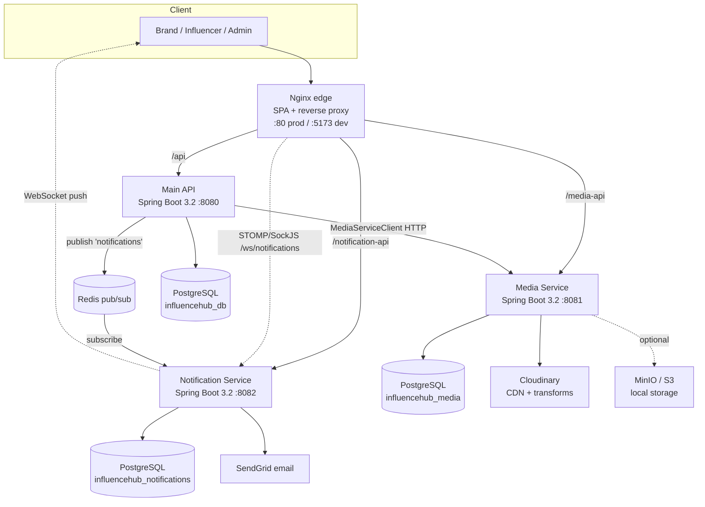

# InfluenceHub — High-Level Design

## Context & Goals

InfluenceHub is a two-sided influencer-marketing marketplace for the Indian market.
**Brands** run campaigns and pay for content; **influencers** produce and monetize it;
**admins** keep the marketplace safe. The central design challenge is *trust across an
untrusted exchange*: an influencer must prove the work is done before payment, while the
brand must not be able to walk away with the finished asset without paying. InfluenceHub
solves this with an **escrow + watermark** model backed by a media pipeline.

Design goals:

- **Isolate blast radius** — media processing and notification traffic must not degrade
  the core transactional API. This drove the split into three independently deployable
  services, each with its own database.
- **Protect creator work** — originals are never exposed until money moves; previews are
  watermarked and downloads are token-gated.
- **Real-time UX** — invitations, negotiations, approvals and payments surface instantly
  in-app and by email.
- **Stateless, horizontally scalable** — JWT auth with no server-side session state.

## Architecture Diagram

## Components & Responsibilities

### Main API — `backend/influencehub-api` (:8080, `influencehub_db`)

| Concern | Responsibility |
|---------|----------------|
| Auth & users | Signup/login, JWT issuance, profiles (brand & influencer) |
| Campaigns | Project (campaign) CRUD, influencer search, multi-influencer invites |
| Negotiation | Brand offer / influencer counter-offer, agreement, history |
| Deliverables | Submission, revision requests, approval, escrow content linkage |
| Payments | Escrow processing, platform fee + GST, invoice generation |
| Messaging | Direct brand↔influencer messages scoped to a project |
| Admin | Verification, disputes, campaign moderation, dashboards, audit logs |
| Integration | Calls Media Service over HTTP; publishes notification events to Redis |

### Media Service — `services/media-service` (:8081, `influencehub_media`)

| Concern | Responsibility |
|---------|----------------|
| Upload | Single/multiple file upload to Cloudinary (or MinIO/S3) |
| Watermarking | Server-side text watermark on images; protected-vs-original variants |
| Derivatives | Thumbnails (Thumbnailator) and previews; video handling via FFmpeg |
| Access control | Time-limited, single-use **download tokens** (ORIGINAL/WATERMARKED/PREVIEW/THUMBNAIL) |
| Metadata | Tracks file, entity linkage, protection flag, Cloudinary public IDs |

### Notification Service — `services/notification-service` (:8082, `influencehub_notifications`)

| Concern | Responsibility |
|---------|----------------|
| Ingest | Subscribes to the Redis `notifications` channel and consumes events |
| Persist | Stores notifications + per-user preferences |
| Real-time | Pushes to clients over STOMP/SockJS (`/ws/notifications`) |
| Email | Sends templated emails via SendGrid, honoring user preferences |

### Frontend — `frontend` (React 19 / Vite / Nginx)

Role-based SPA (public, brand, influencer, admin areas). Talks to the three services
via Axios, subscribes to live notifications over STOMP/SockJS, and in production is
served by Nginx which also reverse-proxies `/api`, `/media-api`, and `/notification-api`.

## Data Stores

Each service owns a **separate PostgreSQL 15 database**:

| Database | Owner | Key tables |
|----------|-------|-----------|
| `influencehub_db` | Main API | users, brand/influencer profiles, projects, campaign_influencers, deliverables, negotiation_history, messages, payments, disputes (+ evidence/comments), admin_audit_logs |
| `influencehub_media` | Media Service | media_files, download_tokens |
| `influencehub_notifications` | Notification Service | notifications, notification_preferences |

**Redis** backs the notification fan-out (pub/sub on the `notifications` channel) and
underpins the real-time layer.

**Why database-per-service:** each service can evolve its schema, scale, and be deployed
independently without coordinating migrations. There are no cross-database foreign keys —
services reference each other by opaque IDs (e.g. a deliverable stores a media UUID) and
integrate through APIs/events, keeping ownership boundaries clean.

## External Integrations

- **Cloudinary** — primary media store and CDN. The Media Service uploads originals,
  produces watermarked/preview variants, and serves the original URL only when a
  deliverable is unprotected.
- **SendGrid** — transactional email for invites, negotiation updates, approvals, and
  payment receipts, gated by each user's notification preferences.
- **MinIO / S3 (optional)** — an S3-compatible local storage backend selectable via a
  storage-type switch, so the media pipeline runs fully offline in development.

## Cross-Cutting Concerns

- **Shared JWT auth** — the Main API issues a signed JWT (JJWT, HMAC). Every service
  validates it independently with the shared secret via a `JwtAuthenticationFilter`,
  so no service depends on a central session store.
- **Inter-service HTTP** — the Main API is the only caller of the Media Service, through
  a thin `MediaServiceClient` (upload, fetch metadata, generate download tokens, delete).
- **Real-time notifications** — a single published event drives persistence, a WebSocket
  push, *and* an email, decoupling producers from delivery channels.
- **Escrow** — payment is only allowed once deliverables are approved; the content
  protection flag and release timestamp on a deliverable govern original-asset access.

## Key Design Decisions & Trade-offs

**Microservices split (3 services).** Media processing (CPU/IO heavy) and notification
fan-out are isolated from the transactional core so a spike in uploads or emails can't
stall campaign/payment operations, and each can scale independently.
*Trade-off:* added operational surface and network hops (e.g. the Main API's HTTP call
to the Media Service) versus a simpler monolith.

**Watermark-until-paid escrow.** Instead of trusting either party, the platform delivers
a watermarked preview and only mints an ORIGINAL download token after payment settles.
This makes the trust guarantee a property of the *media pipeline*, not the UI.
*Trade-off:* server-side watermarking and token issuance add processing and storage cost
per asset, but remove the marketplace's core trust risk.

**Database-per-service.** Clean ownership and independent evolution/scaling at the cost
of no cross-service joins and eventual-consistency between services — an intentional
choice favoring autonomy over transactional convenience.
