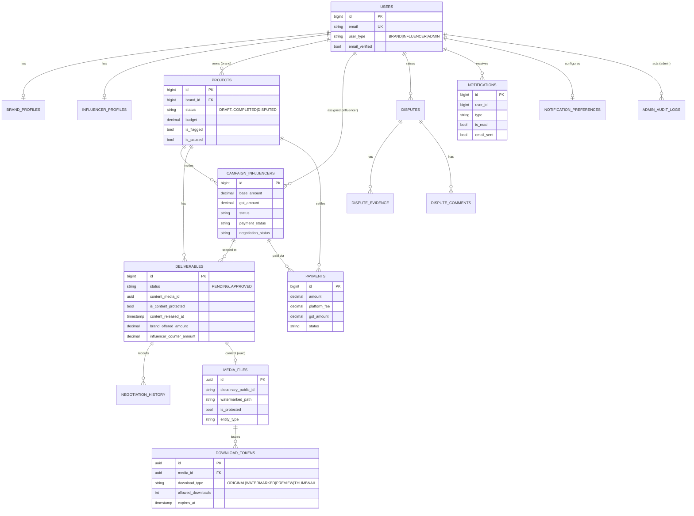

# InfluenceHub — Low-Level Design

## Module / Package Breakdown

All three services follow a layered Spring Boot structure
(`controller → service → repository → entity`, with `dto`, `config`, `security`,
`client`, `exception`). Packages are rooted at `com.influencehub.*`.

### Main API — `backend/influencehub-api` (`com.influencehub`)

| Package | Contents (representative) |
|---------|---------------------------|
| `controller` | `AuthController`, `ProjectController`, `CampaignInfluencerController`, `NegotiationController`, `Deliverable`/`PaymentController`, `InfluencerProfileController`, `BrandProfileController`, `MessageController`, `UserController` |
| `controller.admin` | `AdminAuthController`, `AdminUserController`, `AdminCampaignController`, `AdminDisputeController`, `AdminPaymentController`, `AdminDashboardController`, `AdminAuditController` |
| `service` | `UserService`, `ProjectService`, `CampaignInfluencerService`, `NegotiationService`, `DeliverableService`, `PaymentService`, `InvoiceService`, `CloudinaryService`, `DisputeService`, `AuditService`, `UserVerificationService`, `NotificationPublisher` |
| `entity` | `User`, `BrandProfile`, `InfluencerProfile`, `Project`, `CampaignInfluencer`, `Deliverable`, `NegotiationHistory`, `Message`, `Payment`, `Dispute`, `DisputeEvidence`, `DisputeComment`, `AdminAuditLog` |
| `repository` | Spring Data JPA repositories per aggregate |
| `dto`, `dto.admin`, `dto.media` | Request/response models, incl. media DTOs |
| `security` | `JwtAuthenticationFilter`, `UserPrincipal` |
| `config` | `SecurityConfig`, `RedisConfig`, `CloudinaryConfig`, `AdminInitConfig` |
| `client` | `MediaServiceClient` (HTTP calls into the Media Service) |
| `util` | `JwtUtil`, `NotificationUtil` |

### Media Service — `services/media-service` (`com.influencehub.media`)

| Package | Contents |
|---------|----------|
| `controller` | `MediaController` (`/api/media`) |
| `service` | `MediaService`, `WatermarkService`, `ThumbnailService`, `CompressionService`, `TokenService`, `StorageService`, `CloudinaryStorageService`, `MinioStorageService` |
| `entity` | `MediaFile`, `DownloadToken` |
| `enums` | `FileType`, `MediaStatus`, `DownloadType`, `EntityType` |
| `config` | `StorageConfig`, `MediaConfig`, `S3ClientConfig`, `FFmpegConfig`, `CorsConfig` |

### Notification Service — `services/notification-service` (`com.influencehub.notification`)

| Package | Contents |
|---------|----------|
| `controller` | `NotificationController` (`/api/notifications`), `HealthController` |
| `service` | `NotificationService`, `RedisSubscriber`, `WebSocketService`, `EmailService` |
| `entity` | `Notification`, `NotificationPreference` |
| `config` | `RedisConfig`, `WebSocketConfig`, `WebSocketSecurityConfig`, `SendGridConfig`, `CorsConfig`, `WebConfig` |

## Key API Endpoints

| Area | Method & Path | Service |
|------|---------------|---------|
| Auth | `POST /api/auth/signup`, `POST /api/auth/login` | Main API |
| Profiles | `GET/PUT /api/influencer/profile`, `POST /api/influencer/profile/photo`, `GET/PUT /api/brand/profile` | Main API |
| Campaigns (brand) | `POST/GET /api/brand/projects`, `GET /api/brand/projects/{id}`, `PUT /api/brand/projects/{id}/status` | Main API |
| Influencer discovery | `GET /api/brand/influencers/search`, `POST /api/brand/projects/{id}/influencers` | Main API |
| Invitations (influencer) | `GET /api/influencer/invitations`, `POST /api/influencer/invitations/{id}/accept` \| `/decline` | Main API |
| Negotiation | `POST /api/influencer/opportunities/{id}/counter` \| `/accept` \| `/decline`; `POST /api/brand/campaigns/{pid}/influencers/{id}/counter`; `GET /api/negotiations/{id}/history` | Main API |
| Deliverables | `POST/GET /api/brand/projects/{id}/deliverables`, `PUT /api/brand/deliverables/{id}/approve` \| `/request-revision`, `PUT /api/influencer/deliverables/{id}/submit` \| `/start` | Main API |
| Payments | `POST /api/payments/process`, `GET /api/payments/{id}/invoice`, `GET /api/brand/payments`, `GET /api/influencer/payments`, `GET /api/payments/project/{id}/summary` | Main API |
| Messaging | `POST /api/messages`, `GET /api/messages/conversation/{userId}`, `GET /api/messages/unread-count` | Main API |
| Admin | `/api/admin/users`, `/api/admin/campaigns`, `/api/admin/disputes`, `/api/admin/payments`, `/api/admin/dashboard`, `/api/admin/audit-logs` | Main API |
| Media | `POST /api/media/upload`, `GET /api/media/{id}`, `GET /api/media/{id}/preview` \| `/thumbnail` \| `/download`, `POST /api/media/{id}/generate-token`, `GET /api/media/download` | Media Service |
| Notifications | `GET /api/notifications`, `GET /api/notifications/unread-count`, `PUT /api/notifications/{id}/read` \| `/read-all`, `GET/PUT /api/notifications/preferences` | Notification Service |
| Real-time | STOMP endpoint `/ws/notifications` (SockJS), broker `/topic` `/queue`, app prefix `/app` | Notification Service |

## Core Data Model

*(Media and notification tables live in their own databases; links to `USERS`/`DELIVERABLES`
are by ID reference, not enforced foreign keys across databases.)*

## Key Logic

**Escrow payment → media unlock.** A `Deliverable` carries `content_media_id`,
`is_content_protected` (default true) and `content_released_at`. While protected, the
Media Service serves only the **watermarked preview**; the Main API guards
`POST /api/payments/process` so payment is allowed only when the campaign's deliverables
are `APPROVED`. On a completed payment the influencer's payment status advances, an
invoice is generated, and the original becomes retrievable via a freshly minted ORIGINAL
download token.

**Watermarked preview vs original.** `WatermarkService` composites a semi-transparent
text overlay onto images server-side; `CloudinaryService`/`CloudinaryStorageService`
return the original URL only when the asset is unprotected. Downloads are never direct —
`TokenService` issues a `DownloadToken` scoped to a `DownloadType` with an expiry and an
`allowed_downloads` counter, so links are short-lived and single-use.

**GST invoice.** `PaymentService` computes base amount, platform fee, and GST; on
settlement `InvoiceService.generateInvoice(payment)` produces a prefixed invoice document
(`INV-...`) retrievable at `GET /api/payments/{id}/invoice`. Razorpay order/payment ID
columns are present for gateway integration; demo mode completes payments immediately.

**Negotiation / counter-offer.** Pricing moves through
`PENDING → BRAND_OFFERED → INFLUENCER_COUNTERED → AGREED/REJECTED`, tracked on the
deliverable (`brand_offered_amount`, `influencer_counter_amount`, `final_amount`) with an
append-only `negotiation_history` row (`offered_by`, `amount`, `notes`) per step.

**Notification fan-out.** `NotificationPublisher` serializes an event and
`redisTemplate.convertAndSend("notifications", json)`. The Notification Service's
`RedisSubscriber.handleMessage` deserializes it and calls
`NotificationService.createNotification`, which persists the notification, pushes it over
WebSocket via `WebSocketService.sendToUser` (plus an unread-count update), and — if the
user's preferences allow — emails it through SendGrid.

## Security Design

- **JWT** issued by `JwtUtil` (JJWT, HMAC signing key from `jwt.secret`, TTL from
  `jwt.expiration`). Tokens are stateless and carry the user identity/role.
- Each service runs a `JwtAuthenticationFilter` that validates the bearer token and
  populates a `UserPrincipal` in the Spring Security context — no shared session store.
- `SecurityConfig` enforces stateless sessions and role-based access (BRAND / INFLUENCER
  / ADMIN); admin routes under `/api/admin/**` are separately guarded, and admin actions
  are written to `admin_audit_logs` (with IP/user-agent) for accountability.
- Passwords are BCrypt-hashed. CORS is configured per service for the SPA origin.

## Notable Patterns

- **Client wrapper for inter-service calls** — `MediaServiceClient` encapsulates all HTTP
  interaction with the Media Service behind a typed interface.
- **Event-driven pub/sub** — producers publish to Redis and never call notification
  channels directly, keeping delivery concerns (WebSocket, email) fully decoupled.
- **Strategy for storage** — `StorageService` with `CloudinaryStorageService` /
  `MinioStorageService` implementations selected by configuration.
- **Capability tokens** — expiring, single-use `DownloadToken`s instead of durable URLs.
- **Layered architecture + DTO boundaries** consistently across all three services.
