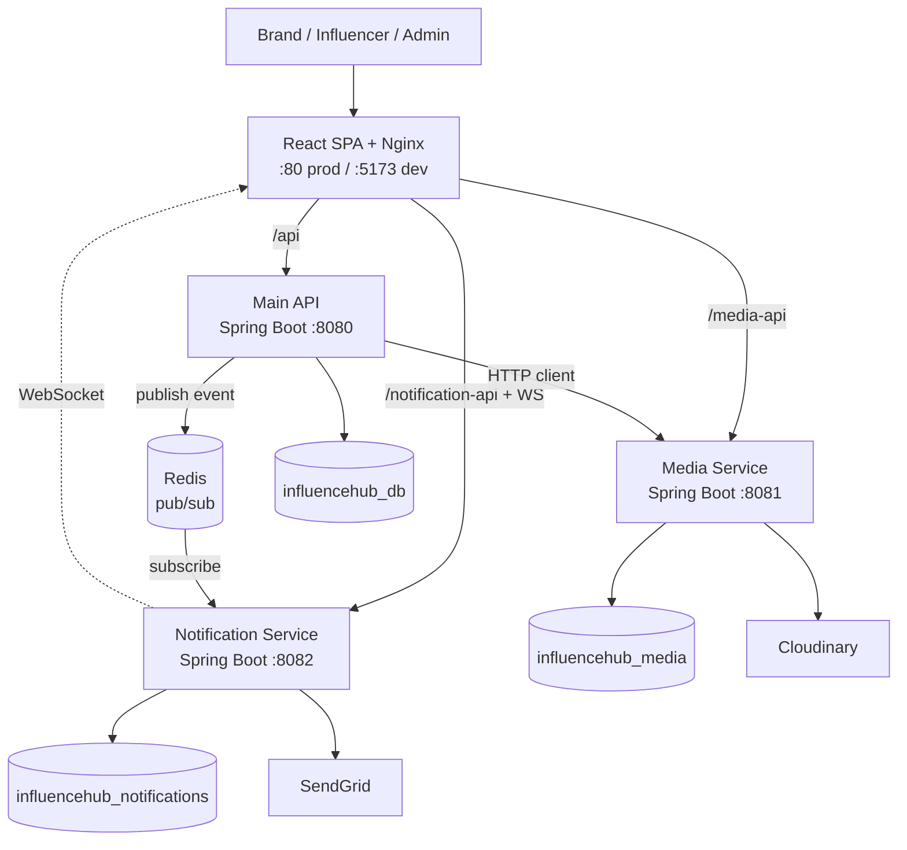

# InfluenceHub

**A microservices influencer-marketing marketplace connecting Indian brands with creators — with escrow-protected content that stays watermarked until the brand pays.**

## Overview

InfluenceHub is a full-stack marketplace where brands run marketing campaigns and
influencers monetize their reach. Brands create campaigns, discover and invite
influencers, negotiate per-deliverable pricing, review submitted content, and release
payment through an escrow model. Influencers submit content that is delivered as a
**watermarked preview** and only unlocks to the original asset once payment settles —
solving the classic "show the work before you get paid" trust problem that plagues
creator marketplaces.

The system is built as **three independent Spring Boot services** (Main API, Media
Service, Notification Service), each owning its own PostgreSQL database, coordinated
over HTTP and a Redis pub/sub bus, and fronted by a React single-page app served
through Nginx. An admin console adds verification, dispute resolution, and audit
logging on top.

## Key Features

- **Escrow content protection** — deliverables ship watermarked; the original is
  gated behind time-limited, single-use download tokens released only after payment.
- **Campaign lifecycle** — brands create campaigns, search/filter influencers by
  category, follower count and engagement, and invite multiple creators per campaign.
- **Two-sided price negotiation** — brand offer → influencer counter-offer → agreement,
  with a full negotiation history trail per deliverable.
- **GST-aware payments** — escrow payment with platform fee and GST breakdown, plus
  auto-generated invoices (Razorpay integration fields wired in).
- **Real-time + email notifications** — a Redis-driven fan-out delivers in-app
  WebSocket (STOMP/SockJS) notifications and SendGrid emails from a single event.
- **Media pipeline** — Cloudinary-backed upload, server-side watermarking, thumbnail
  and preview generation, with an optional MinIO/S3 local storage backend.
- **Admin console** — user verification, dispute workflow with evidence and comments,
  campaign moderation (flag/pause/remove), dashboards, and tamper-evident audit logs.
- **Stateless JWT auth** shared across all three services.

## Tech Stack

| Layer | Technology |
|-------|-----------|
| Frontend | React 19, Vite 7, TailwindCSS 3.4, React Router 7, Axios |
| Real-time client | STOMP over SockJS (`@stomp/stompjs`, `sockjs-client`) |
| Backend | Java 17, Spring Boot 3.2 (3 services) |
| Auth | JWT (JJWT), Spring Security |
| Data | PostgreSQL 15 (database-per-service) |
| Messaging / cache | Redis (pub/sub + real-time fan-out) |
| Media | Cloudinary (CDN + transforms), Thumbnailator, FFmpeg, optional MinIO/S3 |
| Email | SendGrid |
| Edge / delivery | Nginx (serves SPA + reverse-proxies the APIs) |
| Packaging | Docker (per-service Dockerfiles), Railway |

## Architecture at a Glance

## Status

Demo-ready. Roughly **181 Java files** across three Spring Boot services and
**~86 JS/JSX files** in the React frontend. Each service ships with a Dockerfile;
databases are provisioned per service; the app runs end-to-end with seeded demo
accounts for the brand, influencer, and admin roles.

## Highlights

- **Database-per-service** boundaries — no shared schema, no cross-service joins;
  services integrate only through explicit APIs and events.
- **Watermark-until-paid escrow** implemented as a real media pipeline (server-side
  watermarking + token-gated original download), not a UI stub.
- **Event-driven notifications** — one published event fans out to persistence,
  live WebSocket push, and templated email with zero coupling back to the sender.
- **Stateless JWT** verified independently by every service, enabling horizontal
  scaling without sticky sessions.

## Docs

- [High-Level Design (HLD.md)](./HLD.md) — services, data stores, integrations, trade-offs
- [Low-Level Design (LLD.md)](./LLD.md) — packages, endpoints, data model, core logic
- [Flows (FLOWS.md)](./FLOWS.md) — sequence diagrams for the key user journeys
