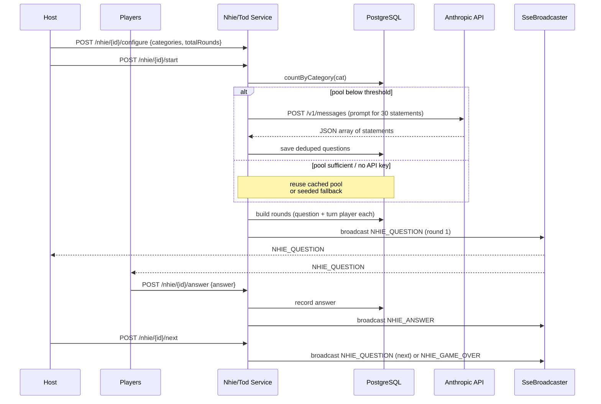
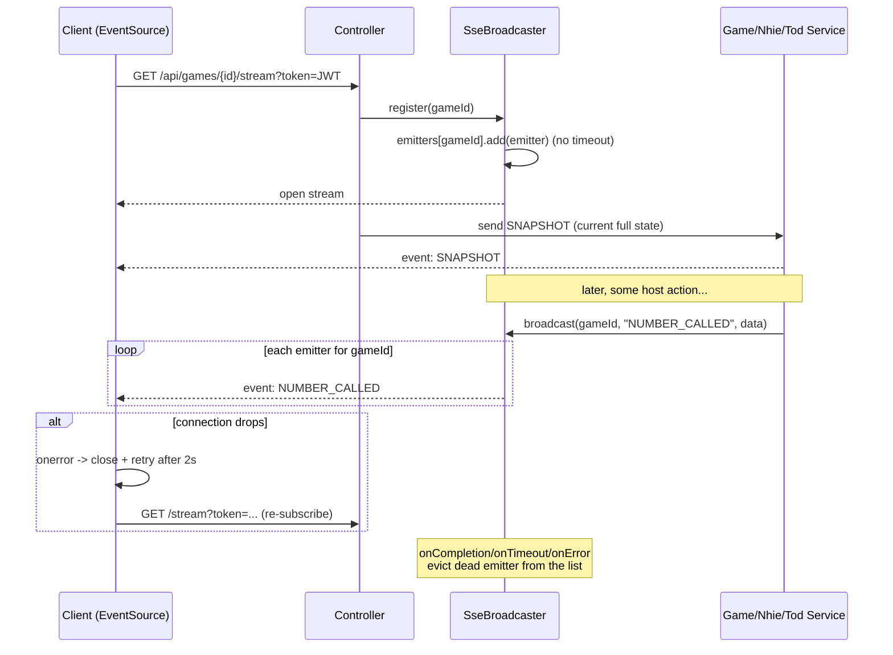

# Party Games — Key Flows

Sequence diagrams and walkthroughs for the most important paths. `H` = host screen, `P` = player phone, `API` = Spring Boot backend, `DB` = PostgreSQL, `Claude` = Anthropic API, `SSE` = the in-memory broadcaster.

## 1. Register / Login

```mermaid
sequenceDiagram
    participant U as Client (SPA)
    participant API as AuthController
    participant DB as PostgreSQL
    U->>API: POST /api/auth/register {displayName,email,password}
    API->>DB: findByEmail(email)
    alt email taken
        API-->>U: 400 "Email already registered"
    else new
        API->>API: BCrypt.encode(password)
        API->>DB: save(user)
        API->>API: JwtService.generateToken(user)
        API-->>U: 200 {token, user}
    end
    Note over U: token stored client-side;<br/>sent as Bearer header on every call
    U->>API: POST /api/auth/login {email,password}
    API->>DB: findByEmail
    API->>API: BCrypt.matches?
    API-->>U: 200 {token, user}  |  401 invalid
```

**Walkthrough.** Registration rejects duplicate emails, BCrypt-hashes the password, persists the user, and returns a freshly signed JWT plus the user DTO. Login looks the user up by email and verifies the password against the stored hash, returning `401` on any mismatch. The SPA keeps the token and attaches it as `Authorization: Bearer …` to subsequent REST calls (and as a `?token=` query param when opening SSE streams, since `EventSource` can't set headers). Tokens carry the user id and expire after 24 hours.

## 2. Tambola Game Lifecycle

```mermaid
sequenceDiagram
    participant H as Host
    participant P as Player
    participant API as GameController / GameService
    participant DB as PostgreSQL
    participant SSE as SseBroadcaster

    H->>API: POST /api/games?gameType=TAMBOLA
    API->>DB: insert game (join_code, LOBBY)
    API-->>H: {gameId, joinCode}
    H->>API: POST /games/{id}/prizes (patterns + rewards)

    P->>API: POST /games/join {joinCode}
    API->>DB: insert player (PENDING)
    H->>API: POST /games/{id}/players/{pid}/admit
    API->>DB: player -> ADMITTED

    H->>API: POST /games/{id}/start
    API->>API: TicketGenerator.generate(n)
    API->>DB: save one ticket per admitted player; status RUNNING

    loop each draw
        H->>API: POST /games/{id}/draw
        API->>DB: insert draw (number, sequence_index)
        API->>SSE: broadcast NUMBER_CALLED
        SSE-->>H: NUMBER_CALLED
        SSE-->>P: NUMBER_CALLED (ticket auto-marks; number spoken)
    end

    P->>API: POST /games/{id}/claim {pattern}
    API->>DB: load real ticket + called numbers
    API->>API: ClaimVerifier.verify(ticket, called, pattern)
    alt valid
        API->>DB: mark prize won + insert win
        API->>SSE: broadcast PRIZE_WON
        SSE-->>H: PRIZE_WON (leaderboard updates)
        SSE-->>P: PRIZE_WON (winner popup)
        API-->>P: {success:true}
    else bogey
        API-->>P: {success:false, "Bogey!"}
    end

    H->>API: POST /games/{id}/end
    API->>SSE: broadcast GAME_OVER
```

**Walkthrough.** The host creates a Tambola game (getting a short join code), then defines the ordered prize list. Players join by code and land in `PENDING` until the host admits them. On **start**, the server generates one valid housie ticket per admitted player, persists each grid, and flips the game to `RUNNING`. Each **draw** picks the next number (randomly in AUTO mode, host-chosen in MANUAL), persists it with a monotonic `sequence_index`, and broadcasts `NUMBER_CALLED` to every screen — player tickets auto-mark and the host screen speaks the number. When a player **claims** a pattern, the server re-derives the truth from the DB (the player's stored ticket and the real called-number set), runs `ClaimVerifier`, and only on success marks the prize won, records a `wins` row, and broadcasts `PRIZE_WON` (driving the winner popup and leaderboard). Invalid claims get a "Bogey!" and change nothing. Ending the game broadcasts `GAME_OVER`.

## 3. NHIE / ToD AI Question Generation & Rounds



**Walkthrough.** The host configures categories and a round count (5/10/15/20). On start, the service ensures each chosen category's pool meets a minimum size; if short and an API key is present, it prompts **Claude** for ~30 fresh statements, parses the returned JSON array, and persists deduplicated rows. With no key or on error it falls back to a built-in seed pool, so play never blocks. Rounds are built (each with a question and a turn player) and the first question is broadcast. Players answer, the answer is recorded and broadcast, and the host advances with **next** — emitting the next `NHIE_QUESTION` or `NHIE_GAME_OVER` at the end. **Truth or Dare** follows the same content path with a richer round: a bottle **spin** selects the next player (`TOD_SPIN_RESULT`), who **chooses** Truth or Dare (`TOD_CHOICE_MADE`, pulling an AI-generated prompt), the group **votes** up/down (`TOD_VOTE_UPDATE`), and the host **reveals** the result with points awarded (`TOD_RESULT`) before advancing.

## 4. SSE Subscription & Broadcast Mechanics



**Walkthrough.** A client opens an `EventSource` to the game's `/stream` endpoint, passing the JWT as a query param. `SseBroadcaster.register` creates a no-timeout `SseEmitter` and appends it to the game's `CopyOnWriteArrayList` inside `ConcurrentHashMap<gameId, List<SseEmitter>>`; a `SNAPSHOT` event immediately hydrates the client with full current state. Thereafter any service action calls `broadcast(gameId, eventName, data)`, which iterates that game's emitters and pushes a named event to each — clients register per-event listeners (`NUMBER_CALLED`, `PRIZE_WON`, `NHIE_QUESTION`, `TOD_RESULT`, `GAME_OVER`, …) and update local React state. Emitter lifecycle callbacks (completion, timeout, error) and send failures evict dead emitters, and the client hook auto-reconnects two seconds after any error — a lightweight, self-healing fan-out that is intentionally single-instance (the registry is in-process memory).
