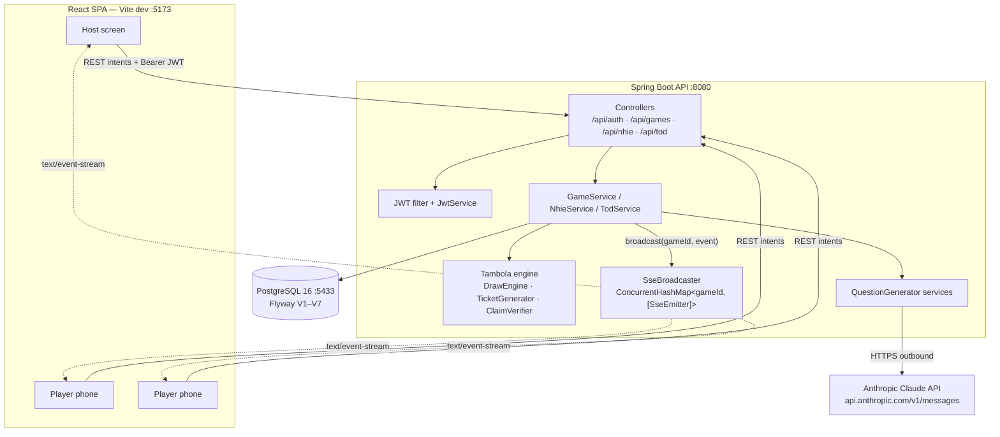

# Party Games — High-Level Design

## Context & Goals

Party Games is a hub for in-house social party games. A group gathers in one room; a **host** drives the game from a big screen (laptop/TV) and **players** join from their phones. The product goals shape the architecture:

- **One sign-in, many games.** Users authenticate once at the hub and launch any game from a home-screen card. Auth, lobby, player admission, and realtime plumbing are shared across all games.
- **Fairness by construction.** The server is the single source of truth for every outcome. Clients cannot fabricate a win or peek at undrawn numbers.
- **Low-latency shared state.** Every screen in a game — host and all players — sees number calls, prize wins, and questions within a moment of each other.
- **Fresh, unpredictable content.** The conversation games (Never Have I Ever, Truth or Dare) need a large, varied question pool without a human curating one.

The system targets a single co-located group per game (tens of players), run on a single backend instance.

## Architecture Diagram

## Components & Responsibilities

| Component | Package | Responsibility |
| --- | --- | --- |
| **Auth** | `com.partygames.auth`, `com.partygames.config` | Register/login, issue and validate JWTs, BCrypt hashing, stateless `SecurityFilterChain`, CORS. |
| **Tambola engine** | `com.partygames.tambola.engine` | Pure game logic: `DrawEngine` (draw 1–90, no repeats), `TicketGenerator` (valid 3×9 housie tickets), `Pattern` + `ClaimVerifier` (prize validation). No Spring/JPA dependencies — unit-testable in isolation. |
| **Tambola service** | `com.partygames.service.GameService`, `com.partygames.controller` | Orchestrates game lifecycle: create, set prizes, join/admit, start, draw, repeat, claim, leaderboard, end. Persists state and broadcasts events. |
| **Never Have I Ever** | `com.partygames.nhie` | Configure categories/rounds, start (build rounds from the question pool), serve questions turn by turn, record answers, broadcast. |
| **Truth or Dare** | `com.partygames.tod` | Bottle-spin to pick a player, Truth/Dare choice, group up/down voting, result reveal with points, round advancement. |
| **SSE broadcaster** | `com.partygames.service.SseBroadcaster` | In-memory registry of emitters keyed by `gameId`; registers subscribers, fans out named events, self-heals dead emitters via completion/timeout/error callbacks. |
| **Question generators** | `nhie...QuestionGeneratorService`, `tod...TodQuestionGeneratorService` | Call Claude to top up the per-category question pool; parse, dedup, persist; fall back to a seeded pool when no key/on error. |

## Data Stores

- **PostgreSQL 16** — the system of record for users, games, players, tickets, draws, prizes, wins, and the per-game NHIE/ToD configs, rounds, questions, and votes. Schema is managed by **Flyway** migrations `V1__init` through `V7__tod_spin`, including native Postgres `ENUM` types (`game_status`, `prize_pattern`, `game_type`, `nhie_category`, `tod_category`, …). Uniqueness constraints enforce invariants at the DB level — e.g. `draws(game_id, number)` and `draws(game_id, sequence_index)` guarantee no repeated or reordered draws.
- **In-memory SSE emitter registry** — a `ConcurrentHashMap<Long, List<SseEmitter>>` inside `SseBroadcaster`. This is transient connection state, not persisted, and lives in the single backend process.

## External Integrations

- **Anthropic Claude API** — outbound HTTPS to `api.anthropic.com/v1/messages` (model `claude-sonnet-4`, `anthropic-version: 2023-06-01`, `max_tokens: 2048`). When a category's question pool drops below a floor, the generator prompts Claude for ~30 unique statements as a JSON array, extracts and parses the array (tolerating surrounding prose), and persists deduplicated rows. If no API key is configured, or the call fails, it seeds a built-in fallback pool instead — so the games are never blocked on the external service.

## Cross-Cutting Concerns

- **Authentication.** Stateless JWT. Tokens carry the user id as subject, signed HMAC-SHA, 24-hour expiry. A `OncePerRequestFilter` reads the `Authorization: Bearer` header, with a query-parameter fallback (`?token=`) specifically because the browser `EventSource` API cannot set custom headers on an SSE connection. `/api/auth/**` and `/api/health` are public; everything else requires a valid token.
- **Realtime broadcast per gameId.** Events are addressed to a game, and every emitter registered for that game receives them. Because the registry is in-process memory, the design is **single-instance**: horizontal scaling would require an external pub/sub (e.g. Redis) or sticky routing so that a broadcast reaches emitters on other nodes. This is an accepted trade-off for a co-located-group product.
- **Server-authoritative design.** All randomness (number draws, ticket generation) and all validation (claim verification, turn/phase checks) happen server-side within `@Transactional` service methods. Clients send intents and render pushed state; they hold no authoritative copy of the outcome.
- **Client-side speech synthesis.** The number caller is a purely presentational concern handled on the client via the Web Speech API (`useSpeechCaller`), converting a drawn number into spoken words ("twenty-two, two, two") with a mute toggle — keeping audio/UX out of the server.

## Key Design Decisions & Trade-offs

- **SSE over WebSocket.** The traffic pattern is overwhelmingly server → client fan-out (host draws, everyone watches); client → server actions are ordinary REST intents. SSE gives that with plain HTTP, native browser `EventSource`, automatic reconnection, and no extra protocol or handshake — a simpler fit than a full-duplex WebSocket. The cost is one long-lived response per subscriber and no built-in client→server channel (unneeded here), plus the header limitation worked around with a token query param.
- **Server-side claim verification.** A prize claim is re-evaluated against the persisted draw history and the player's stored ticket grid before any winner is announced. This makes cheating structurally impossible from the client and is covered by tests (`PatternAndClaimTest`). The trade-off is a round-trip and DB read per claim — negligible at this scale.
- **AI-generated content with fallback.** Delegating question authoring to Claude yields large, varied, category-specific pools with near-zero curation effort, cached in Postgres and topped up lazily. The trade-offs — latency on cold pools, cost, and non-determinism — are contained by caching, a minimum-pool threshold, and a deterministic fallback pool that keeps the games fully playable without any API key.
