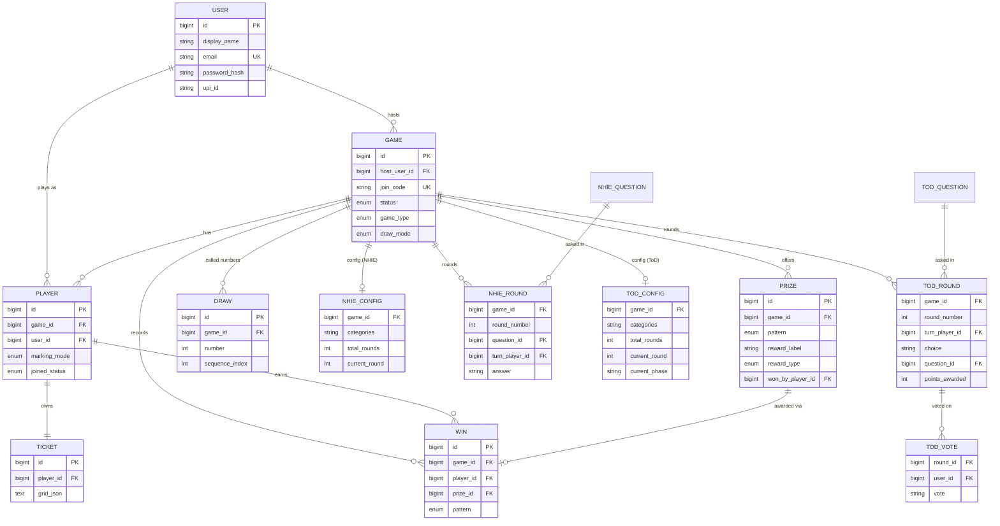

# Party Games — Low-Level Design

## Module / Package Breakdown

All backend code lives under `com.partygames`:

| Package | Contents |
| --- | --- |
| `auth` | `AuthController` (register/login), `JwtService` (sign/verify), `JwtAuthenticationFilter` (Bearer + `?token=` fallback), `dto` (Register/Login/Auth/User). |
| `config` | `SecurityConfig` — stateless filter chain, BCrypt encoder, CORS. |
| `controller` | `GameController` (Tambola + game lifecycle), `UserController` (`/me`, `/me/games`), `HealthController`, and `controller.dto` request/response records. |
| `service` | `GameService` (Tambola orchestration), `SseBroadcaster` (emitter registry + fan-out). |
| `domain.entity` | JPA entities: `User`, `Game`, `Player`, `Ticket`, `Draw`, `Prize`, `Win`, plus `NhieGameConfig/Question/Round`, `TodGameConfig/Question/Round/Vote`. |
| `domain.repository` | Spring Data JPA repositories for each aggregate. |
| `domain.enums` | `GameType`, `GameStatus`, `DrawMode`, `MarkingMode`, `JoinedStatus`, `PrizePattern`, `RewardType`, `NhieCategory`, `TodCategory`. |
| `tambola.engine` | Framework-free logic: `DrawEngine`, `TicketGenerator`, `TambolaTicket`, `Pattern`, `ClaimVerifier`. |
| `nhie` | `controller`, `service` (`NhieService`, `QuestionGeneratorService`), `dto`. |
| `tod` | `controller`, `service` (`TodService`, `TodQuestionGeneratorService`), `dto`. |

Frontend (`frontend/src`) mirrors this: `context/` (Auth, Theme), `hooks/` (`useGameStream`, `useNhieStream`, `useTodStream`, `useSoundCues`, `useSpeechCaller`), `pages/` (Landing, Login, Register, Home hub, per-game host/player lobbies), `components/` (host/player game surfaces, `TodBottleSpin`, `ProtectedRoute`).

## Key API Endpoints

All paths are prefixed `/api`. SSE streams are `text/event-stream`; everything else is JSON. All except `/auth/**` and `/health` require a valid JWT.

| Area | Method & Path | Purpose |
| --- | --- | --- |
| Auth | `POST /auth/register`, `POST /auth/login` | Create account / sign in; returns `{ token, user }`. |
| User | `GET /me`, `GET /me/games` | Current user; game history. |
| Games | `POST /games?gameType=TAMBOLA\|NHIE\|TOD` | Create a game, returns join code. |
| Games | `POST /games/{id}/prizes` | Host sets ordered prize list (Tambola). |
| Games | `POST /games/join` · `POST /games/{id}/players` | Join by code · host adds a guest. |
| Games | `POST /games/{id}/players/{playerId}/admit` | Host admits a pending player. |
| Games | `GET /games/{id}` · `GET /games/{id}/ticket` | Game detail · caller's ticket. |
| Games | `POST /games/{id}/start` | Generate tickets, move to RUNNING. |
| Games | `POST /games/{id}/draw` · `POST /games/{id}/repeat` | Draw next (AUTO/MANUAL) · repeat last number. |
| Games | `POST /games/{id}/claim` | Claim a prize pattern (server-verified). |
| Games | `GET /games/{id}/leaderboard` · `POST /games/{id}/end` · `DELETE /games/{id}` | Standings · end · delete. |
| Games | `GET /games/{id}/stream` | **SSE** subscribe to game events. |
| NHIE | `POST /nhie/{id}/configure` · `/start` · `/answer` · `/next` · `GET /nhie/{id}` · `GET /nhie/{id}/stream` | Configure categories/rounds, start, answer, advance, detail, **SSE**. |
| ToD | `POST /tod/{id}/configure` · `/start` · `/spin` · `/choose` · `/vote` · `/reveal` · `/next` · `GET /tod/{id}` · `GET /tod/{id}/stream` | Spin bottle, pick Truth/Dare, vote, reveal result, advance, detail, **SSE**. |

## Core Data Model

## Key Logic

- **`DrawEngine` (number draw).** Constructed with a seedable `Random`, it shuffles a `1..90` list once and hands out numbers in that order via `next()`, tracking a `LinkedHashSet` of called numbers so `allCalled()`, `lastCalled()`, and `remaining()` are O(1). Seedability makes draws reproducible under test. In the running service, AUTO mode reconstructs the called set from the `draws` table and picks a random unused number; MANUAL mode accepts a host-specified number after validating range and non-repetition — the DB's unique constraints are the final guard.
- **`TicketGenerator` (housie ticket rules).** Produces a valid 3×9 ticket satisfying: exactly 15 filled cells, exactly 5 per row, 1–3 per column, column *c* holding values only from its band (1–9, 10–19, … 80–90), and each column sorted ascending top-to-bottom. It uses a **generate-then-validate** strategy: allocate per-column counts summing to 15, greedily balance filled rows to 5 each (most-constrained columns first), draw from shuffled per-column pools, and regenerate on the rare invalid layout. Grids are persisted as JSON in `tickets.grid_json`.
- **`Pattern` + `ClaimVerifier` (server-side validation).** `Pattern` is an enum where each constant (`EARLY_FIVE`, `TOP_LINE`, `MIDDLE_LINE`, `BOTTOM_LINE`, `FOUR_CORNERS`, `FULL_HOUSE`) implements its own `matches(ticket, calledNumbers)`. `ClaimVerifier` simply delegates, so a new pattern is added by adding one enum constant — no verifier changes. On claim, `GameService` loads the *actual* called numbers and the player's *real* ticket, verifies, and only then marks the prize won, writes a `wins` row, and broadcasts. A failing check returns "Bogey!".
- **AI `QuestionGeneratorService`.** When a category pool is below `MIN_POOL_SIZE` (20), it asks Claude for `GENERATE_COUNT` (30) statements as a JSON array, extracts the array from the response text, and saves each as a `NhieQuestion`/`TodQuestion`, relying on a `UNIQUE(category, text)` constraint to skip duplicates. No key or an error triggers a hardcoded fallback seed pool.

## Security Design

- **JWT** signed with HMAC-SHA (jjwt 0.12.6); subject = user id; **24-hour** expiry; validated on every request by `JwtAuthenticationFilter`. SSE connections pass the token as a query param since `EventSource` cannot send headers.
- **Passwords** hashed with **BCrypt** (`BCryptPasswordEncoder`); only the hash is stored (`users.password_hash`).
- **Session policy** is `STATELESS`; CSRF disabled (token-based, no cookies); CORS restricted to the dev SPA origins.

## Notable Patterns

- **Server-authoritative:** all randomness and validation live server-side inside `@Transactional` methods; clients send intents only.
- **Engine separation:** `tambola.engine` is pure, framework-free, and independently unit-tested (`DrawEngineTest`, `TicketGeneratorTest`, `PatternAndClaimTest`).
- **SSE broadcaster registry:** a single `@Component` owns `Map<gameId, List<SseEmitter>>`, with `CopyOnWriteArrayList` for lock-free iteration during broadcast and lifecycle callbacks that evict dead emitters.
