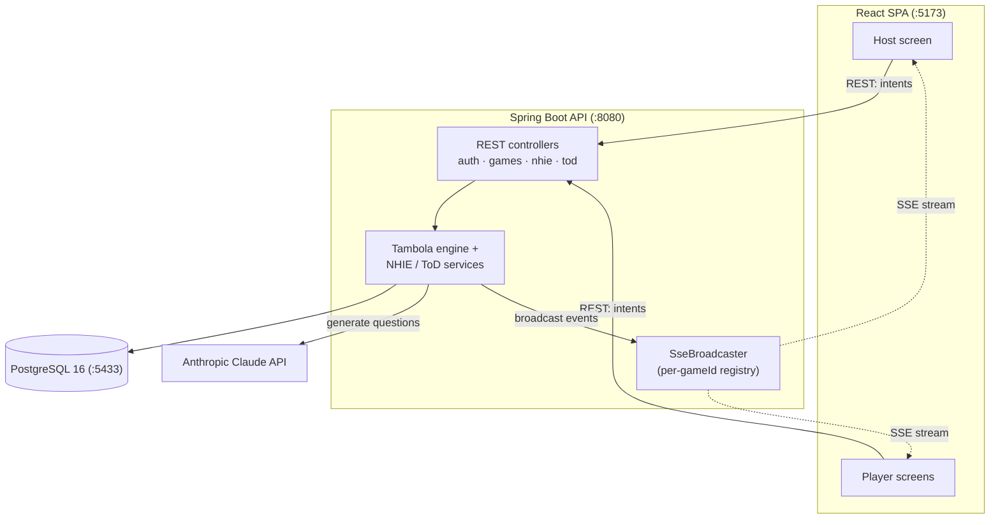

# Party Games

**A hub of real-time, multiplayer party games with a strictly server-authoritative game engine.**

Sign in once at the hub, then launch any game from a home-screen card. Three games ship today — Tambola (Housie), Never Have I Ever, and Truth or Dare — all sharing a single auth, lobby, and realtime layer. Hosts drive the game from a laptop/TV screen while players join from their phones; every meaningful decision (which number is drawn, whether a prize claim is valid, what question comes next) is made and verified on the server.

## Overview

Party Games is a full-stack application: a **React 19 + TypeScript** single-page app talking to a **Spring Boot 3.4 / Java 17** REST API backed by **PostgreSQL 16**. Live game state is pushed to every connected screen over **Server-Sent Events (SSE)** — not WebSocket — via an in-memory, per-game emitter registry. Question content for the two conversation games is generated on demand by the **Anthropic Claude API**, with a hardcoded fallback pool so the games work offline.

The guiding principle is **server authority**: clients only render state and send intents ("draw next", "I claim Top Line"). They never decide outcomes, which keeps the games fair and cheat-resistant.

## Key Features

- **Single hub, many games** — one JWT-based sign-in; games launch from home-screen cards and reuse the same auth, lobby, player-admission, and SSE plumbing.
- **Tambola / Housie** — host + player screens, 1–90 number board, AUTO or MANUAL number draw, repeat-last-number, six prize patterns (Early Five, three lines, Four Corners, Full House), and a live leaderboard.
- **Server-verified prize claims** — a claim is re-checked against the *actual* called numbers and the player's *real* generated ticket before any winner is announced. Invalid claims return a "Bogey!".
- **Never Have I Ever** — host configures categories and round count (5/10/15/20); the server serves AI-generated statements round by round and tracks answers.
- **Truth or Dare** — animated bottle-spin selects the next player, who chooses Truth or Dare; the group up/down-votes the result and points are awarded.
- **AI question generation** — Claude produces category-specific questions on the fly, deduplicated and cached in Postgres; a built-in fallback pool covers the no-API-key case.
- **Realtime everywhere via SSE** — number calls, prize wins, questions, votes, and game-over all fan out to every subscribed screen in the game.
- **Speech + sound cues** — the Tambola caller reads each drawn number aloud (Web Speech API, "twenty-two, two, two") with mute control, plus sound cues and confetti.

## Tech Stack

| Layer | Technology |
| --- | --- |
| Frontend | React 19, TypeScript, Vite 8, React Router 7, plain CSS |
| Realtime (client) | Native `EventSource` via custom hooks with auto-reconnect |
| Backend | Java 17, Spring Boot 3.4.1, Spring Web / Data JPA / Security, Maven |
| Auth | JWT (jjwt 0.12.6, HMAC-SHA), BCrypt password hashing |
| Realtime (server) | Spring MVC `SseEmitter` + in-memory broadcaster registry |
| Database | PostgreSQL 16, Flyway migrations (V1–V7) |
| AI | Anthropic Claude API (`claude-sonnet-4`) for question generation |
| Dev infra | Docker Compose (Postgres + pgAdmin) |

## Architecture at a Glance

## Status

Actively developed personal project. Three playable games (Tambola, NHIE, Truth or Dare) with host and player surfaces. Backend has unit and integration tests covering the draw engine, ticket generator, and claim verification (`DrawEngineTest`, `TicketGeneratorTest`, `PatternAndClaimTest`). Runs locally via Docker Compose; single-instance by design (in-memory SSE registry).

## Highlights

- **Server-authoritative game engine** — the server draws numbers, generates questions, and validates every claim; clients hold no authority over outcomes.
- **SSE-based realtime** — a deliberately simple, HTTP-native fan-out (`ConcurrentHashMap<gameId, List<SseEmitter>>`) chosen over WebSocket for the host-broadcasts-to-players traffic pattern.
- **AI question generation** — Claude integration with JSON-array prompting, dedup on persist, and graceful fallback.

## Docs

- [High-Level Design](./HLD.md) — context, components, integrations, cross-cutting concerns, key trade-offs.
- [Low-Level Design](./LLD.md) — packages, API endpoints, data model, core algorithms, security.
- [Flows](./FLOWS.md) — sequence diagrams for auth, the Tambola lifecycle, AI questions, and SSE mechanics.
