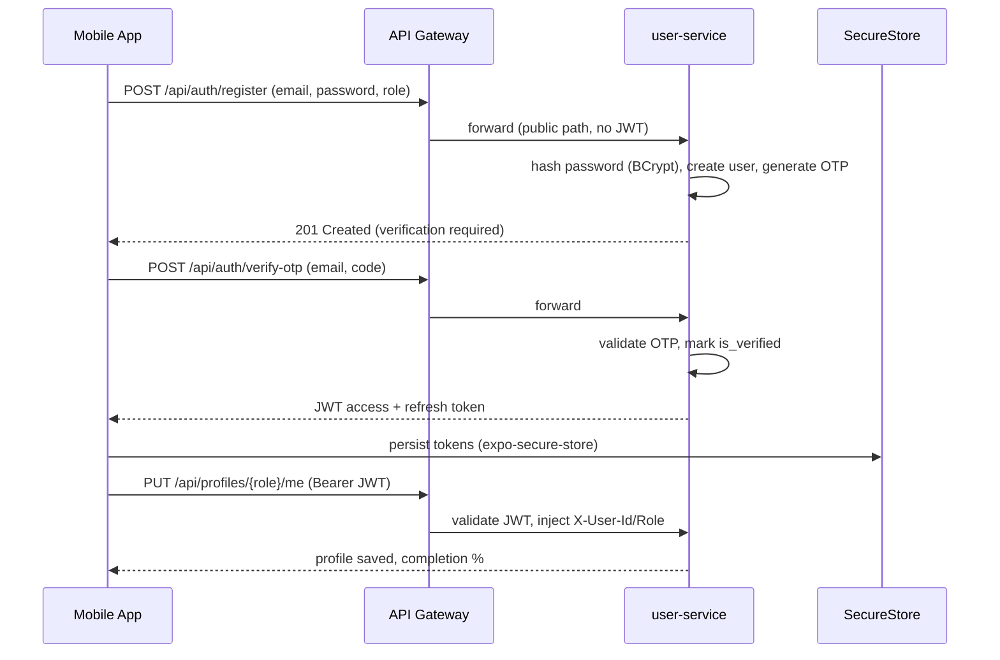
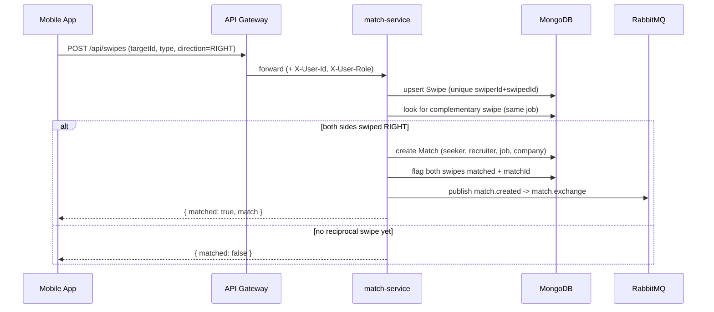
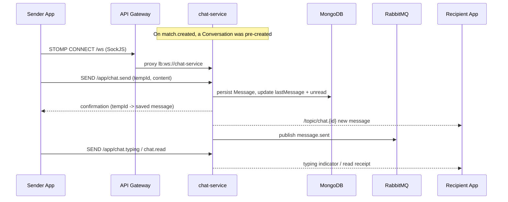
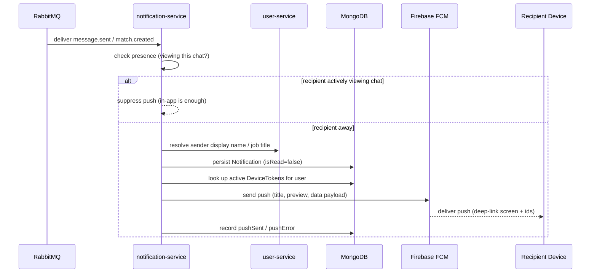
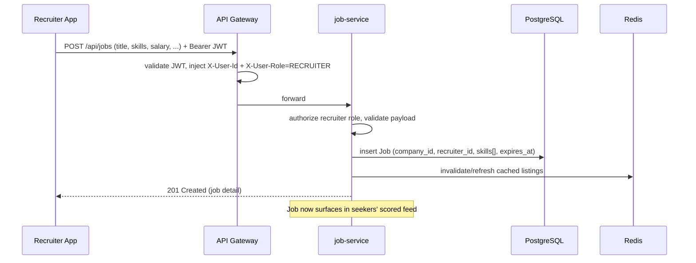
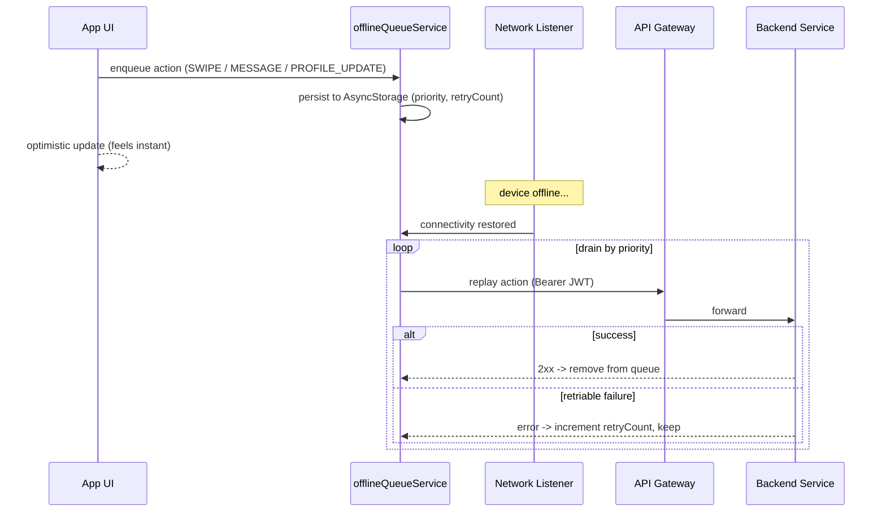

# Linder — Key Flows

Six end-to-end flows spanning the mobile app, the gateway, and the backend services. Each shows the sequence and a short walkthrough of what happens and why.

## 1. Authentication & Onboarding

**Walkthrough.** Registration is a public route, so the gateway forwards it without a token. user-service BCrypt-hashes the password, stores the account, and issues an email OTP. After the user submits the OTP, the account is verified and a JWT access token plus refresh token are returned; the app persists them in `expo-secure-store` (via Redux Persist). The user then selects a role (seeker or recruiter) and completes the corresponding profile — the first authenticated call, now carrying the bearer token that the gateway validates and enriches with identity headers.

## 2. Swipe → Mutual Match

**Walkthrough.** Every swipe is recorded idempotently (unique index on swiper + swiped). On a right/up swipe, match-service checks for the complementary swipe — a seeker's interest in a job paired with a recruiter's interest in that seeker *for the same job*. When both exist, a `Match` is created, both swipes are back-filled with the `matchId`, and a `match.created` event is published to the RabbitMQ topic exchange. Publishing (rather than calling downstream services directly) keeps the swipe response fast and lets chat and notification services react independently.

## 3. Real-Time Chat over STOMP/WebSocket

**Walkthrough.** Because a conversation is created the moment a match forms, chat is ready as soon as the match appears. The app opens a STOMP session over SockJS; the gateway proxies the upgrade to chat-service (`lb:ws://`). Outbound messages carry a client `tempId` so the optimistic UI can reconcile the persisted message when the confirmation returns. chat-service stores the message, updates the conversation's last-message summary and unread counters, broadcasts to the conversation topic and per-user destinations, and publishes `message.sent` for the notification pipeline. Typing indicators and read receipts travel over the same socket.

## 4. Push Notification via RabbitMQ → FCM

**Walkthrough.** notification-service consumes match/message/interview events from RabbitMQ. For messages it first checks presence — if the recipient is currently viewing that conversation (tracked via the presence endpoints), the push is suppressed since the in-app socket already delivered the message. Otherwise it enriches the event with human-readable names, writes an in-app `Notification`, fetches the user's active FCM device tokens, and sends a push carrying a data payload (target screen + ids) for deep-linking. Dead-letter queues protect against poison messages, and each attempt records `pushSent`/`pushError`.

## 5. Recruiter Job Creation

**Walkthrough.** A recruiter posts a role from the app. The gateway validates the JWT and forwards the `RECRUITER` role header; job-service authorizes on that header, validates the payload, and persists the job in PostgreSQL with its required-skills array (GIN-indexed) and expiry. Cached listings are refreshed so the posting immediately enters the seeker feed, where it will be ranked by the compatibility scorer against each seeker's profile.

## 6. Offline Queue Sync

**Walkthrough.** When the device is offline, user actions are applied optimistically in the UI and appended to a durable, prioritized queue in `AsyncStorage` (capped at 100 actions, 24-hour TTL, per-action retry limits). A network listener wakes the queue when connectivity returns and replays actions highest-priority-first through the gateway. Successful actions are removed; retriable failures increment a retry counter and stay queued, while expired or exhausted actions are dropped. This makes swiping and messaging resilient on unreliable mobile networks without blocking the user.
