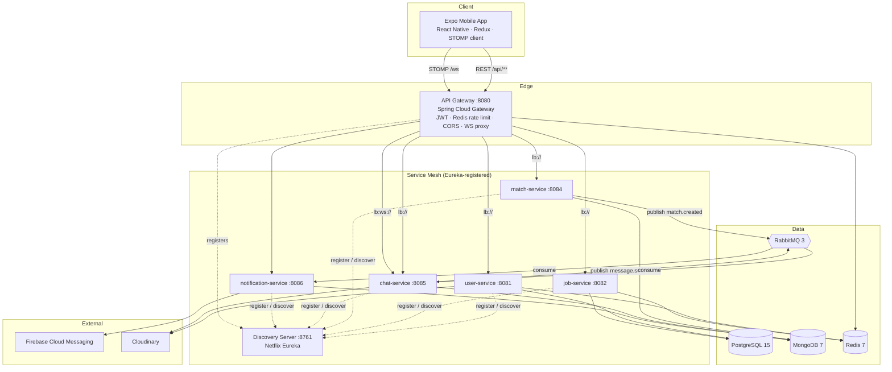

# Linder — High-Level Design

## Context & Goals

Linder is a two-sided job-matching marketplace delivered as a native mobile app. Its central interaction is a swipe: seekers swipe on jobs, recruiters swipe on candidates for a specific role, and a **mutual right-swipe** creates a match that unlocks real-time chat. The design has to satisfy several competing goals:

- **Two distinct user journeys** (seeker vs. recruiter) sharing one auth and profile system.
- **High-write, low-schema interactions** (swipes, matches, messages) that must scale independently of the relatively stable relational data (users, jobs, companies).
- **Real-time messaging** with typing and read receipts, plus **push notifications** when users are offline.
- **A mobile client that stays usable offline**, syncing queued actions when connectivity returns.
- **Independent deployability** of each capability so the team can iterate on matching, chat, or notifications in isolation.

These goals drove a microservices architecture with polyglot persistence and event-driven communication.

## Architecture Diagram

## Components & Responsibilities

| Service | Port | Data store | Responsibilities |
|---------|------|-----------|------------------|
| **discovery-server** | 8761 | — | Netflix Eureka registry; every service registers here and resolves peers by logical name (`lb://…`). |
| **api-gateway** | 8080 | Redis | Single entry point. Validates JWT, injects trusted identity headers, enforces Redis-backed rate limits, handles CORS, proxies REST and WebSocket traffic, tags requests with trace IDs. |
| **user-service** | 8081 | PostgreSQL + Redis | Registration, OTP verification, login, JWT issuance, refresh tokens; seeker/recruiter profiles; companies; photo/resume uploads to Cloudinary. |
| **job-service** | 8082 | PostgreSQL + Redis | Job posting CRUD, search, personalized feed with compatibility scores, view tracking and recruiter analytics. |
| **match-service** | 8084 | MongoDB | Records swipes, detects mutual matches, manages the match/hiring-status lifecycle, exposes interested-candidate queries; publishes match events. |
| **chat-service** | 8085 | MongoDB + RabbitMQ | Conversations and messages, STOMP WebSocket endpoint, typing/read receipts, attachments; creates a conversation on `match.created`; publishes `message.sent`. |
| **notification-service** | 8086 | MongoDB + RabbitMQ | Consumes match/message/interview events, persists in-app notifications, manages device tokens, and delivers FCM push (skips push when the recipient is actively viewing the chat). |
| **common** | — | — | Shared library: standard `ApiResponse` / `PageResponse` DTOs, common exceptions, and utilities reused across services. |

## Data Stores — Polyglot Persistence

Linder deliberately uses the right store for each access pattern rather than forcing one database everywhere.

| Store | Owned by | Holds | Why |
|-------|----------|-------|-----|
| **PostgreSQL 15** | user-service, job-service | users, seeker/recruiter profiles, companies, jobs | Strongly relational, constraint-rich data; array + GIN indexes power skill matching; Flyway-managed migrations. |
| **MongoDB 7** | match, chat, notification | swipes, matches, conversations, messages, notifications, device tokens | High write volume, evolving shapes, and naturally document-oriented (a message, a match, a notification). Compound indexes serve the hot query paths. |
| **Redis 7** | gateway, user, job | rate-limit counters, cached hot data, session/token support | Sub-millisecond reads for caching and the token-bucket rate limiter. |
| **RabbitMQ 3** | match, chat → notification | match/message/interview events | Asynchronous, durable event backbone that decouples producers from the notification consumer. |

Each service owns its schema (database-per-service), so services stay loosely coupled and can scale and evolve independently.

## External Integrations

- **Firebase Cloud Messaging (FCM)** — the notification service holds the Firebase Admin credentials and sends push messages to device tokens registered by the app. (Credentials are provided out-of-band and are never checked into the repo.)
- **Cloudinary** — media pipeline for profile photos, resumes, and chat image/file attachments; the app and services upload to Cloudinary and persist only the returned URLs.

## Cross-Cutting Concerns

- **Authentication at the edge** — JWTs are issued by the user-service and validated by a gateway filter on every non-public route. The gateway strips the bearer token and forwards `X-User-Id`, `X-User-Role`, and `X-User-Email` headers, so downstream services trust the gateway and remain stateless.
- **Service discovery** — all services register with Eureka; the gateway and inter-service calls route by logical id via client-side load balancing (`lb://…`, `lb:ws://…` for WebSocket).
- **Rate limiting** — Spring Cloud Gateway's `RequestRateLimiter` backed by Redis, with multiple key resolvers (per-user, per-IP, per-path) to throttle sensitive endpoints such as login and swiping.
- **Event-driven communication** — match and chat services publish to RabbitMQ **topic exchanges** (`match.exchange`, `notification.exchange`) with **dead-letter queues** for durability; consumers react without synchronous coupling.
- **Real-time transport** — STOMP over WebSocket with a SockJS fallback; the gateway proxies `/ws/**`, and the chat service runs the STOMP broker (`/app` app-destination prefix, `/topic` + `/queue` broker, `/user` for per-user destinations).
- **Observability** — Spring Boot Actuator health/metrics endpoints, Prometheus metric export, structured logging with propagated trace IDs, and SpringDoc OpenAPI docs per service.

## Key Design Decisions & Trade-offs

**Microservices over a modular monolith.** Splitting by domain (auth, jobs, matching, chat, notifications) lets each capability scale and deploy independently — chat's WebSocket workload and matching's write-heavy load have very different profiles. The cost is operational complexity (discovery, gateway, distributed data), mitigated by Eureka, a single gateway, and docker-compose for local infra.

**Polyglot persistence over one database.** PostgreSQL gives integrity and rich querying for core entities, while MongoDB absorbs high-volume, document-shaped interaction data. The trade-off is no cross-store transactions or joins; the system compensates with event-driven consistency and denormalized identifiers (e.g. matches carry seeker/recruiter/job/company IDs).

**Event-driven match → notification.** When a mutual match forms, match-service simply publishes `match.created`. Chat-service consumes it to open a conversation, and notification-service consumes it to notify both parties and push via FCM. This keeps matching fast and oblivious to downstream concerns, and makes it trivial to add new reactions (analytics, email) later — at the cost of eventual, rather than immediate, consistency and the need to handle retries/dead-lettering.
