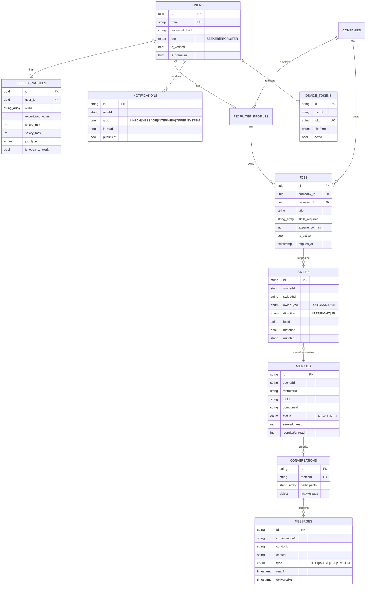

# Linder — Low-Level Design

## Module / Package Breakdown

**Backend** — Maven multi-module project (`com.linder.*`), one module per service plus a shared library. Each service follows a consistent layered layout: `controller → service → repository → entity/document → dto`, with `config` for cross-cutting wiring and `event` for messaging.

| Module | Package root | Notable internals |
|--------|--------------|-------------------|
| `discovery-server` | `com.linder.discovery` | Eureka server bootstrap. |
| `api-gateway` | `com.linder.gateway` | `filter/JwtAuthenticationFilter`, `filter/LoggingFilter`, `filter/ResponseHeaderFilter`; `config/RateLimiterConfig` (key resolvers), `config/CorsConfig`; `controller/FallbackController`. |
| `user-service` | `com.linder.user` | `controller/{Auth,Profile,User,FileUpload,Settings,ReferenceData,Internal}Controller`; JPA entities for users/profiles/companies; JWT + security config. |
| `job-service` | `com.linder.job` | Job CRUD, search, feed scoring, view-tracking analytics; async config. |
| `match-service` | `com.linder.match` | `controller/{Swipe,Match}Controller`; `document/{Swipe,Match}`; `event/EventPublisher`; `config/RabbitMQConfig`. |
| `chat-service` | `com.linder.chat` | `controller/{Chat,ChatWebSocket}Controller`; `document/{Conversation,Message,MessageType}`; `event/MatchEventListener`; STOMP + RabbitMQ config. |
| `notification-service` | `com.linder.notification` | `controller/{Notification,Device,ChatPresence}Controller`; `document/{Notification,DeviceToken,…}`; `event/NotificationEventListener`; Firebase config. |
| `common` | `com.linder.common` | `dto/ApiResponse`, `dto/PageResponse`, shared exceptions and utilities. |

**Mobile app** — feature-organized TypeScript under `app/src/`: `api/` (Axios clients), `screens/`, `components/`, `navigation/` (React Navigation stacks/tabs), `store/` (Redux Toolkit slices + Redux Persist), `services/` (`socketService`, `offlineQueueService`, `notificationService`), `hooks/`, `contexts/`, `theme/`, `types/`, `utils/`.

## Key API Endpoints

All client traffic enters through the gateway at `:8080`. Public auth routes bypass JWT; everything else requires a bearer token.

| Domain | Method & Path | Service | Purpose |
|--------|---------------|---------|---------|
| Auth | `POST /api/auth/register` | user | Create account (seeker or recruiter). |
| Auth | `POST /api/auth/verify-otp` · `POST /api/auth/resend-otp` | user | Verify / resend email OTP. |
| Auth | `POST /api/auth/login` · `POST /api/auth/refresh-token` | user | Login; rotate access token. |
| Auth | `GET /api/auth/me` · `POST /api/auth/logout` | user | Current user; invalidate token. |
| Profiles | `GET·PUT /api/profiles/seeker/me` · `/api/profiles/recruiter/me` | user | Read/update role profile. |
| Profiles | `GET /api/profiles/seeker/completion` · `/api/profiles/seekers/batch` | user | Completion %, batch lookup. |
| Companies | `POST /api/companies` · `GET /api/companies/search` · `/{id}` | user | Company create / search / detail. |
| Files | `POST /api/files/**` | user | Photo/resume upload (Cloudinary). |
| Jobs | `GET /api/jobs` · `/search` · `/feed` · `/{id}` | job | List, search, scored feed, detail. |
| Jobs | `POST·PUT·DELETE /api/jobs` · `/{id}` | job | Create / update / soft-delete (recruiter). |
| Jobs | `GET /api/jobs/my-jobs` · `/{id}/viewers` · `/{id}/view-stats` | job | Recruiter job management & analytics. |
| Swipes | `POST /api/swipes` | match | Record a swipe (may return a match). |
| Swipes | `GET /api/swipes/{history,swiped-ids,check}` | match | Swipe history / dedupe / lookup. |
| Swipes | `GET /api/swipes/jobs/{jobId}/candidates` · `/interested-seekers` | match | Recruiter candidate pipeline. |
| Matches | `GET /api/matches` · `/{matchId}` · `/jobs/{jobId}` | match | List/detail matches. |
| Matches | `PUT /api/matches/{matchId}/status` · `POST /{matchId}/read` | match | Advance status; clear unread. |
| Chats | `GET /api/chats` · `/{matchId}` · `/{matchId}/messages` | chat | Conversation list, thread, history. |
| Chats | `POST /api/chats/{matchId}/messages` · `PUT /{matchId}/read` | chat | Send (REST fallback); mark read. |
| Chats | `POST /api/chats/{matchId}/attachments/{image,file}` | chat | Multipart attachment upload. |
| Notifications | `GET /api/notifications` · `/unread-count` · `PUT /{id}/read` · `/read-all` | notification | In-app notification center. |
| Devices | `POST /api/devices/register` · `DELETE /api/devices/{token}` | notification | Register / revoke FCM device token. |
| Presence | `POST /api/presence/chat/{conversationId}/{enter,leave}` | notification | Suppress push while viewing chat. |
| Real-time | STOMP `SEND /app/chat.{send,typing,read,join,leave}` | chat | WebSocket messaging channel. |

## Core Data Model

**Store ownership:** `USERS`, `SEEKER_PROFILES`, `RECRUITER_PROFILES`, `COMPANIES`, `JOBS` live in **PostgreSQL** (user- and job-service). `SWIPES` and `MATCHES` live in **MongoDB** (match-service); `CONVERSATIONS` and `MESSAGES` in **MongoDB** (chat-service); `NOTIFICATIONS` and `DEVICE_TOKENS` in **MongoDB** (notification-service). Cross-store links are by UUID/string id rather than foreign keys.

## Key Logic

**Swipe recording & de-duplication.** A `Swipe` captures `swiperId`, `swipedId`, `swipeType` (`JOB` for seekers, `CANDIDATE` for recruiters), `direction` (`LEFT`/`RIGHT`/`UP`), and, for recruiter swipes, the `jobId`. A unique compound index on `{swiperId, swipedId}` makes each swipe idempotent, and `swiped-ids` lets the client filter already-seen cards.

**Mutual-match detection.** On a positive swipe (`RIGHT`/`UP`), match-service looks for the complementary swipe: a seeker's right-swipe on a job matches a recruiter's right-swipe on that seeker *for that same job*. When both exist, a `Match` is created (unique on `{seekerId, recruiterId, jobId}`), both originating swipes are flagged `matched` with the `matchId`, and a `match.created` event is published. `UP` swipes yield a `superLikeMatch`.

**Real-time chat.** Clients open a STOMP session and `SEND` to `/app/chat.send`, `chat.typing`, `chat.read`, `chat.join`/`leave`. The service persists messages, updates the conversation's `lastMessage` and each side's unread counter, and broadcasts to the conversation topic (`/topic/chat.{id}`) plus per-user destinations. Typing indicators and read receipts flow over the same channel; messages carry `deliveredAt` / `readAt` timestamps.

**RabbitMQ event → FCM push.** notification-service listens on match/message/interview queues. On `match.created` it resolves display names and job title, writes a `MATCH` notification for both users, and pushes via FCM. On `message.sent` it first checks presence — if the recipient is actively viewing that conversation, push is **suppressed**; otherwise a truncated preview is delivered. Push results are recorded (`pushSent` / `pushError`) for auditing.

**Offline action queue (mobile).** `offlineQueueService` persists a prioritized queue of actions (`SWIPE`, `MESSAGE`, `PROFILE_UPDATE`, `MATCH_ACTION`, `NOTIFICATION_READ`) to `AsyncStorage` (cap 100, 24h TTL, per-action retry counts). A network listener drains the queue highest-priority-first when connectivity returns, so the UI stays responsive offline.

## Security Design

- **Token issuance** — user-service authenticates credentials (BCrypt-hashed passwords), enforces OTP email verification, and issues short-lived JWT access tokens plus refresh tokens.
- **Edge validation** — `JwtAuthenticationFilter` at the gateway validates the signature/expiry of every request to a non-public path, rejects invalid tokens with 401, and injects trusted `X-User-Id`, `X-User-Role`, and `X-User-Email` headers before forwarding. A curated public-path list (auth, docs, health) bypasses validation.
- **Authorization** — role-based access (`SEEKER` / `RECRUITER`); recruiter-only endpoints (job create/update, candidate pipeline, analytics) key off the forwarded role header.
- **Client secret storage** — the mobile app persists tokens in `expo-secure-store` (Keychain/Keystore), wired through Redux Persist rather than plain async storage.
- **Rate limiting** — Redis-backed token buckets throttle sensitive endpoints (login, register, swipe) per user and per IP.

## Notable Patterns

- **API Gateway** — one authenticated, rate-limited, CORS-aware entry point that also proxies WebSocket traffic.
- **Service discovery / client-side load balancing** — Eureka registration with `lb://` routing decouples callers from host/port.
- **Event-driven architecture** — topic exchanges with dead-letter queues decouple matching/chat from notification delivery.
- **Database-per-service + polyglot persistence** — each service owns its schema in the store best suited to its access pattern.
- **Offline-first mobile** — optimistic UI backed by a durable, prioritized sync queue and temp-id reconciliation for chat.
