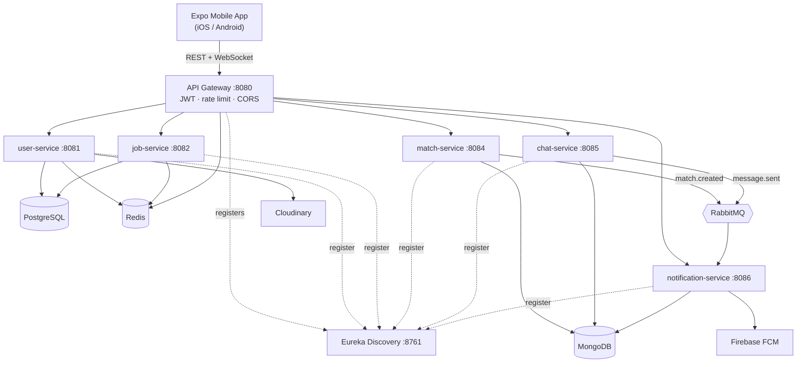

# Linder

> Swipe to get hired — a Tinder-style job-matching platform where seekers and recruiters match, then chat in real time.

## Overview

Linder reimagines job discovery as a two-sided swiping experience. Job seekers swipe on postings; recruiters swipe on candidates for specific roles. When both sides swipe right on the same job, a **mutual match** is created and a private, real-time chat channel is unlocked — mirroring the double opt-in model that made dating apps engaging, applied to hiring.

The system is a **monorepo** containing a cross-platform mobile app and a Spring Cloud microservices backend:

- **`app/`** — a React Native + Expo mobile client (iOS & Android) with an offline-first architecture, real-time chat over STOMP/WebSocket, and push notifications.
- **`backend/`** — seven Java microservices (Eureka discovery, an API gateway, and five domain services) using polyglot persistence across PostgreSQL, MongoDB, Redis and RabbitMQ.
- **`docs/`** — architecture, API design, and database-schema documentation.

Scope at a glance: ~231 Java files across the backend, ~161 TypeScript/TSX files in the mobile app.

## Key Features

- **Two-sided swiping** — seekers swipe on jobs, recruiters swipe on candidates for a given role; left = pass, right = interested, up = super-like (premium).
- **Mutual-match detection** — a match document is created only when both parties swipe right on the same job, unlocking chat between them.
- **Compatibility scoring** — the job feed ranks postings with a weighted match score (skills, salary, location, experience, job type) plus human-readable match reasons.
- **Real-time chat** — STOMP-over-WebSocket messaging with typing indicators, delivery/read receipts, and image/file attachments.
- **Push notifications** — event-driven fan-out via RabbitMQ to a notification service that delivers Firebase Cloud Messaging (FCM) pushes to registered devices.
- **Recruiter hiring pipeline** — matches progress through a status lifecycle (`NEW → VIEWED → CHATTING → INTERVIEW → OFFERED → HIRED`), with job analytics (viewers, view stats).
- **Offline-first mobile** — swipes, messages and profile edits are queued locally and synced automatically when connectivity returns.
- **Secure auth** — email/password registration with OTP verification, JWT issued by the user service and validated centrally at the gateway.

## Tech Stack

Linder is a **native mobile app** (Expo/React Native) talking to a **Spring Cloud microservices backend**.

| Layer | Technology |
|-------|------------|
| Mobile framework | React Native 0.81 + Expo SDK 54, React 19, TypeScript 5.9 |
| Mobile state | Redux Toolkit + Redux Persist (via `expo-secure-store`) |
| Mobile navigation / UI | React Navigation 7, Reanimated |
| Real-time (client) | STOMP over WebSocket (`@stomp/stompjs` + `sockjs-client`) |
| Mobile networking | Axios; Expo Notifications (FCM); Cloudinary uploads |
| Mobile build | native `ios/` + `android/` projects, EAS build |
| Backend language | Java 17 |
| Backend framework | Spring Boot 3.2, Spring Cloud 2023.0.0 (Maven multi-module) |
| Service discovery | Netflix Eureka |
| API gateway | Spring Cloud Gateway (JWT, Redis rate limiting, CORS) |
| Relational store | PostgreSQL 15 (Flyway migrations) |
| Document store | MongoDB 7 |
| Cache / rate limit | Redis 7 |
| Messaging | RabbitMQ 3 (topic exchanges, dead-letter queues) |
| Push / media | Firebase Cloud Messaging, Cloudinary |
| Observability | Spring Actuator + Prometheus, SpringDoc OpenAPI |

## Architecture at a Glance



## Status

**v0.2 — Phase 2 complete.** All seven backend services are implemented (auth, profiles, jobs, swiping/matching, real-time chat, push notifications) and the mobile app supports the full seeker and recruiter journeys end to end. Backend infrastructure runs via `docker-compose` (PostgreSQL, MongoDB, Redis, RabbitMQ) with services launched through Maven; the mobile app runs via Expo. Phase 3 (advanced analytics, interview scheduling) is in preparation.

## Repository Layout

```
linder/
├── app/                     # React Native + Expo mobile client
│   ├── src/
│   │   ├── api/             # Axios clients (auth, jobs, chat, notifications)
│   │   ├── screens/         # Auth, Home/Swipe, Matches, Chat, Profile
│   │   ├── navigation/      # React Navigation stacks + bottom tabs
│   │   ├── store/           # Redux Toolkit slices + Redux Persist
│   │   ├── services/        # socketService, offlineQueueService, notificationService
│   │   └── components / hooks / contexts / theme / types / utils
│   ├── ios/ · android/      # native projects (EAS build)
├── backend/                 # Spring Cloud microservices (Maven multi-module)
│   ├── discovery-server/    # Eureka  :8761
│   ├── api-gateway/         # Spring Cloud Gateway  :8080
│   ├── user-service/        # auth + profiles  :8081  (PostgreSQL + Redis)
│   ├── job-service/         # jobs + feed  :8082  (PostgreSQL + Redis)
│   ├── match-service/       # swipes + matches  :8084  (MongoDB)
│   ├── chat-service/        # real-time chat  :8085  (MongoDB + RabbitMQ + WS)
│   ├── notification-service/# push + in-app  :8086  (MongoDB + RabbitMQ + FCM)
│   ├── common/              # shared DTOs, exceptions, utils
│   └── docker-compose.yml   # PostgreSQL, MongoDB, Redis, RabbitMQ
└── docs/                    # architecture, API design, DB schema, monitoring
```

## Running Locally

1. **Infra** — `docker-compose up` under `backend/` starts PostgreSQL, MongoDB, Redis and RabbitMQ.
2. **Services** — start the discovery server, then the gateway and domain services via Maven; each registers with Eureka and exposes Actuator health + SpringDoc OpenAPI.
3. **App** — from `app/`, run the Expo dev server and launch on an iOS/Android simulator or device; the client points at the gateway's `/api` base and `/ws` WebSocket endpoint.

## Highlights

- **Polyglot persistence by design** — relational data (users, jobs) in PostgreSQL; high-write, schema-flexible data (swipes, matches, messages, notifications) in MongoDB; ephemeral data (cache, rate-limit counters) in Redis.
- **Event-driven decoupling** — the match and chat services never call the notification service directly; they publish events to RabbitMQ topic exchanges (with dead-letter queues) and let the notification service react.
- **Centralized edge security** — JWT is validated once at the gateway, which strips the token and forwards trusted `X-User-Id` / `X-User-Role` headers downstream, keeping domain services stateless and simple.
- **Offline-first mobile UX** — a persistent, prioritized action queue makes swiping and messaging feel instant even on flaky networks.

## Docs

- [High-Level Design (HLD)](./HLD.md) — system context, service responsibilities, data stores, cross-cutting concerns, and key trade-offs.
- [Low-Level Design (LLD)](./LLD.md) — module breakdown, API surface, data model, core algorithms, and security design.
- [Key Flows (FLOWS.md)](./FLOWS.md) — sequence diagrams for onboarding, matching, chat, push, job creation, and offline sync.
