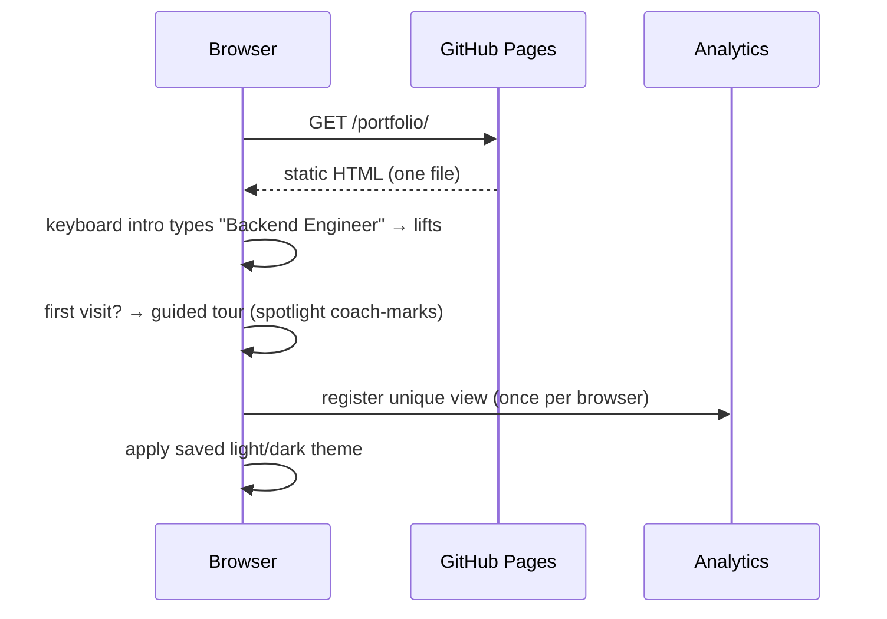
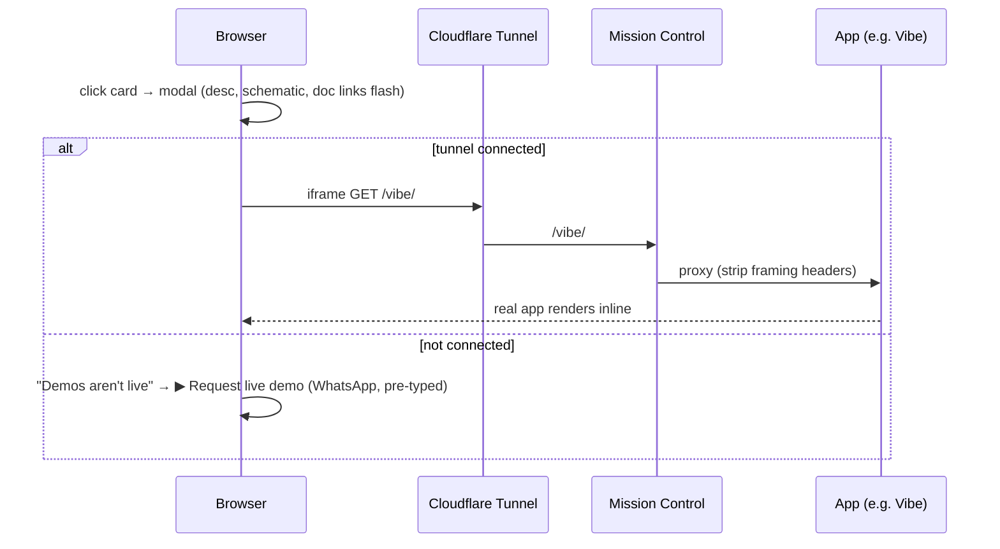
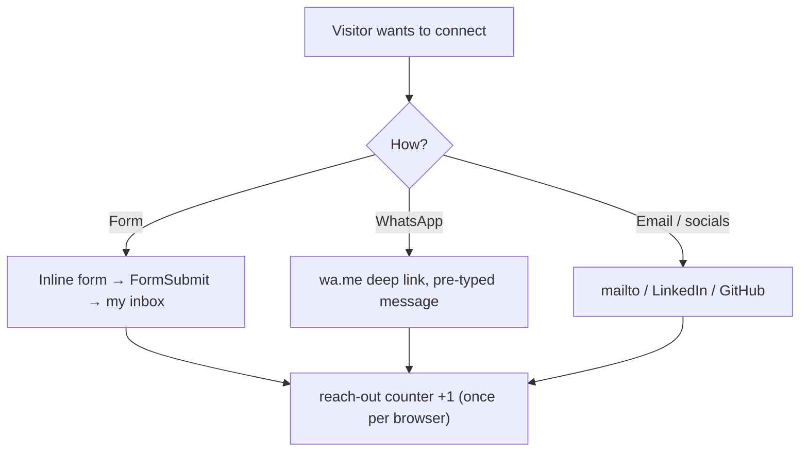

# This Portfolio — Flows

## 1. First page load



## 2. Exploring a project + live demo



## 3. Reaching out



## 4. Bringing the whole thing live for a demo

```bash
# 1. control plane
cd hub && HUB_TOKEN="" node server.js           # :8088

# 2. public URL (no interstitial)
cloudflared tunnel --url http://localhost:8088   # → https://<name>.trycloudflare.com

# 3. toggle apps on from the dashboard (each on its own port, SSE boot terminal)

# 4. paste the tunnel URL into the portfolio → every card embeds its running app
```

## 5. What a visitor sees when demos are off
- Site, intro, tour, docs, counters, analytics, contact — **all still fully work** (they're public/always-on).
- Only the in-card live previews swap to a **"request live demo" WhatsApp** button — nothing looks broken.
