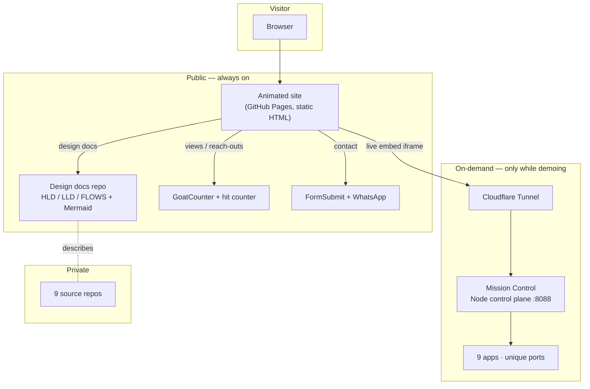

# This Portfolio — High-Level Design

## Purpose

Present my work as **living, running software** — not screenshots — from a single link, while keeping source code private and paying nothing for always-on infrastructure.

## System overview



## The four layers

| Layer | What it does | Built with |
|---|---|---|
| **Presentation** | Animated site, keyboard intro, guided tour, theming, project modals | Hand-written HTML/CSS/JS on GitHub Pages |
| **Engagement** | View/reach counters, analytics, contact form + WhatsApp | GoatCounter, a hit counter, FormSubmit, WhatsApp deep links |
| **Live demos** | Runs & streams all 9 apps into the site | Node zero-dep control plane + Cloudflare Tunnel |
| **Content & code** | Public design docs; private source | Markdown + Mermaid (public), private git repos |

## How a live demo reaches the browser

```
Browser → project card <iframe src="https://<tunnel>/vibe/">
        → Cloudflare Tunnel
        → Mission Control (localhost:8088)  [reverse proxy, strip X-Frame-Options/CSP]
        → Vibe frontend (localhost:5273, base-pathed /vibe)
        → the real app renders inline in the portfolio
```

Mission Control is **one component** of this system — the piece responsible for the "live demo" layer. Its own internal design is detailed in [LLD](./LLD.md).

## Key decisions

| Decision | Why |
|---|---|
| **Static single-file site** | Zero build/deploy friction; instantly hostable; nothing to break. |
| **Live demos on-demand, not cloud-hosted** | 9 full stacks 24/7 is expensive & pointless; run them only while demoing. |
| **Cloudflare Tunnel over ngrok** | No interstitial page → iframes actually load. |
| **Public docs, private code** | Show the engineering ideas without giving away source. |
| **Zero-dependency control plane** | Portable, auditable, safe to expose behind a token. |
| **Graceful fallback** | Off-hours visitors get a WhatsApp CTA, never a broken frame. |

## Non-goals
- Not a CMS or a framework SPA — deliberately a hand-authored page.
- Not always-on demo hosting — demos are a live, attended experience.
