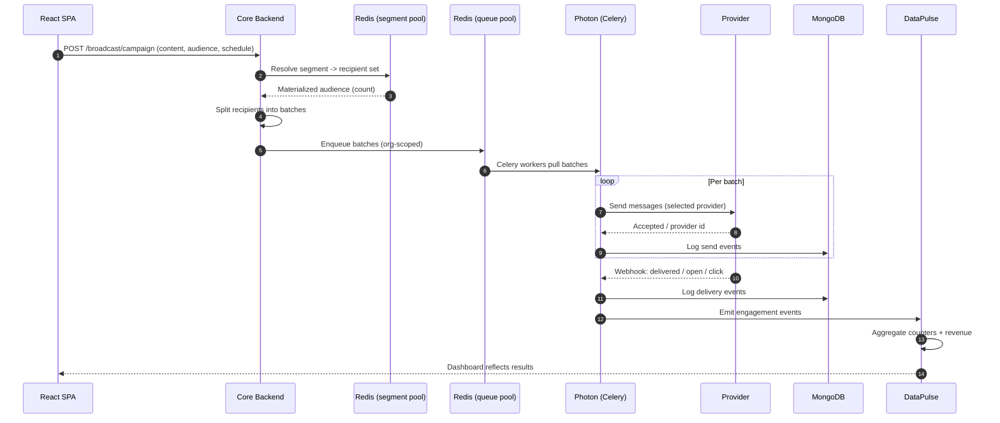
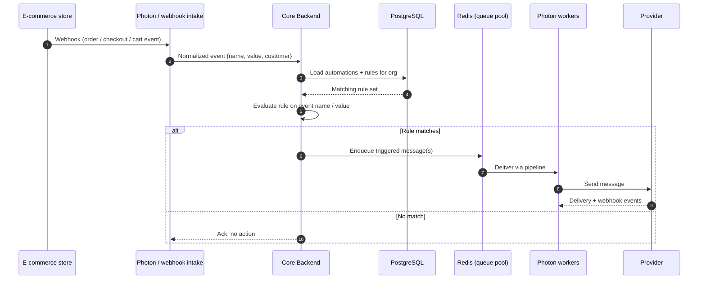
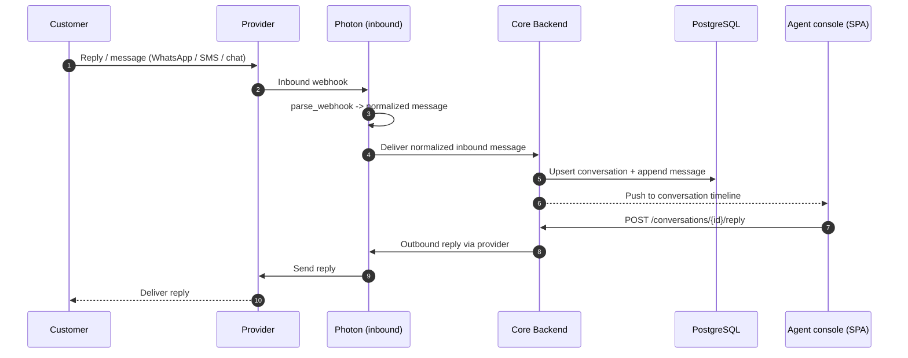
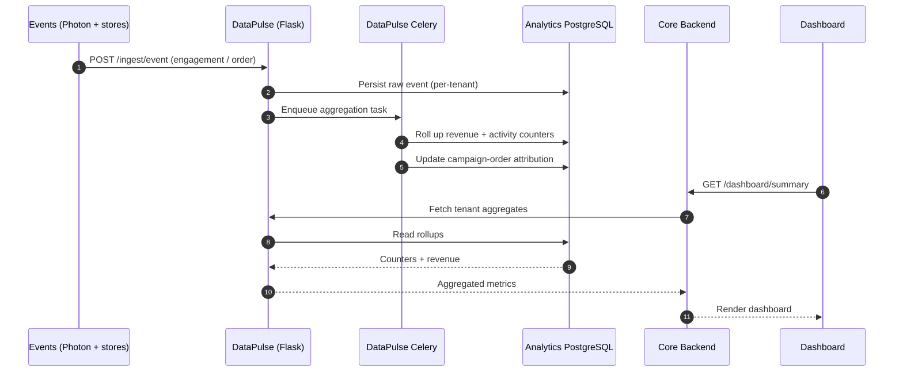

# Retaint — Key Flows

**Sanitized architecture case study of a proprietary multi-tenant platform — brands, domains and internal identifiers omitted.**

Each flow below shows the runtime interaction across services. All identifiers, providers and stores are generic.

---

## 1. Authentication & Session

```mermaid
sequenceDiagram
    autonumber
    participant U as User
    participant SPA as React SPA
    participant API as Core Backend
    participant PG as PostgreSQL
    participant RC as Redis (cache pool)

    U->>SPA: Enter credentials
    SPA->>API: POST /auth/login
    API->>PG: Verify user + password hash
    PG-->>API: User record
    API->>RC: Create session, store token
    API-->>SPA: Auth token + session cookie
    SPA->>API: GET /auth/org/list (token)
    API->>PG: Orgs for user
    PG-->>API: Org list
    SPA->>API: POST /auth/org/select {orgId}
    API->>RC: Bind session -> organization context
    API-->>SPA: Tenant context set
    Note over SPA,API: Every later request carries the token;<br/>backend resolves the organization on each call.
```

A user authenticates once; the backend issues a token and a server-side session in the Redis cache pool. Because a user may belong to several organizations, an explicit **org-select** step binds the active tenant to the session. From then on, tenant resolution happens on every request, and all data access is scoped by the organization key.

---

## 2. Campaign Broadcast (End-to-End)



The merchant composes a campaign in the editor (content → audience → schedule → review). On launch, the backend **resolves the audience** against the Redis segment pool, splits recipients into **batches**, and enqueues them on the Redis queue pool. Photon's Celery workers deliver each batch through the tenant's selected provider, logging every send to MongoDB. Provider **webhooks** later report delivery, opens and clicks, which flow to DataPulse for aggregation — closing the loop on the analytics dashboard. This is the path that carries millions of messages per campaign window.

---

## 3. Event-Triggered Automation (E-commerce Webhook)



E-commerce platforms (Shopify and others) post events via webhook. The event is normalized and handed to the automation engine, which loads the organization's automations and **evaluates rules on the event name and value** (e.g. order placed over a threshold, checkout started). Matching rules enqueue triggered messages onto **the same delivery pipeline** used by broadcasts — so automations and campaigns share one hardened send path.

---

## 4. Inbound Message → Conversation / Live Chat



Inbound messages from any channel arrive as provider webhooks. Each provider adapter's `parse_webhook` normalizes them into one canonical message shape, which the backend threads into a **conversation** (creating or appending). Agents see a unified timeline in the console and reply through the same provider abstraction — so a WhatsApp thread, an SMS thread and a live-chat thread all behave identically to the agent.

---

## 5. Analytics Ingestion → Dashboard



Engagement events from delivery and order/catalog events from stores are **ingested** into per-tenant analytics tables. Celery aggregation tasks roll raw events into **revenue and activity counters** and maintain **campaign-order attribution**. Dashboards read these pre-aggregated rollups, keeping reporting fast and fully isolated from the transactional core and the live delivery path.

---

## 6. Scheduled Job — Abandoned Cart (Cron Dispatcher)

```mermaid
sequenceDiagram
    autonumber
    participant CRON as External cron dispatcher
    participant API as Core Backend (job handler)
    participant APG as Analytics PostgreSQL
    participant PG as PostgreSQL
    participant RQ as Redis (queue pool)
    participant W as Photon workers
    participant PR as Provider

    CRON->>API: Trigger abandoned-cart job (per org)
    API->>APG: Find checkouts abandoned in window
    APG-->>API: Candidate customers
    API->>PG: Check suppression / recent contact
    PG-->>API: Eligible recipients
    API->>RQ: Enqueue recovery messages
    RQ->>W: Deliver via pipeline
    W->>PR: Send recovery message
    PR-->>W: Delivery webhook -> analytics
    Note over CRON,API: Job endpoints are idempotent;<br/>in-process scheduler disabled in production.
```

Recurring work runs via the **external cron dispatcher**, which invokes idempotent job endpoints (campaign scheduling, counter persistence, billing consolidation, abandoned cart/checkout). In the abandoned-cart example, the job finds checkouts abandoned within a time window from analytics data, filters out suppressed or recently-contacted customers, and enqueues recovery messages onto the **shared delivery pipeline** — the same one broadcasts and automations use. Because every job is idempotent, a re-fired trigger never double-sends.
