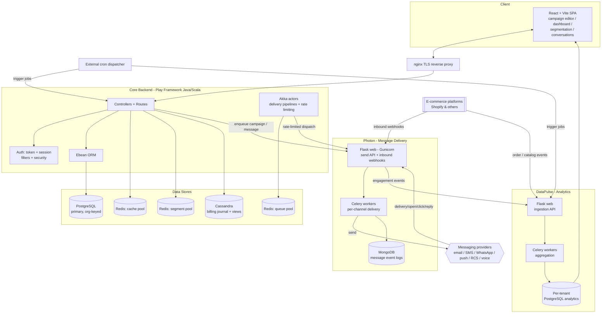

# Retaint — High-Level Design

**Sanitized architecture case study of a proprietary multi-tenant platform — brands, domains and internal identifiers omitted.**

## Context & Goals

Retaint is a multi-tenant SaaS marketing-automation and customer-engagement platform. A single deployment serves many merchant organizations, each fully isolated, and the same codebase is white-labeled for several brands chosen at build time.

Design goals that shaped the architecture:

- **High delivery throughput** — a single broadcast can target millions of recipients across multiple channels; delivery must be horizontally scalable and decoupled from the request path.
- **Channel & provider independence** — email, SMS, WhatsApp, push, RCS and voice each have several interchangeable providers; the platform must add or fail over providers without touching campaign logic.
- **Real-time + analytical workloads** — live delivery, inbound conversations and rate limiting need low-latency stores; revenue and engagement reporting need aggregation-friendly stores. These are deliberately separated.
- **Strict tenant isolation** — every record, segment, queue and dashboard is scoped by organization.
- **Operability at scale** — long-running work runs as workers and externally-scheduled jobs, never inside a web request.

## Architecture Overview

## Component Responsibilities

| Component | Responsibility |
|---|---|
| **React + Vite SPA** | Campaign editor (content → audience → schedule → review), analytics dashboards, segmentation UI, conversations/live-chat console. Talks only to the Core Backend. |
| **Core Backend (Play)** | System of record and orchestrator. Auth, tenant resolution, campaign/segment/automation modelling (Ebean over PostgreSQL), audience resolution via Redis, billing/wallet accounting, and dispatch of delivery work to Photon. Hosts Akka actors for delivery pipelines and rate limiting. |
| **Akka actor system** | In-process concurrent pipelines (delivery runners, notifiers, rate limiters) that pace and fan out work between the backend and the delivery service. |
| **Photon (delivery)** | Channel-agnostic send service. Flask web tier exposes the send API and receives inbound provider webhooks; Celery workers deliver in batches per channel through the provider abstraction; message events logged to MongoDB. |
| **DataPulse (analytics)** | Ingests engagement and e-commerce events, syncs orders/customers/products from stores, and aggregates per-tenant counters and revenue (Celery) into PostgreSQL for dashboards. |
| **External cron dispatcher** | Owns all recurring work — campaign scheduling, abandoned cart/checkout, counter persistence, billing consolidation — by hitting job endpoints. The in-process scheduler is disabled in production. |
| **nginx TLS reverse proxy** | TLS termination and routing to the SPA and service tiers. |

## Data Stores — Polyglot Persistence Rationale

| Store | Used for | Why |
|---|---|---|
| **PostgreSQL (primary)** | Organizations, users, campaigns, segments, automations, integrations, wallet — via Ebean. | Strong relational model, transactions and constraints for the system of record; org-keyed rows for tenant isolation. |
| **PostgreSQL (per-tenant analytics)** | Orders, customers, products, engagement counters, revenue rollups. | Analytical workloads are isolated from the transactional core so heavy aggregation never contends with the request path. |
| **Redis — cache pool** | Hot lookups, session/token data, config. | Sub-millisecond reads on the request path. |
| **Redis — queue pool** | Delivery/work queues bridging backend → workers. | Simple, fast, durable-enough queues for batch fan-out. |
| **Redis — segment pool** | Resolved audience sets and segment membership. | Set operations (union/intersect/diff) make audience math cheap and fast. |
| **Cassandra** | Billing journal and denormalized activity / recommendation views. | Append-heavy, high-write journal and wide denormalized read views scale linearly and tolerate node loss. |
| **MongoDB** | Per-message delivery event logs. | Schemaless, high-volume write path for heterogeneous provider event payloads. |

## Cross-Cutting Concerns

- **Multi-tenancy by organization.** Every request resolves an organization context; data access, queues, segments and dashboards are all keyed by org. Users can belong to multiple orgs and switch context.
- **Redis-backed queues & segments.** Decoupling delivery from the request path (queue pool) and doing audience math in Redis sets (segment pool) is what makes million-recipient broadcasts feasible.
- **Akka delivery & rate limiting.** Delivery runners and rate limiters are modelled as actors, giving bounded concurrency and back-pressure without blocking web threads, and per-tenant/per-provider throttling.
- **Provider abstraction.** Each channel defines a common send/receive contract; concrete providers implement it. Providers are selected per tenant/channel and can fail over, all behind one interface.
- **White-labeling at build time.** Branding, theming and enabled feature set are baked per white-label brand during the build, so one codebase produces multiple branded products.
- **Separation of real-time and analytical paths.** Delivery/inbound (Photon + MongoDB + Redis) is kept independent from reporting (DataPulse + analytics PostgreSQL), so a reporting spike never slows message delivery.

## Key Design Decisions & Trade-offs

| Decision | Rationale | Trade-off |
|---|---|---|
| **Separate delivery microservice (Photon)** | Isolates the high-throughput, provider-heavy send path; scales and deploys independently of the core. | Cross-service contract and eventual consistency between core state and delivery logs. |
| **Separate analytics service (DataPulse)** | Keeps expensive aggregation and store-sync off the transactional core. | Duplicated/denormalized data; ingestion lag on dashboards. |
| **Polyglot persistence (PG + Redis + Cassandra + MongoDB)** | Each workload gets a store fit for its access pattern. | Operational complexity — four data technologies to run and reason about. |
| **External cron dispatcher over in-process scheduler** | Centralized, observable scheduling; jobs survive app restarts and scale independently. | Requires an external system; job endpoints must be idempotent. |
| **Redis for both queues and segment math** | One fast primitive covers fan-out queuing and set-based audience resolution. | Redis becomes a critical-path dependency requiring careful capacity planning. |
| **Akka actors for delivery/rate-limiting** | Bounded concurrency and back-pressure without thread-per-task blocking. | Actor model adds a learning curve and its own supervision concerns. |
