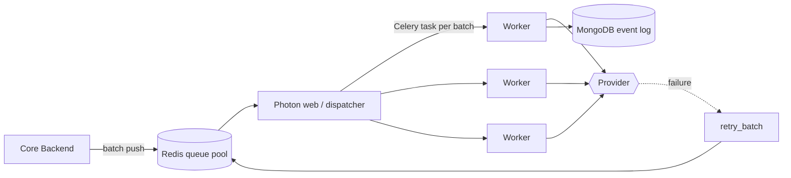
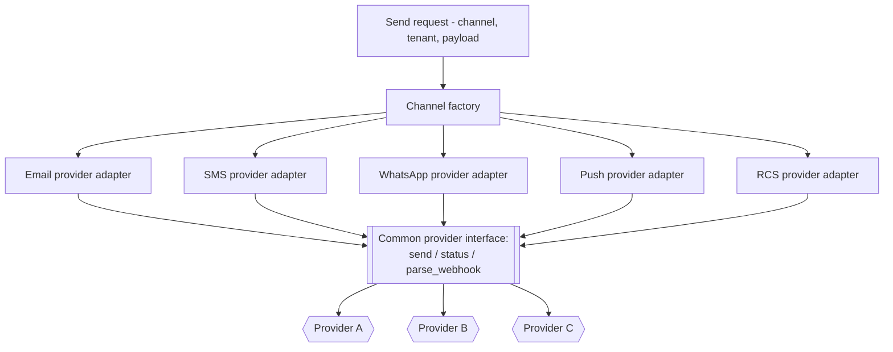

# Retaint — Low-Level Design

**Sanitized architecture case study of a proprietary multi-tenant platform — brands, domains and internal identifiers omitted.** All paths below are illustrative and generic; no secrets, hostnames or provider identifiers are shown.

## Service & Module Breakdown

### Core Backend (Play — Java/Scala)

| Module area | Responsibility |
|---|---|
| `controllers` | HTTP entry points, grouped by domain route files (broadcast, segments, dashboard, webhooks, conversations, integrations, auth). |
| `security` / `filters` | Token + session auth, request filters, tenant (organization) resolution. |
| `models` | Ebean entities per domain: campaigns, broadcasts, segments, automations, integrations, SMS/WhatsApp/RCS/push, live-chat, conversations, wallet/payment, user profiles. |
| `redisModels` | Redis-backed counters and structures (e.g. growth/activity counters) used for real-time metrics. |
| `cassandra` | Billing journal and denormalized activity/segment/order views. |
| `akkasystem` | Actor `protocol`s and `runner`s for delivery pipelines, notifications, rate limiting and background fan-out. |
| `scheduler` | Scheduled-job handlers invoked by the external cron dispatcher (see Scheduled-Job Model). |
| `hook` / `factory` / `drivers` | Provider/integration wiring and outbound clients. |

### Photon — Message Delivery (Python)

| Module | Responsibility |
|---|---|
| `mailer`, `sms`, `whatsapp`, `rcs`, `pushnotification`, `otp` | Per-channel controllers + Celery `tasks`. |
| `campaign_helpers` | Batch build/send helpers per channel plus `retry_batch` for failed-batch retries. |
| `conversation` | Inbound message handling and conversation normalization. |
| `cluster` | Worker/node coordination and job views. |
| `baseapp` / `app` | Flask app factory, Gunicorn entry, blueprint registration. |

### DataPulse — Analytics (Python)

| Module | Responsibility |
|---|---|
| `controllers` | Ingestion and read endpoints: `data_ingestor`, `order`, `customer`, `product`, `segment`, `summary`, `performance`, `tenant`, `job`. |
| `jobs` | Store-sync jobs per e-commerce platform (orders, customers, products, checkouts, refunds) and RFM/attribution analysis. |
| `tasks` | Celery tasks for segment pre-caching and counter refresh. |
| `models` / `queries` | SQLAlchemy models and query builders over per-tenant analytics PostgreSQL. |
| `job_healer` | Detects and re-runs failed/stuck ingestion jobs. |

### Web Frontend (React + Vite)

| Area | Pages / modules |
|---|---|
| Campaign | `CampaignEditor`, `Broadcast`, `CampaignsPage` — content → audience → schedule → review. |
| Audience | `AudiencePage`, segmentation UI. |
| Automation | `AutomationBuilder`, `AutomationPage`. |
| Analytics | `Dashboard`, `DashboardPage`, `LiveActivitiesPage`. |
| Conversations | `ConversationsPage`, chatbot editor. |
| Channels & integrations | per-channel and per-store settings pages. |
| `api/` | Thin typed clients (`client.js`, `conversationAPI`, `onsiteAPI`, …) wrapping backend routes. |

## Representative API / Endpoint Areas

Generic shapes only — grouped by the backend route files they map to.

| Domain | Example endpoints | Notes |
|---|---|---|
| **Auth** | `POST /auth/login`, `POST /auth/token/refresh`, `GET /auth/session`, `POST /auth/org/select` | Token + session; org selection sets tenant context. |
| **Broadcast / campaign** | `POST /broadcast/campaign`, `POST /broadcast/campaign/{id}/schedule`, `POST /broadcast/campaign/{id}/send`, `GET /broadcast/campaign/{id}/status` | Compose, schedule, launch, monitor. |
| **Segments** | `POST /segments`, `POST /segments/{id}/resolve`, `GET /segments/{id}/count` | Resolve materializes membership into the Redis segment pool. |
| **Automations** | `POST /automations`, `POST /automations/{id}/rules`, `GET /automations/{id}/runs` | Event-name/value rule sets. |
| **Dashboard / analytics** | `GET /dashboard/summary`, `GET /dashboard/revenue`, `GET /dashboard/engagement` | Reads per-tenant analytics PostgreSQL via DataPulse. |
| **Inbound webhooks** | `POST /webhook/provider/{channel}`, `POST /webhook/store/{platform}` | Delivery/open/click/reply events and e-commerce events; verified and tenant-scoped. |
| **Conversations** | `GET /conversations`, `GET /conversations/{id}`, `POST /conversations/{id}/reply` | Unified inbound/outbound timeline for live chat. |
| **Delivery (Photon)** | `POST /send/{channel}` (internal), `POST /inbound/{provider}` | Internal send contract from core; inbound provider callbacks. |
| **Ingestion (DataPulse)** | `POST /ingest/event`, `POST /ingest/order`, `POST /jobs/{name}/run` | Engagement/e-commerce ingestion and job triggers. |

## Queueing & Worker Model

- **Batching.** The core resolves an audience segment and pushes recipients in **batches** onto the Redis queue pool rather than one message per queue item — this keeps queue volume and worker overhead low at million-recipient scale.
- **Celery workers** pull batches and deliver per channel. Concurrency is bounded per channel/provider so a slow provider cannot starve others.
- **Rate limiting** is enforced both by Akka actors on the core side (pacing dispatch) and by per-provider limits on the worker side.
- **Retry.** Failed batches route to `retry_batch` with backoff; permanently failed recipients are recorded and surfaced in analytics.
- **Event logging.** Every send and every provider callback is written to MongoDB, decoupled from campaign state in PostgreSQL.

## Multi-Channel Provider Abstraction

- Each **channel** exposes a common contract (`send`, `status`, `parse_webhook`). Concrete **provider adapters** implement it.
- Provider selection is **per tenant + per channel**, resolved at send time, enabling per-tenant provider assignment, cost routing and **failover** without changing campaign code.
- Inbound webhooks are normalized by the same adapter's `parse_webhook`, so delivery receipts and replies land in one canonical event shape regardless of provider.

## Analytics Counter / Aggregation Model

- **Real-time counters** (opens, clicks, deliveries, growth) live in Redis (`redisModels`) for instant dashboard tiles, then are periodically **persisted/consolidated** into PostgreSQL by scheduled jobs.
- **Event ingestion** into DataPulse writes raw engagement/e-commerce events, which Celery aggregation tasks roll up into per-tenant **revenue** and **activity** counters and **campaign-order attribution** maps.
- **Store sync jobs** pull orders/customers/products/checkouts per e-commerce platform into per-tenant analytics tables that back segmentation and revenue reporting.

## Scheduled-Job Model

The in-process scheduler is disabled in production; the **external cron dispatcher** invokes idempotent job endpoints. Representative jobs:

| Job | Purpose |
|---|---|
| Broadcast campaign scheduler | Launches campaigns whose scheduled time has arrived. |
| Broadcast action (bulk) scheduler | Fans out queued broadcast delivery actions. |
| Event-rule action scheduler | Evaluates pending automation rules and fires actions. |
| Live-segment / activity-segment refresh | Recomputes dynamic segment membership. |
| Counter persist / consolidation | Flushes Redis counters to PostgreSQL. |
| Billing / debit consolidation | Rolls up wallet debits into the Cassandra billing journal. |
| Abandoned cart / checkout | Detects abandonment windows and triggers recovery journeys. |

## Notable Patterns

- **Event-driven** — webhooks and queue events drive delivery, automation and analytics.
- **Worker pools** — Celery for delivery/analytics, Akka actors for in-core concurrency.
- **Polyglot persistence** — store chosen per access pattern (see HLD).
- **Multi-tenant isolation** — organization key threaded through every layer, queue and dataset.
- **Provider abstraction / adapter pattern** — uniform contract over many messaging providers.
- **CQRS-ish separation** — transactional core (PostgreSQL) vs. read-optimized analytics (separate PostgreSQL) and denormalized Cassandra views.
