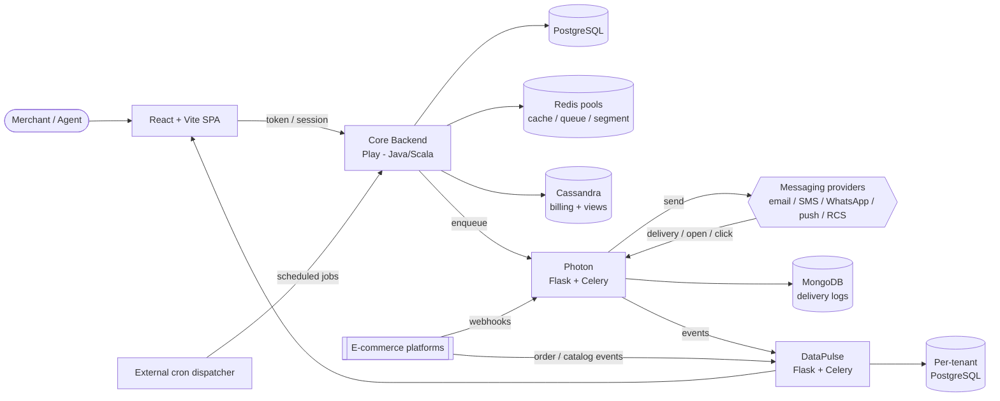

# Retaint — Omnichannel Marketing Automation Platform

> Broadcast, automate and converse with customers across every channel — email, SMS, WhatsApp, push, RCS and live chat — from one multi-tenant SaaS.

**Sanitized architecture case study of a proprietary multi-tenant platform — brands, domains and internal identifiers omitted.**

---

## Context & Problem

Direct-to-consumer merchants run their customer lifecycle across a fragmented set of tools: one product for email, another for SMS, a third for on-site popups, and yet more for analytics and support. Each silo has its own audience list, its own reporting, and no shared view of the customer.

**Retaint** consolidates this into a single multi-tenant platform (comparable in scope to Klaviyo or MoEngage). A merchant connects their store, and from one workspace can:

- Segment their audience on behaviour, order history and engagement.
- Send one-off **broadcast** campaigns or long-running **event-triggered automations**.
- Reach customers across **six channels** through a large pool of interchangeable messaging providers.
- Talk to customers in real time via **live chat / conversations**.
- Measure engagement and attributed revenue on analytics **dashboards**.

The platform is delivered as several cooperating services and is **white-labeled** for multiple brands, selected at build time.

## Key Features

| Capability | Description |
|---|---|
| **Audience segmentation** | Rule-based and behavioural segments resolved against Redis-backed audience sets and Cassandra activity data. |
| **Multi-channel broadcast** | Compose once, deliver to email / SMS / WhatsApp / push / RCS at high throughput (millions of messages). |
| **Event-triggered automations** | E-commerce webhook events (order, checkout, cart, etc.) evaluated against rules to fire journeys automatically. |
| **Live chat & conversations** | Inbound provider webhooks normalized into a unified conversation timeline for agents. |
| **Engagement & revenue analytics** | Per-tenant dashboards for delivery, opens, clicks, and campaign-attributed revenue. |
| **E-commerce integrations** | Deep integration with Shopify and other e-commerce platforms via webhooks and catalog/order sync. |
| **Multi-tenancy & white-labeling** | Every tenant isolated by organization key; UI and branding themed per white-label at build time. |

## Tech Stack

| Layer | Technology |
|---|---|
| **Core Backend / API** | Play Framework (Java, some Scala), Ebean ORM, Akka actors |
| **Web Frontend** | React + Vite SPA |
| **Message Delivery** ("Photon") | Python — Flask (Gunicorn) web + Celery workers |
| **Analytics** ("DataPulse") | Python — Flask + Celery + SQLAlchemy |
| **Primary datastore** | PostgreSQL (core + per-tenant analytics) |
| **Cache / queues / segments** | Redis (multiple logical pools) |
| **Billing & denormalized views** | Cassandra |
| **Message-delivery logs** | MongoDB |
| **Scheduling** | External cron dispatcher (in-process scheduler disabled in prod) |
| **Delivery & infra** | Docker, docker-compose, container registry, cloud VMs / Kubernetes, nginx TLS reverse proxy |

## High-Level Architecture

## Role & Scale Highlights

**Kumar Srajan — Senior Software Engineer.** Built major parts of the platform end to end:

- Designed and shipped an **end-to-end marketing-automation tool** integrating Shopify (and other e-commerce) webhooks into a rule-driven automation engine.
- Built a **high-throughput broadcast system** delivering **millions of messages** across six channels and many interchangeable providers.
- Worked across the polyglot stack: Play/Java core, Python delivery & analytics services, React frontend, and the polyglot persistence layer (PostgreSQL, Redis, Cassandra, MongoDB).

**Scale characteristics:** multi-tenant (organization-keyed isolation), six delivery channels, many pluggable providers, millions of messages per campaign window, and separate real-time and analytical data paths.

## Engineering Challenges

- **Throughput without blocking the request path.** Audiences are resolved as Redis set operations and pushed to workers as *batches*, not per-message queue items, so a single launch can address millions of recipients without overwhelming queues or web threads. Akka actors pace dispatch and apply per-tenant / per-provider rate limits.
- **Channel & provider churn.** Six channels and many interchangeable providers sit behind one `send / status / parse_webhook` contract, so onboarding a new provider or failing one over is a configuration change, not a rewrite.
- **Two data personalities.** The transactional core (PostgreSQL, Ebean) is kept strictly separate from the read-optimized analytics store (a second PostgreSQL) and the append-heavy Cassandra billing/activity views — a reporting spike can never slow message delivery.
- **Operational recurring work.** All scheduled work (campaign launch, abandoned cart, counter persistence, billing consolidation) runs as *idempotent* endpoints driven by an external cron dispatcher, so restarts and re-fires never double-send or double-bill.
- **One codebase, many brands.** White-label branding and feature flags are resolved at build time, producing several branded products from a single source tree.

## Documentation

- [High-Level Design (HLD.md)](./HLD.md) — architecture, component responsibilities, datastore rationale, cross-cutting concerns, key decisions.
- [Low-Level Design (LLD.md)](./LLD.md) — module breakdown, endpoint areas, queueing & worker model, provider abstraction, analytics model.
- [Flows (FLOWS.md)](./FLOWS.md) — sequence diagrams for auth, broadcast, automations, inbound conversations, analytics, and scheduled jobs.
