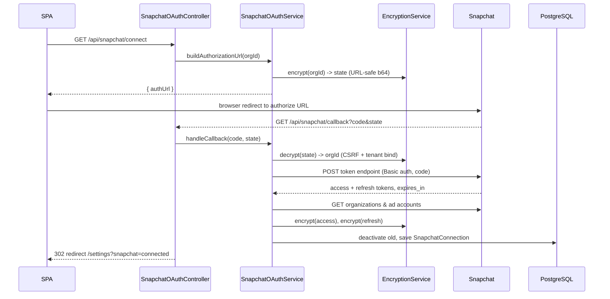
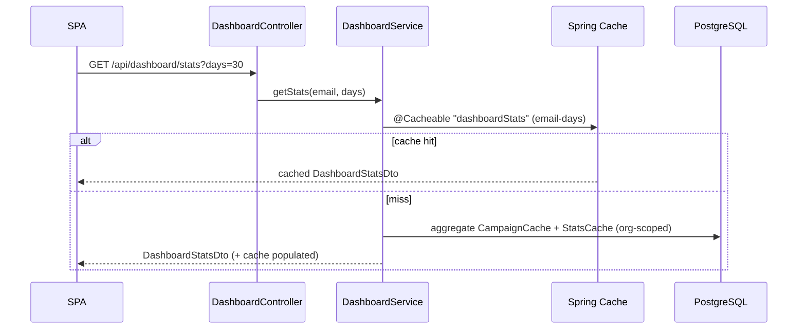
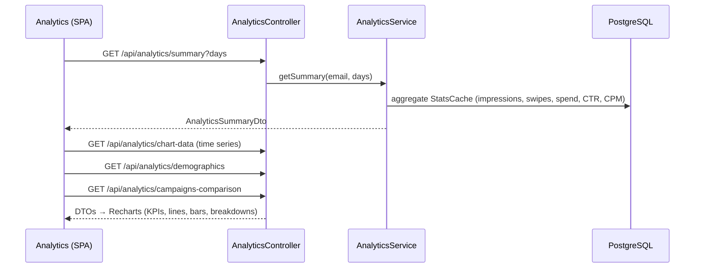
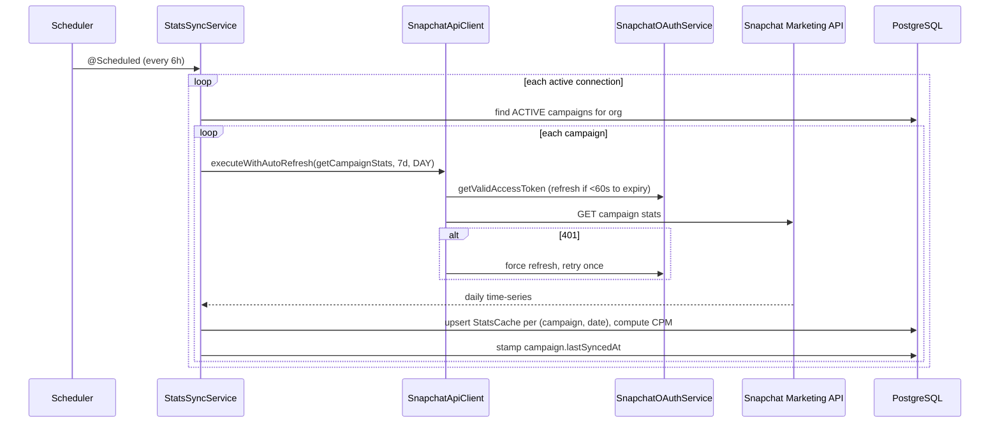

# SnapAds Pro — Key Flows

Each flow below pairs a sequence diagram with a short walkthrough. Actors are the **SPA**
(React), the **API** (Spring Boot controllers + services), **PostgreSQL**, and **Snapchat**
(OAuth + Marketing API).

## 1. Authentication — Signup / Login → JWT access + refresh

```mermaid
sequenceDiagram
    participant SPA
    participant Auth as AuthController
    participant Svc as AuthService
    participant DB as PostgreSQL
    SPA->>Auth: POST /api/auth/login {email, password}
    Auth->>Svc: login(request)
    Svc->>DB: find user by email
    Svc->>Svc: BCrypt verify password
    Svc->>Svc: JwtUtil.generateAccessToken (24h)
    Svc->>Svc: JwtUtil.generateRefreshToken (7d)
    Svc-->>SPA: { accessToken, refreshToken, user }
    Note over SPA: store tokens (Zustand);<br/>Axios adds Authorization: Bearer <access>
    SPA->>Auth: POST /api/auth/refresh {refreshToken}
    Auth->>Svc: refreshToken(request)
    Svc->>Svc: validate token_type == "refresh", not expired
    Svc-->>SPA: { new accessToken }
```

**Walkthrough.** Signup creates a `User` (and an `Organization` when applicable, making the
first user an `ADMIN`) with a BCrypt-hashed password. Login verifies credentials and issues
two tokens carrying a `token_type` claim. The SPA keeps them in a Zustand store; an Axios
interceptor attaches the access token to every request. When the short-lived access token
expires, the SPA silently calls `/api/auth/refresh` — the API only accepts a token whose
`token_type` is `refresh`, so an access token can't be replayed here and vice-versa.

## 2. Snapchat Account Connection (OAuth 2.0)



**Walkthrough.** The connect endpoint returns an authorize URL whose `state` is the caller's
**encrypted organization id** — this both binds the callback to a tenant and provides CSRF
protection. Snapchat redirects the browser back to the public `/callback` endpoint, where
the service decrypts `state`, exchanges the `code` for tokens (HTTP Basic with client id/
secret), fetches the first ad account, and stores a `SnapchatConnection` with **encrypted**
access/refresh tokens. Any prior active connection is deactivated first. The user lands back
in the SPA settings page with a success flag.

## 3. Campaign Creation Wizard → Orchestrated Snapchat API calls

```mermaid
sequenceDiagram
    participant SPA as Wizard (SPA)
    participant CampC as CampaignController
    participant Create as CampaignCreationService
    participant Api as SnapchatApiClient
    participant Snap as Snapchat Marketing API
    participant DB as PostgreSQL
    Note over SPA: Step 1 details → 2 targeting → 3 creative → 4 review
    SPA->>CampC: POST /api/campaigns (FullCampaignRequest)
    CampC->>Create: createFullCampaign(request, email)
    Create->>Create: resolve org + active connection, valid token
    Create->>Api: createCampaign(...)
    Api->>Snap: POST campaign
    Create->>Api: createAdSquad(... targeting)
    Api->>Snap: POST ad squad
    Create->>Api: createCreative(...)
    Api->>Snap: POST creative
    Create->>Api: createAd(creative → ad squad)
    Api->>Snap: POST ad
    alt any step fails
        Create->>Api: deleteCampaign(...) (rollback)
    else success
        Create->>DB: save CampaignCache (4 IDs + jsonb)
        opt launch requested
            Create->>Api: activate campaign/adsquad/ad
        end
    end
    Create-->>SPA: CampaignDto (201 Created)
```

**Walkthrough.** The 4-step wizard collects everything into one `FullCampaignRequest`. The
server does the hard part: it converts budgets to micro-currency, maps the chosen objective
to Snapchat's objective + optimization goal, and builds a targeting spec (geo, age bands,
gender, interests). It then creates the four Snapchat objects **in order** — campaign, ad
squad, creative, ad — since each depends on the previous. If any call fails, a best-effort
rollback deletes the campaign so no half-built objects remain. On success the four returned
IDs and the original request are cached in `CampaignCache`, and — if the user chose to launch
— all objects are flipped to `ACTIVE`.

## 4. Dashboard Stats



**Walkthrough.** The dashboard reads exclusively from local caches — never live from
Snapchat — so it's fast and cheap. `DashboardService.getStats` is `@Cacheable` keyed by
user + window, aggregating `CampaignCache` and `StatsCache` rows scoped to the caller's
organization. Chart data (`/chart-data`) is cached the same way; recent activity is drawn
from `AuditLog`.

## 5. Analytics — Summary / Time-series / Demographics



**Walkthrough.** The analytics page fans out to several read endpoints — summary KPIs,
time-series chart data, audience demographics, and per-campaign comparison — all computed
from the `StatsCache` table and rendered with Recharts. Because everything reads from the
local cache, the whole page loads without a single outbound Snapchat call. A manual
`POST /api/analytics/sync` lets a user force fresh data on demand.

## 6. Stats Sync & Caching



**Walkthrough.** A scheduled job runs every 6 hours over all active connections, pulling the
last 7 days of daily stats for each active campaign. Token freshness is handled
transparently: `getValidAccessToken` refreshes within a 60-second expiry buffer, and
`executeWithAutoRefresh` retries once on a 401 with a freshly refreshed token. Each returned
day is **upserted** into `StatsCache` (unique on campaign + date) with a computed CPM, and
the campaign's `lastSyncedAt` is updated — this is exactly the data the dashboard and
analytics flows read back.
