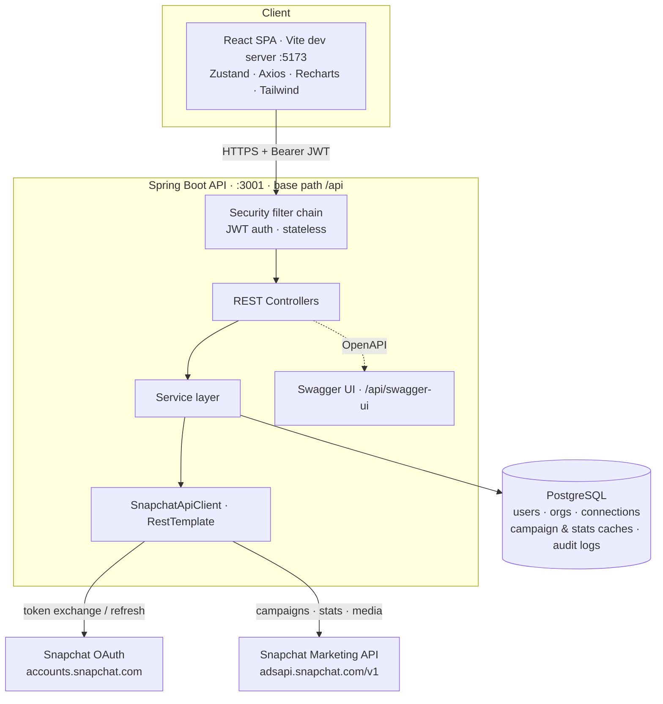

# SnapAds Pro — High-Level Design

## Context & Goals

SnapAds Pro is a B2B SaaS product that abstracts the Snapchat Marketing API behind a
friendly dashboard so marketing teams can run Snapchat ad campaigns without touching raw
API calls. The design targets four goals:

1. **Single connection, full lifecycle** — connect a Snapchat Ads account once via OAuth,
   then create, launch, and monitor campaigns.
2. **Multi-tenant isolation** — every artifact is scoped to an `Organization`; users,
   connections, campaigns, and stats never cross tenant boundaries.
3. **Secure custody of third-party credentials** — OAuth tokens are encrypted at rest and
   auto-refreshed, so an operator never handles them manually.
4. **Fast, cheap analytics** — performance data is cached locally and synced on a schedule
   rather than fetched live on every dashboard load.

## Architecture Diagram

The frontend calls the API under the `/api` prefix; all controllers are mapped there
(there is no separate servlet context path). CORS permits the SPA origin
(`http://localhost:5173` by default).

## Components & Responsibilities

| Component | Responsibility |
|-----------|----------------|
| **AuthController** (`/api/auth`) | Signup, login, token refresh, forgot/reset password |
| **SnapchatOAuthController** (`/api/snapchat`) | Build authorize URL, handle OAuth callback, report connection status, disconnect |
| **CampaignController** (`/api/campaigns`) | List (paged), detail, create (wizard), update, status change, delete, duplicate |
| **DashboardController** (`/api/dashboard`) | Aggregate KPI stats, chart data, recent activity |
| **AnalyticsController** (`/api/analytics`) | Summary, time-series chart data, campaign comparison, demographics, manual sync |
| **MediaController** (`/api/media`) | Multipart creative upload proxied to Snapchat |
| **AuthService / JwtUtil** | Credential verification, access + refresh token issue/validate |
| **SnapchatOAuthService** | Authorization URL + state, code→token exchange, encrypted token storage, refresh |
| **SnapchatApiClient** | All Marketing API HTTP calls via `RestTemplate`, with auto-refresh-on-401 wrapper |
| **CampaignCreationService** | Orchestrates campaign → ad squad → creative → ad creation and rollback |
| **StatsSyncService** | Scheduled + on-demand pull of daily stats into `StatsCache` |
| **DashboardService / AnalyticsService** | Read models over cached data, some `@Cacheable` |
| **EncryptionService** | AES-256-GCM encrypt/decrypt of sensitive values |
| **SecurityConfig / JwtAuthenticationFilter** | Stateless filter chain, public-endpoint allowlist, BCrypt |
| **config.*** | `CorsConfig`, `CacheConfig`, `OpenApiConfig`, `RestTemplateConfig`, `JpaAuditingConfig`, `SnapchatProperties`, `DataSeeder` |

## Data Stores

**PostgreSQL** is the single source of truth. Entities (all UUID-keyed via a shared
`BaseEntity` with JPA auditing timestamps):

- Identity & tenancy: `User`, `Organization`, `Subscription` (+ `Plan`, `Role`,
  `SubscriptionStatus` enums).
- Integration: `SnapchatConnection` (encrypted access/refresh tokens, ad-account binding).
- Caches: `CampaignCache` (Snapchat object IDs + denormalized campaign fields, plus a
  `jsonb` blob of the original request) and `StatsCache` (one row per campaign per day).
- Audit: `AuditLog` (org/user, action, entity ref, `jsonb` details, IP).

Schema is managed by Hibernate `ddl-auto: update`; a `DataSeeder` populates a demo
organization, users, campaigns, stats, and audit logs on first run.

**Spring Cache (in-memory)** sits in front of a few expensive read paths (e.g. dashboard
stats and chart data) using the default concurrent-map cache manager and `@EnableCaching`.

## External Integrations

- **Snapchat OAuth** — `accounts.snapchat.com/login/oauth2` for the authorize and token
  endpoints. The platform requests the `snapchat-marketing-api` scope and uses HTTP Basic
  (client id / secret) for token and refresh exchanges.
- **Snapchat Marketing API v1** — `adsapi.snapchat.com/v1` for organizations, ad accounts,
  campaigns, ad squads, creatives, ads, media upload, and stats. All calls go through
  `SnapchatApiClient` over `RestTemplate`, with typed request/response DTOs under
  `dto.snapchat`.

## Cross-Cutting Concerns

- **Authentication** — stateless JWT. `AuthService` issues a short-lived **access token**
  (24h) and a longer **refresh token** (7d), distinguished by a `token_type` claim so a
  refresh token can never be used as an access token.
- **Token vault** — Snapchat access/refresh tokens are AES-256-GCM encrypted by
  `EncryptionService` before persistence and decrypted only in-memory for outbound calls.
- **Multi-tenancy** — services resolve the caller's `Organization` from the authenticated
  principal and filter every query by `organization_id`.
- **Caching** — Spring Cache reduces repeated read work; `StatsCache` reduces outbound API
  volume.
- **CORS** — configurable allowed origins for the SPA.
- **API documentation** — OpenAPI via springdoc; Swagger UI served at `/api/swagger-ui`,
  raw docs at `/api/docs`.

## Key Design Decisions & Trade-offs

- **Organization-based multi-tenancy (shared schema).** A single set of tables scoped by
  `organization_id` keeps the model simple and cheap to operate. Trade-off: isolation is
  enforced in application code rather than by physical separation, so query-level scoping
  discipline matters.
- **Encrypted token vault instead of plaintext.** Storing OAuth tokens AES-256-GCM
  encrypted protects the most sensitive data even if the database is compromised, at the
  cost of a symmetric key that must be managed as a secret (env-injected, never committed).
- **Cache-and-sync analytics instead of live reads.** A scheduled sync into `StatsCache`
  (every 6 hours) plus `@Cacheable` read paths keeps dashboards fast and well under
  Snapchat rate limits; the trade-off is bounded staleness, mitigated by a manual
  `/api/analytics/sync` trigger.
- **Server-side campaign orchestration.** Concentrating the campaign→ad-squad→creative→ad
  sequence in `CampaignCreationService` gives one place to handle unit conversion,
  objective mapping, and rollback — the client stays thin and never sees Snapchat's object
  graph. Trade-off: the orchestration is a multi-write operation across an external system,
  so partial-failure handling (rollback) is a first-class concern.
