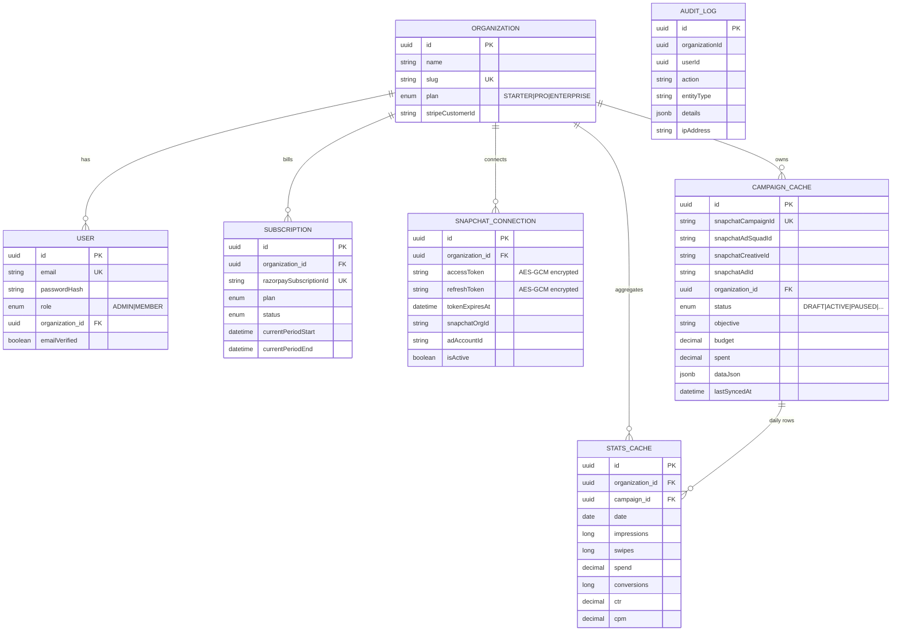

# SnapAds Pro — Low-Level Design

## Module / Package Breakdown

Backend root package: `com.snapadspro`

| Package | Contents |
|---------|----------|
| `config` | `SecurityConfig`-adjacent wiring: `CorsConfig`, `CacheConfig` (`@EnableCaching`), `OpenApiConfig`, `RestTemplateConfig`, `JpaAuditingConfig`, `SnapchatProperties` (typed OAuth/API config), `DataSeeder` (demo data) |
| `controller` | REST endpoints: `AuthController`, `SnapchatOAuthController`, `CampaignController`, `DashboardController`, `AnalyticsController`, `MediaController` |
| `dto` | Request/response records + `dto.snapchat.*` typed Marketing-API models; MapStruct mappers (`UserMapper`, `CampaignMapper`) |
| `entity` | JPA entities extending `BaseEntity`, plus enums (`Plan`, `Role`, `CampaignStatus`, `SubscriptionStatus`) |
| `exception` | Domain exceptions (`ResourceNotFoundException`, `DuplicateResourceException`, `SnapchatApiException`, `SnapchatRateLimitException`, `SnapchatOAuthException`, `InvalidTokenException`) + `GlobalExceptionHandler` |
| `repository` | Spring Data JPA repositories for each aggregate |
| `security` | `JwtUtil`, `JwtProperties`, `JwtAuthenticationFilter`, `UserDetailsServiceImpl` |
| `service` | Business logic: `AuthService`, `SnapchatOAuthService`, `SnapchatApiClient`, `CampaignService`, `CampaignCreationService`, `StatsSyncService`, `DashboardService`, `AnalyticsService`, `EncryptionService` |

Frontend (`frontend/src`) mirrors this by feature: `pages/` (auth, dashboard, campaigns +
`wizard`, analytics, media, team, settings, billing), `components/` (auth, layout, ui),
`services/` (Axios API clients per domain), `store/` (Zustand stores), and `hooks/`.

## Key API Endpoints

| Method | Path | Purpose |
|--------|------|---------|
| POST | `/api/auth/signup` | Create user (+ organization); returns access + refresh tokens |
| POST | `/api/auth/login` | Authenticate; returns tokens |
| POST | `/api/auth/refresh` | Exchange a valid refresh token for a new access token |
| POST | `/api/auth/forgot-password` | Issue a password-reset token |
| POST | `/api/auth/reset-password` | Set a new password using a reset token |
| GET | `/api/snapchat/connect` | Return the Snapchat authorize URL (state = encrypted org id) |
| GET | `/api/snapchat/callback` | OAuth redirect target (public); exchanges code, stores tokens, redirects to SPA |
| GET | `/api/snapchat/status` | Current connection status for the org |
| POST | `/api/snapchat/disconnect` | Deactivate the active connection |
| GET | `/api/campaigns` | Paged campaign list |
| GET | `/api/campaigns/{id}` | Campaign detail |
| POST | `/api/campaigns` | **Create campaign** from wizard payload (`FullCampaignRequest`) |
| PUT | `/api/campaigns/{id}` | Update campaign |
| PATCH | `/api/campaigns/{id}/status` | Pause / activate / archive |
| DELETE | `/api/campaigns/{id}` | Delete campaign |
| POST | `/api/campaigns/{id}/duplicate` | Clone a campaign |
| GET | `/api/dashboard/stats` | KPI summary |
| GET | `/api/dashboard/chart-data` | Dashboard time series |
| GET | `/api/dashboard/recent-activity` | Recent audit activity |
| GET | `/api/analytics/summary` | Aggregated analytics summary |
| GET | `/api/analytics/chart-data` | Time-series metrics |
| GET | `/api/analytics/campaigns-comparison` | Per-campaign comparison |
| GET | `/api/analytics/demographics` | Audience demographic breakdown |
| POST | `/api/analytics/sync` | Trigger an on-demand stats sync |
| POST | `/api/media/upload` | Multipart creative upload to Snapchat |

## Core Data Model

`StatsCache` carries a unique constraint on `(campaign_id, date)` so daily stats are
upserted rather than duplicated. `CampaignCache.snapchatCampaignId` is unique, tying each
local row to exactly one Snapchat campaign.

## Key Logic

**CampaignCreationService — orchestration.** `createFullCampaign(request, email)` resolves
the caller's org and active `SnapchatConnection`, then performs a 4-step fan-out against
`SnapchatApiClient`:

1. `createCampaign` → 2. `createAdSquad` (with geo/age/gender/interest **targeting** built
from the request) → 3. `createCreative` → 4. `createAd` (linking creative to ad squad).

Budgets are converted to Snapchat's micro-currency (×1,000,000), and product objectives are
translated through `OBJECTIVE_MAP` / `OPTIMIZATION_GOAL_MAP`. On success it persists all
four returned IDs into a `CampaignCache` row (plus the raw request as `jsonb`). If any step
throws, a best-effort **rollback** deletes the already-created campaign so no orphaned
objects linger on Snapchat. If the wizard requests launch, `activateAll` flips campaign, ad
squad, and ad to `ACTIVE`.

**StatsSyncService — stats into caches.** A `@Scheduled` job (cron every 6 hours) iterates
active connections; `syncOrganization(orgId)` is also callable on demand. For each `ACTIVE`
campaign it fetches the last 7 days of `DAY`-granularity time-series via
`executeWithAutoRefresh`, then **upserts** a `StatsCache` row per day — computing CPM as
`spend × 1000 / impressions`. `lastSyncedAt` is stamped on the campaign.

**EncryptionService — AES for tokens.** AES-256-GCM (`AES/GCM/NoPadding`) with a random
12-byte IV per value and a 128-bit auth tag. Ciphertext is stored as
`base64(IV ‖ ciphertext ‖ tag)`; the 256-bit key is supplied as 64 hex chars from
configuration and validated at startup.

**Token refresh.** `SnapchatOAuthService.getValidAccessToken(orgId)` returns a decrypted
access token, but if it expires within a 60-second buffer it first calls
`refreshAccessToken` (HTTP Basic + `grant_type=refresh_token`), re-encrypts and stores the
new tokens, and marks the connection inactive if refresh fails. `SnapchatApiClient`
additionally wraps calls in `executeWithAutoRefresh`, retrying once with a fresh token on a
401.

## Security Design

- **JWT filter chain.** `JwtAuthenticationFilter` runs before
  `UsernamePasswordAuthenticationFilter`, extracts the bearer token, validates it via
  `JwtUtil`, and populates the `SecurityContext`. The chain is **stateless**
  (`SessionCreationPolicy.STATELESS`), CSRF disabled (token-based API).
- **Public allowlist.** Only `/api/auth/**`, `/api/snapchat/callback`, and the Swagger/
  docs paths are permitted without a token; everything else requires authentication.
- **Access vs refresh tokens.** Both carry a `token_type` claim; access-token validation
  rejects refresh tokens and vice-versa, so a leaked refresh token cannot call the API
  directly. Passwords are BCrypt-hashed.
- **Encrypted third-party tokens.** Snapchat OAuth tokens live encrypted at rest; the OAuth
  `state` parameter is itself an encrypted (URL-safe base64) organization id, giving CSRF
  protection and tenant binding on the callback.

## Notable Patterns

- **Multi-tenant scoping** — every read/write is filtered by the authenticated user's
  `organization_id`.
- **DTO mapping via MapStruct** — entities never leak to the wire; `UserMapper` /
  `CampaignMapper` generate the boilerplate.
- **Cache-aside** — `StatsCache` / `CampaignCache` tables and `@Cacheable` read methods
  serve the UI, with scheduled/refresh paths repopulating them.
- **Adapter / anti-corruption layer** — `SnapchatApiClient` + `dto.snapchat` isolate
  Snapchat's API shape from the internal domain model.
- **Typed configuration** — `SnapchatProperties` / `JwtProperties` bind external config
  into validated beans.
