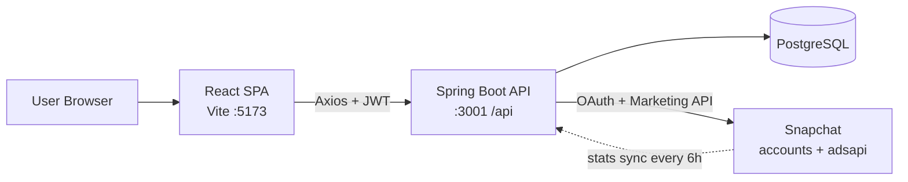

# SnapAds Pro

**A multi-tenant SaaS platform for creating, launching, and monitoring Snapchat advertising campaigns — from OAuth account connection through a guided campaign wizard to a real-time analytics dashboard.**

---

## Overview

SnapAds Pro is a self-serve marketing platform that lets an organization connect its
Snapchat Ads account once (via OAuth), then manage the full campaign lifecycle from a
single React dashboard. The backend orchestrates the Snapchat Marketing API — turning a
single "create campaign" request into the four coordinated objects Snapchat actually
requires (campaign → ad squad → creative → ad) — while caching campaign metadata and
daily performance stats in PostgreSQL to keep the UI fast and to limit outbound API calls.

The system is **multi-tenant**: every user belongs to an `Organization`, and all data
(connections, campaigns, stats, audit logs) is scoped to that organization. Third-party
OAuth tokens are never stored in plaintext — they are encrypted with AES-256-GCM before
they touch the database.

## Key Features

- **Snapchat account connection via OAuth 2.0** — authorize once, tokens are exchanged,
  encrypted, and stored; the platform auto-refreshes them before expiry.
- **Guided campaign-creation wizard** — a 4-step flow (details → targeting → creative →
  review) that the backend fans out into orchestrated Snapchat Marketing API calls, with
  rollback on partial failure.
- **Analytics dashboard** — summary KPIs, time-series charts, campaign comparison, and
  audience demographics rendered with Recharts.
- **Stats caching & scheduled sync** — a background job pulls daily campaign stats into a
  local cache every 6 hours, so dashboards read from PostgreSQL instead of Snapchat.
- **Media library** — upload creative assets straight through to the Snapchat ad account.
- **Team management & multi-tenancy** — organization-scoped users with `ADMIN` / `MEMBER`
  roles.
- **Billing & subscription plans** — `STARTER` / `PRO` / `ENTERPRISE` tiers per org.
- **JWT auth with refresh tokens** — stateless access tokens plus long-lived refresh
  tokens, password reset flow, and BCrypt-hashed credentials.

## Tech Stack

| Layer        | Technology |
|--------------|------------|
| Frontend     | React 19, Vite 8, React Router 7, Zustand 5, Axios, Recharts 3, Tailwind CSS 4, lucide-react |
| Backend      | Java 17, Spring Boot 3.2.5 (Web, Security, Data JPA, Validation, Cache), Maven |
| Auth         | JWT (jjwt 0.12.5) access + refresh tokens, BCrypt, Spring Security |
| Persistence  | PostgreSQL, Spring Data JPA / Hibernate (`ddl-auto: update`) |
| Mapping      | MapStruct 1.5.5 + Lombok |
| Integration  | Snapchat OAuth + Marketing API v1 via RestTemplate |
| Crypto       | AES-256-GCM (JCE) for OAuth token storage at rest |
| API docs     | springdoc / OpenAPI (Swagger UI) |

## Architecture at a Glance

## Status

**In active development.** Core flows — auth, Snapchat OAuth connection, campaign creation
orchestration, dashboard, analytics, and stats sync — are implemented (~100 Java files,
~64 JS/JSX files). No deployment tooling yet; containerization via Docker is planned.

## Highlights

- **Encrypted OAuth token vault** — access and refresh tokens are AES-256-GCM encrypted by
  a dedicated `EncryptionService` (random 12-byte IV per value, 128-bit auth tag) before
  persistence, and transparently decrypted only when an outbound call needs them.
- **Campaign-creation orchestration** — one user action becomes a coordinated sequence of
  Snapchat API writes, with unit conversion (dollars → micro-currency), objective mapping,
  and best-effort rollback if any step fails.
- **Analytics without hammering the API** — a scheduled `StatsSyncService` upserts daily
  stats into a `StatsCache` table, and dashboard queries are additionally served through
  Spring Cache, keeping the UI responsive and API usage low.

## Docs

- [High-Level Design (HLD.md)](./HLD.md) — architecture, components, data stores, integrations, design decisions.
- [Low-Level Design (LLD.md)](./LLD.md) — package breakdown, endpoints, data model, core logic, security.
- [Flows (FLOWS.md)](./FLOWS.md) — sequence diagrams for auth, OAuth connect, campaign wizard, dashboard, analytics, and stats sync.
