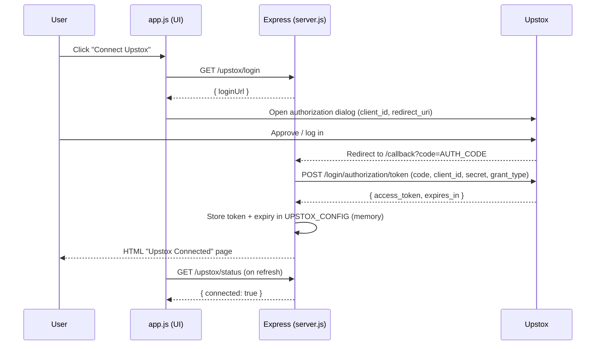
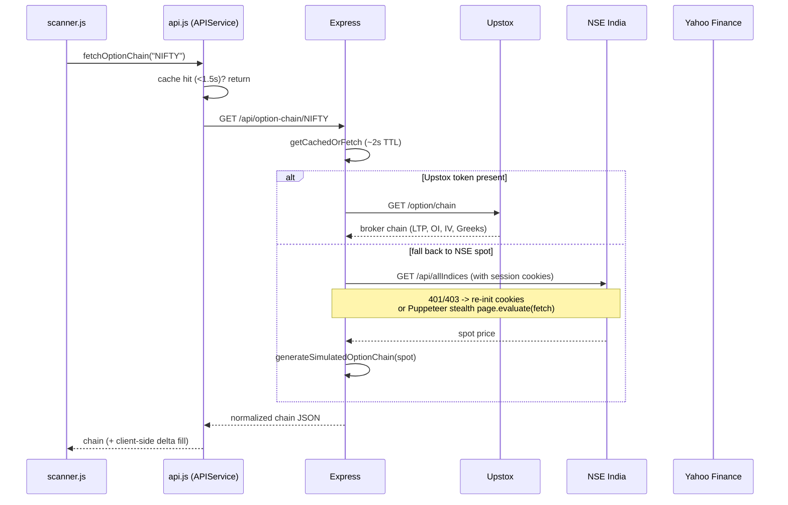
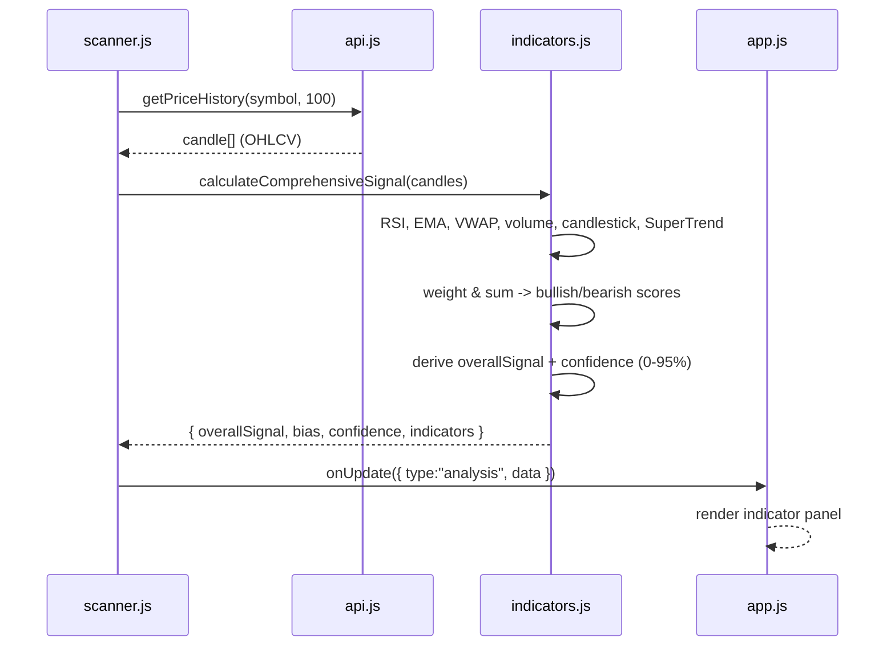
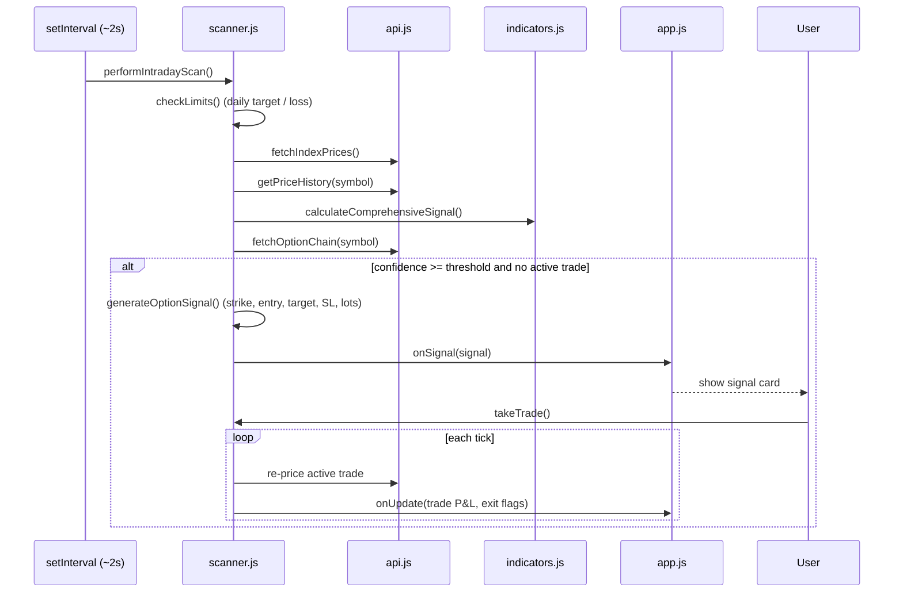

# Trading Assistant — Key Flows

Sequence diagrams and walkthroughs for the five core runtime flows.

## 1. Upstox OAuth Token Flow



**Walkthrough.** The UI asks the backend for the authorization URL (`getUpstoxLoginUrl` builds it from the configured `client_id` and `redirect_uri`) and opens Upstox's login dialog. After the user consents, Upstox redirects to `/callback` with a one-time `code`. The backend exchanges that code for an `access_token` server-side and keeps it, plus `tokenExpiry`, only in the in-memory `UPSTOX_CONFIG` — the browser never touches the client secret or the token. On the next dashboard load, `/upstox/status` compares `Date.now()` to `tokenExpiry` and tells the UI whether to show "connected" or prompt a re-login. The redirect URI runs through an ngrok HTTPS tunnel in development.

## 2. Data Fetch / Proxy Flow (with NSE stealth)



**Walkthrough.** The client always calls the backend, never an upstream directly — this dodges CORS and hides credentials. Both the client (1.5s) and server (~2s) short-circuit on cache hits so a 2s scan loop doesn't hammer providers. For option chains the backend prefers Upstox when authenticated; otherwise it fetches the NSE spot and builds a realistic simulated chain. NSE access is the tricky part: `fetchNSE` sends browser-like headers plus a bootstrapped cookie string and, on a 401/403, re-initializes the session; for hard bot-gating the backend can drive a **`puppeteer-extra` + stealth** headless Chrome that loads NSE and runs the API `fetch` from inside the real page context. Every source is coerced into the one normalized chain shape before returning.

## 3. Indicator Computation Flow



**Walkthrough.** The scanner pulls the latest ~100 candles and hands them to the shared `indicators.js`. `calculateComprehensiveSignal` computes each indicator, then accumulates weighted bullish and bearish scores (EMA 30, RSI 25, VWAP 20, SuperTrend 15, volume 10, candlestick 10, plus a price-action nudge). The net score maps to a signal from STRONG_SELL to STRONG_BUY, and confidence blends dominant-score strength, indicator agreement, and a base floor, capped at 95%. The exact same module runs server-side inside the silver engine — one implementation, no drift.

## 4. Real-Time Scanning Loop



**Walkthrough.** A 2-second interval drives the intraday scanner. Each pass first honors risk guardrails (`checkLimits` halts new trades once the daily target or loss limit is hit), refreshes prices, rotates between NIFTY and BANKNIFTY, recomputes the composite signal, and pulls the option chain. If confidence clears the configured minimum and no trade is open, it builds a concrete signal — 1-strike-OTM CE/PE, entry band, 15% target, 15% stop, and lot sizing from the per-trade risk budget — and pushes it to the UI via the `onSignal` callback. Once the user takes the (paper) trade, subsequent ticks re-price it from the live chain, update P&L, and raise TARGET_HIT / STOP_LOSS_HIT flags. BTST scans run on demand rather than on the loop.

## 5. Simulation Fallback When Backend Unavailable

```mermaid
sequenceDiagram
    participant APP as app.js
    participant API as api.js (APIService)
    participant SRV as Express

    APP->>API: (startup) checkBackend()
    API->>SRV: GET /api/health
    alt backend healthy
        SRV-->>API: 200 { status:"ok" }
        API->>API: useBackend = true (badge: "Live Data")
    else unreachable / error
        API--xSRV: timeout / non-200
        API->>API: useBackend = false; initializeHistory()
        API->>API: badge: "Simulated"
    end
    Note over API: subsequent fetchIndexPrices / fetchOptionChain /<br/>fetchStockData return synthetic but same-shape data
    APP->>API: fetchOptionChain(symbol)
    API-->>APP: simulateOptionChain() (PCR, max-pain, Greeks)
```

**Walkthrough.** At startup `APIService.checkBackend()` pings `/api/health`. On any failure it flips `useBackend = false`, seeds 100 periods of random-walk candle history, and flags the dashboard "Simulated." From then on every data method returns synthetic data with the identical structure the backend would produce — index random walks, a full option chain complete with computed PCR, max-pain, and approximate Greeks, and a 20-symbol stock universe. Individual live calls can also trip this flag mid-session (a failed backend fetch sets `useBackend = false` and falls through to simulation), so the dashboard degrades smoothly instead of erroring — important when the market is closed or the backend is down.
