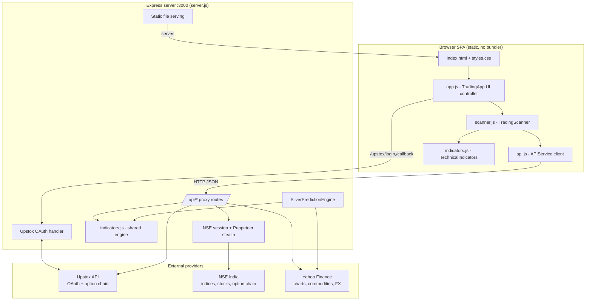

# Trading Assistant — High-Level Design

## Context & Goals

Trading Assistant helps an NSE intraday/BTST trader answer one question quickly: *"is there a high-probability options or stock trade right now, and at what entry/target/stop?"* It aggregates live market data, runs a technical-analysis pipeline, and renders ranked signals in a browser dashboard.

Design goals:

- **Reliable market data despite hostile upstreams.** NSE blocks scripted/CORS access and Upstox requires per-user OAuth; the system must work around both without leaking browser-side secrets.
- **A single source of truth for indicator math**, reused on both server and client.
- **Always-on demoability** — the UI must render something sensible even with the market closed or the backend down.
- **Zero-infrastructure footprint** — no database, no build step; `node server.js` and a browser is the whole stack.

## Architecture Diagram

The browser is a static SPA served by the same Express process that proxies data (`app.use(express.static(__dirname))` plus an `app.get('*')` catch-all that returns `index.html` for non-`/api` paths). All outbound calls to Upstox, NSE, and Yahoo originate from the backend.

## Components & Responsibilities

| Component | File | Responsibilities |
|---|---|---|
| **Backend proxy / BFF** | `server.js` (~1629 lines) | Serves static frontend; proxies and normalizes NSE / Yahoo / Upstox data into a stable JSON contract; runs Upstox OAuth (login URL, code exchange, token status); hosts the server-side silver prediction engine; manages the NSE cookie session and Puppeteer stealth browser; in-memory response caching. |
| **Shared indicator engine** | `indicators.js` (~614 lines) | `TechnicalIndicators` class: RSI, EMA, VWAP, SuperTrend/ATR, volume analysis, candlestick patterns, a weighted `calculateComprehensiveSignal`, and simplified option Greeks. Exported via `module.exports` for Node **and** attached as a global for the browser — one implementation, two runtimes. |
| **Browser scanners** | `scanner.js` (~624 lines) | `TradingScanner` class: intraday-options scanner (interval loop), BTST stock scanner, BTST options scanner; signal generation with entry/target/SL and position sizing; paper-trade lifecycle (take/update/exit); daily stats, limits, and history in `localStorage`. |
| **Browser API client** | `api.js` (~577 lines) | `APIService` class: talks to backend `/api/*`; a 1.5s response cache; health check to detect backend; a full **simulation fallback** (indices, option chain with PCR/max-pain, stock universe) when the backend is down; formatting and market-hours helpers. |
| **UI controller** | `app.js` (~993 lines) | `TradingApp` class: tabbed dashboard (Intraday / BTST Stocks / BTST Options), renders signals, active-trade card, indicator panels, option-chain summary, and silver predictions; wires buttons, keyboard shortcuts, settings modal, paper-trading toggle, and toasts. |

## Data Stores

**There is no database.** All state is either in-memory (server) or in the browser:

- **Backend caches** — a top-level `Map` keyed by resource name (`indices`, `nifty`, `oc-NIFTY`, `stock-<sym>`, …), each entry `{ data, timestamp }`. A `getCachedOrFetch(key, fn, duration)` helper serves cached data when `Date.now() - timestamp < duration`. TTLs are deliberately short to stay near-real-time: **~2s** for indices/option chains, **5s** for stock quotes, **30s** for market status, and the silver engine keeps its own **15s** cache with a 200ms Yahoo rate-limiter.
- **Session state** — `UPSTOX_CONFIG` holds the access token and expiry in memory; `nseCookies` holds the scraped NSE session string; the Puppeteer `browser`/`browserPage` handles are singletons.
- **Client persistence** — `localStorage` stores trading settings, today's stats (date-stamped so they reset next day), and the last 100 trades. The client also keeps rolling `priceHistory` candle arrays per symbol for indicator input.

The caching strategy is intentionally a thin TTL layer rather than a store: it collapses the bursty read pattern of a 2s scan loop into far fewer upstream calls, protecting against NSE/Yahoo rate limits while keeping data fresh enough for intraday decisions.

## External Integrations

| Provider | Purpose | Auth | Notes |
|---|---|---|---|
| **Upstox API** | Broker-grade live option chain (LTP, OI, IV, Greeks) and quotes | OAuth 2.0 (authorization-code) | Preferred option-chain source when a token is present; falls back to NSE/simulation otherwise. |
| **NSE India** | Index prices (`/api/allIndices`), NIFTY 50 constituents (`/api/equity-stockIndices`), market status, VIX, option chain | Cookie-gated public endpoints | Requires a browser-like session; see cross-cutting concerns. |
| **Yahoo Finance** | OHLCV charts for indices/stocks (`^NSEI`, `^NSEBANK`, `^BSESN`, `<SYM>.NS`) and commodities/FX for silver (`SI=F`, `GC=F`, `USDINR=X`) | None | Resilient fallback for indices/candles; primary source for the silver engine. |

## Cross-Cutting Concerns

- **OAuth token handling in memory.** The Upstox access token and expiry live only in `UPSTOX_CONFIG` on the server; the browser never sees the client secret or token. `/upstox/status` reports connection/expiry so the UI can prompt re-login.
- **CORS / proxy pattern.** NSE and Yahoo do not send permissive CORS headers and NSE blocks scripted origins outright. Routing every request through the backend sidesteps CORS entirely and centralizes headers, cookies, and retries.
- **Bot-protection bypass.** NSE returns 401/403 to naive requests. The backend first bootstraps cookies by visiting `nseindia.com` and `/option-chain` with realistic headers, retrying on 401/403; for tougher gating it can launch a **`puppeteer-extra` + stealth** headless Chrome that visits NSE and issues the API `fetch` from the real page context, defeating fingerprint-based bot detection.
- **Client-side simulation fallback.** `APIService.checkBackend()` pings `/api/health`; on failure it flips `useBackend = false` and every fetch method returns synthetically generated but structurally identical data (random-walk prices, a full option chain with computed PCR/max-pain, a 20-stock universe). Markets closed or backend down never breaks the UI.

## Key Design Decisions & Trade-offs

- **Backend proxy instead of direct browser calls.** *Decision:* all upstream traffic goes through Express. *Why:* avoids CORS, hides the Upstox secret, and centralizes NSE anti-bot handling and caching. *Trade-off:* the backend is a single point of failure — mitigated by the client simulator.
- **One dual-use indicator module.** *Decision:* `indicators.js` guards its `module.exports` behind a `typeof module` check so the identical file loads as a Node module and as a browser global. *Why:* the server's silver engine and the browser's scanners must agree on RSI/EMA/VWAP math. *Trade-off:* the file must stay dependency-free and environment-agnostic.
- **No database, stateless server.** *Decision:* only in-memory TTL caches and browser `localStorage`. *Why:* the data is ephemeral and re-fetchable; a DB would add ops overhead for no durability benefit. *Trade-off:* caches and tokens vanish on restart; no cross-device history.
- **Simulation + paper trading for safe demo.** *Decision:* ship a full fallback simulator and paper-trading engine (no real order placement). *Why:* lets the app be explored offline, after hours, and without risking capital, and makes signal logic testable by hand. *Trade-off:* simulated fills and prices are approximations, not exchange-accurate.
- **Multiple upstreams with a preference ladder.** *Decision:* option chain tries Upstox → NSE → simulation; indices try NSE → Yahoo → fallback constants. *Why:* maximizes uptime and data quality. *Trade-off:* more branching and normalization code to maintain.
