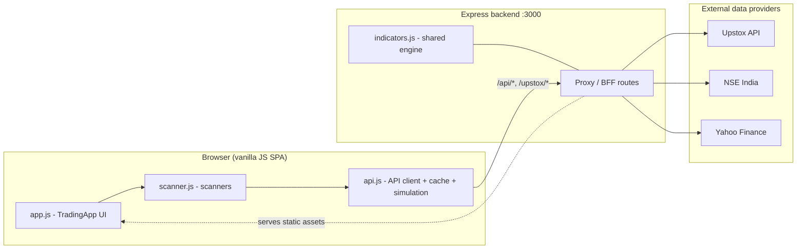

# Trading Assistant

> A real-time, browser-based trading assistant for the Indian equity/derivatives market (NSE) — intraday options and BTST (Buy Today, Sell Tomorrow) strategies, powered by a Node.js data-proxy backend and a shared technical-analysis engine.

## Overview

Trading Assistant is a full-stack decision-support dashboard for NSE traders. It streams live prices for **NIFTY 50**, **BANK NIFTY**, **SENSEX**, and **INDIA VIX**, scans ~20 large-cap NSE stocks, computes a battery of technical indicators, pulls live option chains, and surfaces actionable buy/sell signals with entry, target, and stop-loss levels — all refreshed on a short interval.

Because Indian market data providers (NSE, Yahoo Finance, Upstox) either block cross-origin browser requests or gate data behind broker OAuth, the frontend never talks to them directly. A small **Express backend acts as a proxy / backend-for-frontend (BFF)**, normalizing multiple upstream shapes into one clean JSON contract, and also serves the static frontend. When the backend is unreachable, the browser transparently falls back to a **client-side market simulator** so the UI is always demoable.

## Key Features

- **Intraday options scanner** — rotates through NIFTY/BANKNIFTY on a 2s loop, computes a weighted composite signal, and generates option trade ideas (strike, CE/PE, entry band, 15% target, 15% stop-loss, position sizing by capital risk).
- **BTST scanners** — separate scanners score large-cap stocks and index options for overnight (Buy Today, Sell Tomorrow) setups, ranking the top candidates by a volume/RSI/VWAP/momentum score.
- **Technical indicator engine** — RSI, EMA(9/21/50), VWAP, SuperTrend, volume-spike analysis, candlestick-pattern detection, and pivot points, combined into a single confidence-scored signal.
- **Live option chain** — per-strike LTP, IV, OI, delta, PCR, and max-pain, sourced from Upstox when authenticated and gracefully degrading to NSE/simulation otherwise.
- **Paper trading** — take/skip/exit simulated trades with live P&L, daily target and loss limits, win-rate tracking, and trade history persisted in `localStorage`.
- **Silver / commodity prediction** — a multi-timeframe, 10-indicator engine that predicts COMEX Silver (`SI=F`) direction and maps it onto Indian silver ETFs using USD/INR and the gold/silver ratio.
- **Live-vs-simulated transparency** — the dashboard clearly badges whether it is showing live backend data or the local simulation fallback.

## Tech Stack

| Layer | Technology |
|---|---|
| Runtime | Node.js `>= 18` (native `fetch`, `https`, `fs`) |
| Backend | Express 4, CORS middleware |
| Scraping / bot-bypass | Puppeteer, `puppeteer-extra`, `puppeteer-extra-plugin-stealth` |
| Frontend | Vanilla JavaScript (ES6 classes), HTML5, CSS3 — no framework, no bundler |
| Shared logic | `indicators.js` — dual-use module loaded both in Node (`module.exports`) and the browser (`<script>`) |
| Data sources | Upstox API (broker OAuth), NSE India public APIs, Yahoo Finance |
| Persistence | Browser `localStorage` (settings, daily stats, trade history) — no server database |
| State | In-memory caches with short TTLs on the backend |

## Architecture at a Glance

## Status

**Working prototype.** All core flows function end-to-end: live data proxying, indicator computation, real-time scanning, option chains, paper trading, and silver prediction. There is no automated test suite, CI, or deployment tooling yet, and OAuth currently runs against a developer ngrok tunnel.

## Highlights

- **Shared, dual-use indicator engine** — the same `indicators.js` runs unchanged on the server (silver engine) and in the browser (scanners), eliminating logic drift between backend and frontend.
- **Bot-protection–aware NSE access** — NSE aggressively blocks scripted requests; the backend bootstraps a cookie session and can drive a stealth-patched headless Chrome (`puppeteer-extra-plugin-stealth`) to obtain the cookies real browsers get.
- **Real-time scanning** — interval-driven scanners emit signals via callbacks into the UI, keeping the dashboard reactive without any heavy framework.
- **Graceful degradation** — every data path (indices, option chain, stocks) has a simulation fallback, so the app never hard-fails when an upstream is down or the market is closed.

## Docs

- [High-Level Design (HLD.md)](./HLD.md) — architecture, components, integrations, design decisions.
- [Low-Level Design (LLD.md)](./LLD.md) — modules, routes, data structures, algorithms, security.
- [Flows (FLOWS.md)](./FLOWS.md) — sequence diagrams for OAuth, data proxying, indicators, scanning, and fallback.
