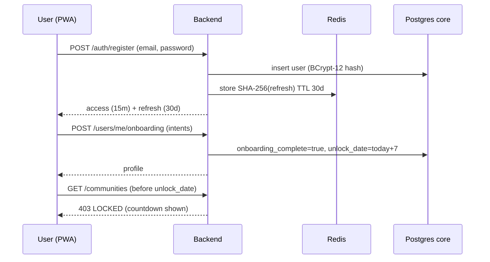
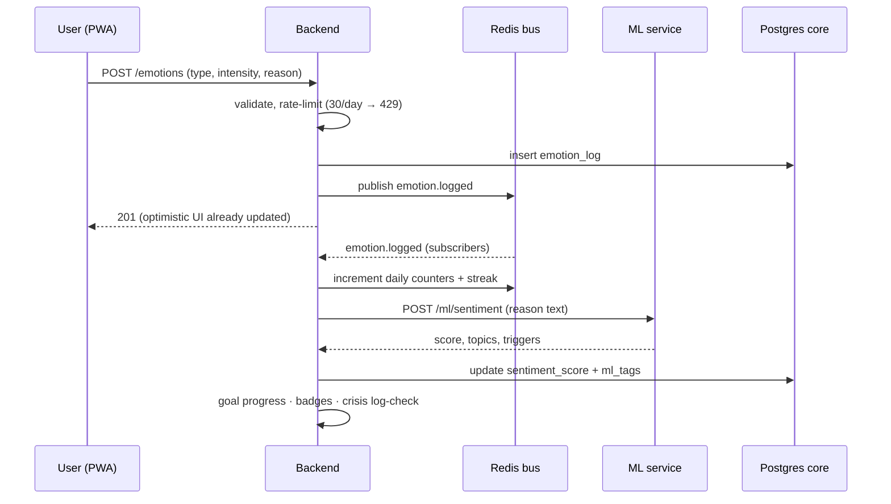
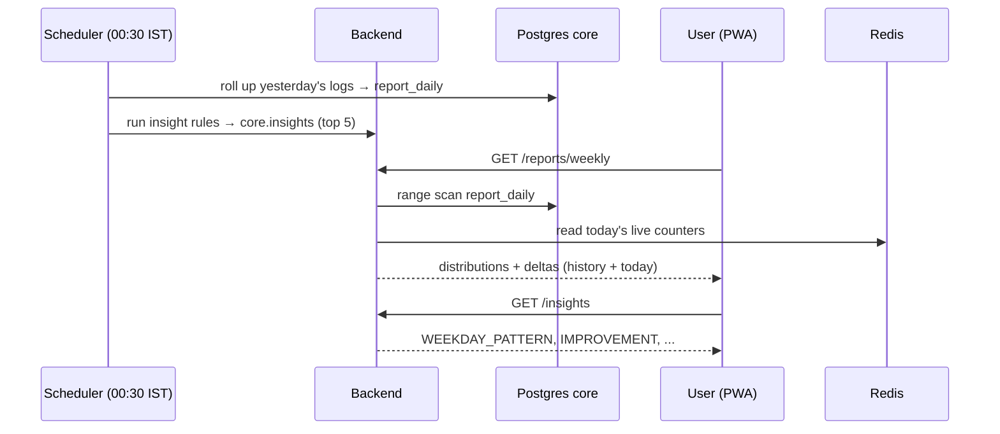
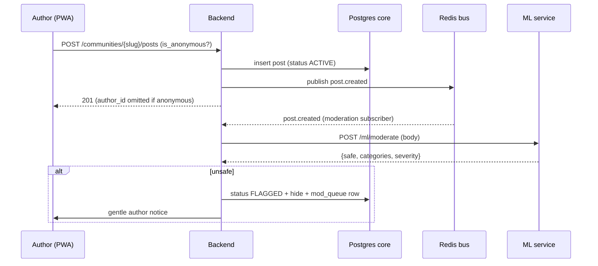
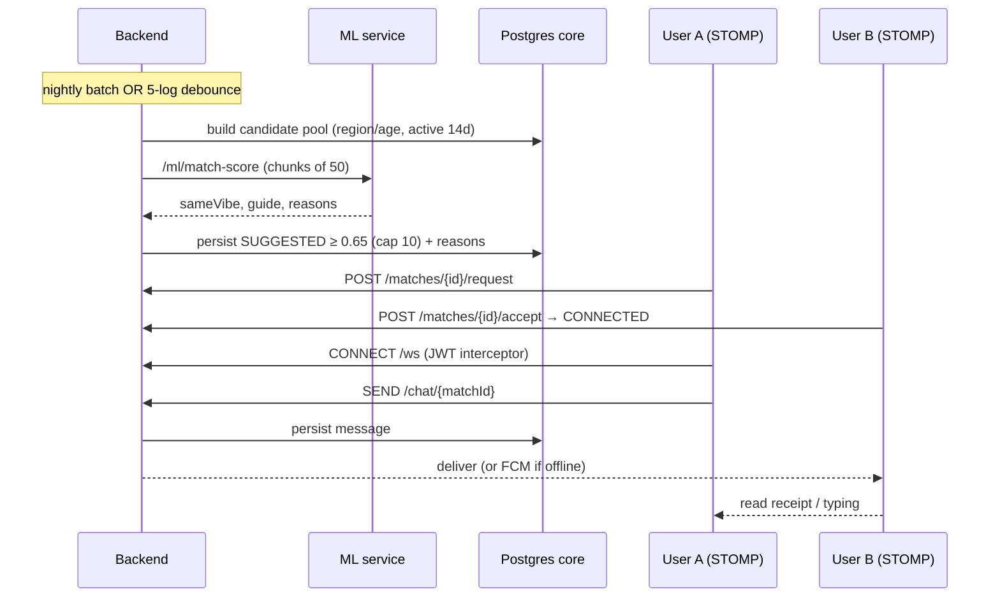
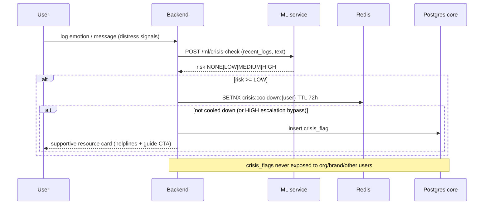

# Vibe — Key Flows

Six representative end-to-end flows. Each shows the sequence and a short walkthrough of the important design points.

## 1. Signup + Onboarding (day-8 unlock gate)

**Walkthrough.** Registration hashes the password with BCrypt cost 12 and issues a short access token plus a rotating refresh token (stored only hashed in Redis). Onboarding is idempotent and sets `unlock_date` to seven days out. Community and matching endpoints return `403 LOCKED` until then, and the PWA renders a friendly unlock countdown — the product deliberately makes users build a solo self-reflection habit before opening social features.

## 2. Log Emotion (async event fan-out)

**Walkthrough.** The write path is intentionally thin: validate, persist, publish, respond. Everything else happens asynchronously off the `emotion.logged` event — daily counters and IST streaks in Redis, ML sentiment enrichment writing back `sentiment_score` and `ml_tags`, goal-progress and badge evaluation, and a crisis log-pattern check. A failure in any subscriber never blocks the user's log.

## 3. Reports & Insights (nightly + live merge)

**Walkthrough.** A nightly job at 00:30 IST materializes `report_daily` and regenerates the top-5 insight cards. Weekly/monthly/yearly reports are computed on read from `report_daily` merged with today's live Redis counters, so the current day is always current without a second rollup tier. Insights come from five deterministic rules, each producing a confidence score used to keep only the strongest cards.

## 4. Community Post + ML Moderation

**Walkthrough.** Posts publish immediately (status `ACTIVE`) and are moderated asynchronously so the feed stays fast. The moderation engine flags only harm aimed at others; first-person distress is masked out and left for the crisis pipeline. Unsafe content is hidden from other users (404 to them), queued for a human moderator, and the author gets a kind notice rather than a punitive one. Approving from the mod queue restores it. For anonymous content the author's UUID never enters the response JSON.

## 5. Vibe Matching + STOMP Chat

**Walkthrough.** Matches refresh nightly and on a debounced 5-log trigger. The backend scores candidates through the ML formula in batches of 50, persists suggestions above 0.65 with their human-readable reasons ("You both log ANXIOUS most — often around work"), and caps active suggestions at 10. After request/accept moves the pair to `CONNECTED`, chat opens over STOMP: the CONNECT frame is JWT-authenticated by a channel interceptor, SENDs from non-participants are rejected, messages persist and deliver in real time (with presence, typing, and read receipts), and offline recipients fall back to push.

## 6. Crisis Safety Path

**Walkthrough.** Crisis detection combines a log-pattern layer (consecutive heavy-negative days) with a text layer of curated EN + Hinglish patterns, idioms masked out first. It is assist-only: the response surfaces warm, dismissible helpline resource cards (never alarm-red, no clinical language) and a guide CTA — it never locks accounts or notifies anyone else. A 72-hour Redis cooldown prevents repeat cards, with one deliberate exception: an escalation to HIGH bypasses a cooldown set by a gentler earlier nudge, then re-arms at HIGH. Crisis data lives only in the user's own notification feed and is provably absent from every business or other-user endpoint.
