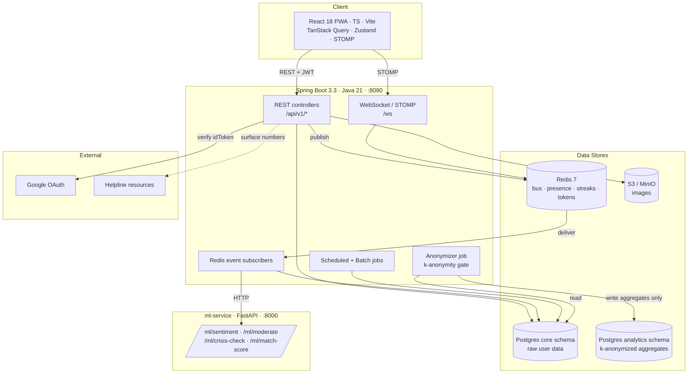

# Vibe — High-Level Design

## Context & Goals

Vibe is a three-sided emotional-wellness platform:

- **Consumers** log emotions, receive personal insights, join communities, and get matched with compatible people or with "guides."
- **Companies** buy anonymized team-wellness dashboards.
- **Brands** buy anonymized emotional-trend reports.

The defining constraint is a **hard, one-way privacy wall**: no individual's raw data may ever reach the business side. The business value must come entirely from aggregates that satisfy k-anonymity. This shapes every layer of the design — the database is split into two schemas, and the only path from personal data to business data is a batch Anonymizer that drops any cohort below threshold.

Secondary goals: keep every ML decision explainable and testable (rule/formula engines behind swappable interfaces), keep the emotion-write path fast (async fan-out over an event bus), and keep every user-facing failure kind — even rate limits and crisis moments.

## Architecture Diagram

## Components & Responsibilities

| Component | Responsibility |
|---|---|
| **Frontend PWA** | Consumer app: auth, onboarding wizard, logging UI (optimistic), home/streaks, reports, communities, matches, chat, crisis card. Installable PWA with a JWT refresh interceptor and a reconnecting STOMP client. |
| **Backend API** | All business logic across `com.vibe.*` domains: auth, users, emotions, reports/insights/goals, communities/posts, matching, chat, safety, notifications. Owns the `core` schema and all writes to it. |
| **Redis event subscribers** | Off-write-path consumers that react to bus events — aggregation, insight generation, matching refresh, content moderation, crisis detection, badge/goal progress. |
| **Scheduled / Batch jobs** | Nightly report rollups (00:30 IST) and nightly match refresh; Spring Batch reserved for the Phase 7 Anonymizer. |
| **Anonymizer (planned, Phase 7)** | The only bridge from `core` to `analytics`. Buckets by (region, age_group, gender, emotion), enforces k-anonymity (skip cohort < 50; org < 8), writes aggregates only — never raw text or identity. |
| **ML service** | Stateless FastAPI microservice exposing four endpoints. Rule/formula engines today, each behind a `get_engine()` seam so a trained model can replace it without changing the contract. |
| **PostgreSQL** | Two schemas: `core` (raw) and `analytics` (aggregates). |
| **Redis** | Event bus, presence (TTL 60 s), streak counters, real-time daily emotion counters, and the rotating refresh-token store. |
| **S3 / MinIO** | Presigned-upload store for emotion-log images (5 MB, `image/*` only, unguessable UUID keys). |

## Data Stores

- **PostgreSQL 16 — `core` schema.** All personal data: `users`, `emotion_logs` (the heart of the system, with `sentiment_score` and `ml_tags` filled async), `communities`, `posts`/`reactions`/`comments`, `vibe_matches`, `messages`, `goals`, `achievements`, `notifications`, `abuse_reports`, `crisis_flags`, `subscriptions`, plus materialized `report_daily` and `insights`. Chosen for relational integrity, JSONB flexibility (emotion counts, ml_tags, match reasons), and transactional guarantees on things like member counts.
- **PostgreSQL 16 — `analytics` schema.** Anonymized only, by design: `emotion_trends`, `org_wellness`, `organizations`. Every aggregate row carries a `cohort_size` column with a k-anonymity floor (`>= 50` for public trends, `>= 8` for org rows). No `user_id`, no email, no free text anywhere in this schema. Both schemas are created at container init so the boundary exists before any code runs.
- **Redis 7.** Multi-purpose: pub/sub event bus, live daily emotion counters merged into reports on read, streak counters keyed to Asia/Kolkata calendar days, presence with 60 s TTL, and SHA-256-hashed rotating refresh tokens with the configured TTL.
- **S3 / MinIO.** Emotion-log images via presigned PUT; the browser is handed a public endpoint URL and keys are unguessable UUIDs.

## External Integrations

- **Google OAuth** — server-side `idToken` verification then user upsert; OAuth-only users have a null `password_hash`.
- **Helpline resources** — the crisis layer surfaces India-specific mental-health helplines (e.g. Tele-MANAS, iCall, AASRA) as `tel:` resource cards plus a guide CTA.
- **Razorpay (planned, Phase 6)** — subscription checkout and signature-verified webhooks for the premium lifecycle.
- **Push (planned)** — `PushService` is stubbed today (log-only) for offline chat delivery; real FCM is Phase 8.

## Cross-Cutting Concerns

- **JWT auth.** Stateless access tokens (15 min) carry role; a `JwtAuthFilter` populates the `SecurityContext`. Refresh tokens are opaque 256-bit values, rotated on every use and stored only as SHA-256 hashes in Redis, so a stolen or replayed token is single-use and then dead.
- **Redis event bus.** A thin publisher/subscriber layer over Redis pub/sub decouples writes from reactions. Topics include `emotion.logged`, `post.created`, `comment.created`, `reaction.created`, `message.sent`, `insight.improvement`, and `goal.completed`. A feature flag (`vibe.event-bus.enabled`) isolates the bus in tests.
- **Realtime.** STOMP over WebSocket at `/ws`, with a channel interceptor that authenticates the JWT on CONNECT and rejects non-participants on SEND. Presence, typing, and read receipts ride the same channel.
- **Batch / scheduling.** Nightly aggregation and match refresh run on schedules in IST; the heavier, correctness-critical Anonymizer is reserved for Spring Batch in Phase 7.
- **The privacy wall / k-anonymization.** Enforced at three levels: physical (two schemas, the business side reading a separate read-only datasource in Phase 7), procedural (aggregates written only by the Anonymizer, with sub-threshold cohorts dropped), and test-enforced (privacy-sweep tests assert crisis and personal data never appear on org/brand/other-user endpoints; a planned ArchUnit rule forbids b2b classes from importing core repositories).

## Key Design Decisions & Trade-offs

1. **Two schemas over one, from day one.** Splitting `core` and `analytics` at DB-init makes the privacy boundary a structural fact rather than a runtime check. Cost: aggregates need an explicit ETL (the Anonymizer) instead of live queries — accepted, because that ETL is exactly where k-anonymity is enforced.
2. **Rule/formula ML behind swappable interfaces.** Every ML decision is deterministic and explainable (matching is a weighted formula scored to ±0.01 in tests; crisis and moderation are curated pattern lists). Trade-off: lower ceiling than a trained model, but full testability, zero inference infra, and a clean seam (`get_engine()`) to upgrade later.
3. **Event-driven fan-out vs. synchronous processing.** Emotion writes return fast and publish an event; aggregation, matching, moderation, and crisis checks happen asynchronously. Trade-off: eventual consistency (e.g. `ml_tags` fill in shortly after a log) in exchange for a fast, resilient write path.
4. **Compute rollups on read.** Weekly/monthly/yearly reports are derived from `report_daily` plus today's live Redis counters rather than stored in separate tables. Trade-off: a little read-time computation for a much simpler materialization and backfill story.
5. **Moderation and crisis are deliberately different pipelines.** Moderation flags harm aimed at others; first-person distress is masked out of it and routed to a supportive crisis path. Trade-off: extra complexity (span-masking, two engines) to guarantee a person in pain is never treated as a rule violator.
6. **Recall-biased crisis detection.** The crisis engine intentionally over-triggers (negation unmodeled) because the worst outcome of a false positive is a gentle resource card. Trade-off: some false positives, accepted so genuine risk is not missed.
