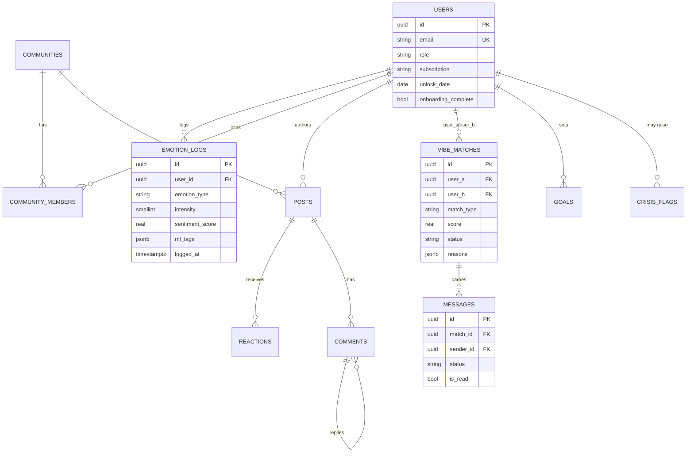

# Vibe — Low-Level Design

## Module / Package Breakdown (`com.vibe.*`)

The backend is organized by domain, each package holding its own controller, service(s), JPA entities, repositories, and DTOs.

| Package | Responsibility |
|---|---|
| `auth` | Register/login/refresh/logout, Google OAuth verify, JWT provider + filter, rotating refresh-token store. |
| `user` | Profile (`/me`), onboarding (sets `unlock_date = today + 7`), public profile with a strict field whitelist. |
| `emotion` | 18-emotion logging, daily rate limit, streaks, presigned image upload, async sentiment client + listener. |
| `report` | Redis live counters, nightly rollup job, `report_daily`, on-read weekly/monthly/yearly queries, admin backfill. |
| `insight` | Rule-based insight engine writing top-5 cards to `core.insights`. |
| `goal` | Goal CRUD, event-driven progress listener, period-end evaluation. |
| `achievement` | Idempotent badge rule engine and progress fractions. |
| `community` | Browse/search/suggested, join/leave gates, feed ranking. |
| `post` | Posts, seven reaction types + karma, threaded comments (depth ≤ 3), reports, anonymity assembler. |
| `match` | Matching engine, candidate pools, ML scoring, match lifecycle state machine, match profiles. |
| `chat` | REST + WebSocket messaging, JWT channel interceptor, presence, push seam. |
| `safety` | Moderation pipeline, mod queue, crisis detection listener + response service, abuse reports. |
| `notification` | In-app notification feed and creation. |
| `payment` | `@PremiumRequired` aspect and premium-feature registry (gate live; billing is Phase 6). |
| `common` | Event bus (publisher/subscriber, channel names), security config, global exception handler, shared errors, paging. |
| `analytics`, `b2b`, `ad`, `insightsplatform` | Placeholder packages for Phases 6–7 (schema + entities exist in migrations). |

## Key API Endpoints

All under `/api/v1`. Representative selection:

| Method | Path | Purpose |
|---|---|---|
| POST | `/auth/register` | Create account (BCrypt-12, issues access + refresh) |
| POST | `/auth/refresh` | Rotate refresh token, mint new access token |
| POST | `/auth/oauth/google` | Verify Google idToken, upsert user |
| GET / PATCH | `/users/me` | Read / update own profile |
| POST | `/users/me/onboarding` | Complete onboarding, set day-8 unlock |
| GET | `/users/{id}/public` | Public profile (whitelisted fields only) |
| POST | `/emotions` | Log an emotion (validated, rate-limited, publishes `emotion.logged`) |
| GET | `/emotions/today` · `/emotions` | Today's logs / ranged paged history |
| GET | `/emotions/streak` | Current + longest streak (IST) |
| POST | `/emotions/image-upload` | Presigned S3 upload URL |
| GET | `/reports/{daily\|weekly\|monthly\|yearly}` | Distributions + deltas |
| GET | `/insights` | Top personal insight cards |
| POST / GET / PATCH | `/goals` | Emotion goal lifecycle |
| GET | `/achievements` | Badges with progress fractions |
| GET | `/communities` · `/communities/suggested` · `/communities/{slug}` | Browse / suggest / detail |
| POST / DELETE | `/communities/{slug}/join` · `/leave` | Membership (unlock + free-cap gates) |
| GET | `/communities/{slug}/posts` | Feed (`hot` \| `new` \| `top`) |
| POST | `/communities/{slug}/posts` | Create post (anonymous toggle) |
| POST / DELETE | `/posts/{id}/reactions` · `/reactions/{type}` | React / un-react |
| POST / GET | `/posts/{id}/comments` | Threaded comments |
| POST | `/posts/{id}/report` | Report content to `abuse_reports` |
| GET | `/matches` | Suggested + active matches with reasons |
| POST | `/matches/{id}/{request\|accept\|decline\|block}` | Match state transitions |
| GET / POST | `/chats` · `/chats/{matchId}/messages` | Conversations / history + send |
| POST | `/chats/{matchId}/read` | Mark read |
| GET / POST | `/mod/queue` · `/mod/{queueId}/{approve\|remove}` | Moderator queue (MODERATOR role) |
| POST | `/admin/reports/backfill` | Rebuild rollups from raw logs (ADMIN) |

WebSocket (STOMP over `/ws`): `@MessageMapping` destinations `/chat/{matchId}`, `/chat/{matchId}/typing`, `/presence/ping`.

## Core Data Model

The `analytics` schema mirrors none of these by identity: `emotion_trends` and `org_wellness` hold only `(date, cohort dimensions, emotion, counts, avg_intensity, cohort_size, top_topics)` with a k-anonymity floor on `cohort_size`.

## Key Logic & Algorithms

- **Event-driven emotion fan-out.** `POST /emotions` validates, enforces a 30/day rate limit (429), persists, and publishes `emotion.logged` non-blocking. Subscribers independently increment Redis daily counters, call `/ml/sentiment` to fill `sentiment_score` + `ml_tags`, advance goal progress, evaluate badges, and (via the crisis listener) check log-pattern risk.
- **Streaks.** Computed against Asia/Kolkata calendar days from Redis counters, so a streak rolls over at IST midnight regardless of server zone; exposes current and longest.
- **Matching (`/ml/match-score`).** A deterministic weighted formula over an 18-emotion vector space: `same_vibe = 0.40·cosine(emotion dist) + 0.20·jaccard(topics) + 0.15·intensity-pattern(Pearson) + 0.15·demographic affinity + 0.10·schedule overlap`. `guide_score` rates B as a guide for A: `0.50·cosine(B.past, A.now) + 0.30·improvement_delta + 0.20·helper_karma`, and is 0 when B has no past profile. Weights are fixed and never renormalized, so sparse profiles earn lower scores. The backend builds candidate pools (same region or age group, active in 14 days, minus blocked/existing pairs), scores in chunks of 50, persists `SUGGESTED` rows ≥ 0.65 (cap 10 active), and stores human-readable `reasons`.
- **Rule-based sentiment.** A curated English + Hinglish lexicon with negation flips and intensifier scaling; returns `score ∈ [-1,1]`, ordered `topics`, and up to 5 `triggers`.
- **Rule-based moderation.** Category wordlists + regexes (harassment, self-harm encouragement, sexual-minors, doxxing). `safe = false` when any category fires; severity is the max across fired categories. First-person distress spans are masked out before harassment/self-harm rules run.
- **Crisis pattern engine.** `risk = max(log-streak layer, text layer)`. Log layer: 3 consecutive heavy negative days → LOW, escalating to MEDIUM. Text layer: curated EN + Hinglish regex tiers (active ideation → HIGH, passive ideation / self-harm mention → MEDIUM, third-person concern → LOW), with idiom exclusions masked out first so "this deadline is killing me" never fires. Deliberately recall-biased.
- **Insight engine.** Five rules (WEEKDAY_PATTERN, TRIGGER_CORRELATION, IMPROVEMENT, ACTIVITY_BOOST, COMMUNITY_ECHO) over the user's history, keeping the top 5 by confidence.
- **Anonymizer (Phase 7).** Buckets `core` data by (region, age_group, gender, emotion); any cohort below the k-anonymity floor produces zero rows; writes only counts, averages, cohort size, and top-5 ml_tag topics — never raw text.

## Security Design

- **JWT access + refresh rotation.** Access tokens (15 min, jjwt-signed, HS-family) carry the user's role and are validated statelessly by `JwtAuthFilter`. Refresh tokens are 256-bit `SecureRandom` values, URL-safe base64 to the client, stored only as SHA-256 hashes in Redis keyed `auth:refresh:{hash} → userId` with the refresh TTL. Consuming a token deletes it and issues a new one, so any replay of a rotated token fails with 401. Logout revokes.
- **Anonymity contract.** For anonymous posts/comments the author's `user_id` never appears in response JSON (author becomes `Anonymous`/`null`), verified by serialization tests. Public profiles expose only whitelisted fields and never the email.
- **Privacy contract.** `crisis_flags` and all personal data are provably absent from org/brand/other-user endpoints — enforced by privacy-sweep tests over every request mapping, with an ArchUnit rule planned to forbid b2b classes from importing core repositories.
- **Access control.** Role-based (USER / MODERATOR / ADMIN / ORG_ADMIN / BRAND_ANALYST); moderator and admin endpoints reject lower roles with 403. Feature gating via a `@PremiumRequired` aspect returning 402.

## Notable Patterns

- **Swappable ML interface** — every engine sits behind a `get_engine()` factory so rules can be replaced by a model without touching callers.
- **Publish/subscribe decoupling** — domain writes publish events; cross-cutting reactions subscribe, keeping the write path thin.
- **Idempotent side effects** — badge awards and the match-refresh debounce use Redis claims/SETNX so retries and duplicate events don't double-fire.
- **DTO mapping via MapStruct** — entities never leak; `password_hash` is never serialized.
- **State machine** — `vibe_matches.status` (SUGGESTED → REQUESTED → CONNECTED / DECLINED / BLOCKED) with canonical row ordering and a 30-day decline cooldown.
