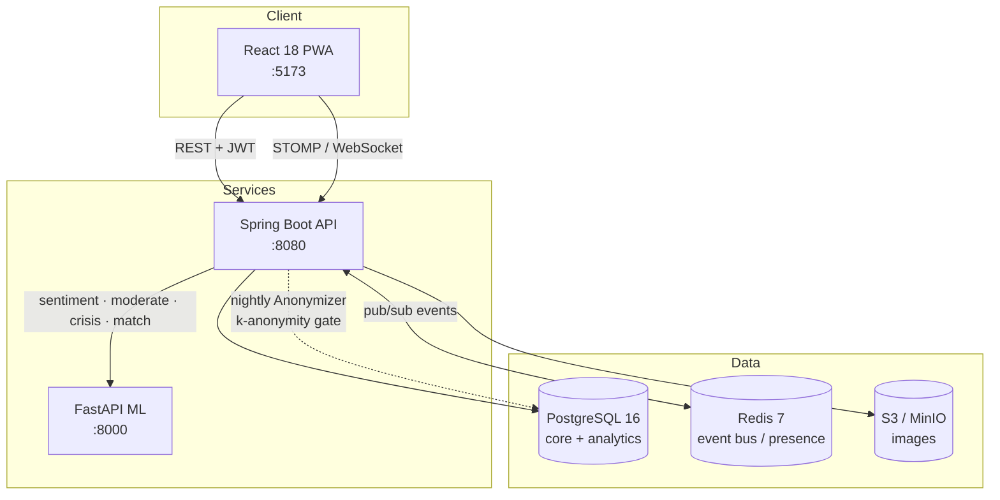

# Vibe

**A three-sided emotional-wellness platform built around a one-way privacy wall: individuals log emotions and get matched; businesses only ever see k-anonymized aggregates.**

## Overview

People struggle to notice their own emotional patterns, and the products that could help them often monetize by selling individual data to employers or advertisers. Vibe separates the two concerns with an architectural guarantee: consumers log emotions, discover patterns, and find compatible people, while companies and brands buy only anonymized, aggregate dashboards. Raw individual data physically never crosses into the business side — the only bridge is a batch **Anonymizer** that enforces k-anonymity thresholds before any number reaches an analytics table.

## Key Features

- **Emotion logging** across an 18-emotion vocabulary with intensity, free-text reason, optional photo, and async ML sentiment/topic enrichment.
- **Streaks, reports, and insights** — Redis-backed daily streaks (IST calendar), nightly rollups, and a rule-based insight engine that surfaces personal patterns (weekday effects, trigger correlations, improvement).
- **Goals and achievements** — emotion goals with event-driven progress and an idempotent badge engine.
- **Communities and posts** — Reddit-style feeds with hot/new/top ranking, threaded comments, seven reaction types, and a hard anonymity contract.
- **Explainable matching** — a deterministic scorer pairs users with similar emotional signatures or with "guides" who have walked a similar path, each match carrying human-readable reasons.
- **Real-time chat** over WebSocket/STOMP with JWT-authenticated connections, presence, typing, and read receipts.
- **Crisis safety layer** — a recall-biased, assist-only detector (English + Hinglish) that surfaces helpline resources and never punishes, gates, or leaks.
- **Day-8 social unlock** — new users spend a week building a self-reflection habit before community and matching features open.

## Tech Stack

| Layer | Technology |
|---|---|
| Backend | Java 21, Spring Boot 3.3 (web, data-jpa, security, websocket, batch, data-redis, actuator), Flyway, MapStruct, jjwt, AWS S3 SDK |
| Frontend | React 18, Vite 5, TypeScript, TanStack Query, Zustand, axios, `@stomp/stompjs`, vite-plugin-pwa |
| ML service | Python 3.12, FastAPI, Pydantic v2 (rule-based, model-swappable engines) |
| Data | PostgreSQL 16 (`core` + `analytics` schemas), Redis 7 (event bus, presence, streaks, refresh-token store) |
| Object storage | S3-compatible (MinIO locally) for emotion-log images |
| Auth | JWT access (15 min) + rotating refresh (30 d), BCrypt, Google OAuth |

## Architecture at a Glance

## Status

Built and verified through Phase 5 (consumer product, beta-complete):

| Phase | Scope | Status |
|---|---|---|
| 0 | Repo, Docker stack, Flyway baseline | Done |
| 1 | Auth + emotion logging | Done |
| 2 | Reports, insights, goals | Done |
| 3 | Communities, posts, moderation | Done |
| 4 | Matching + WebSocket chat (beta gate) | Done |
| 5 | Crisis safety layer | Done |
| 6 | Monetization (subscriptions, ads) | Planned |
| 7 | B2B platforms (Anonymizer, corporate + brand dashboards) | Planned |
| 8 | Hardening & launch | Planned |

The `analytics` schema, the two-schema privacy boundary, and the B2B entities exist in the baseline migration from day one; the Anonymizer job and business-facing UIs are the Phase 7 work not yet started.

## Highlights

- **Privacy enforced by construction, not policy** — two Postgres schemas declared at DB-init time, individual data confined to `core`, aggregates reachable only through a k-anonymized batch bridge.
- **Event-driven core** — emotion logs fan out over a Redis pub/sub bus (`emotion.logged`, `post.created`, `message.sent`, …) so aggregation, matching, moderation, and crisis checks all run asynchronously off the write path.
- **Explainable, deterministic ML** — every matching, moderation, sentiment, and crisis decision is rule/formula based behind a stable interface, so results are testable to ±0.01 and a trained model can later drop in without touching callers.
- **Safety and moderation kept deliberately separate** — first-person distress is masked out of the moderation path and routed to a supportive crisis pipeline, never flagged as a violation.
- **Rotating refresh-token security** — 256-bit opaque tokens stored SHA-256-hashed in Redis, consumed on use so replays fail with 401.

## Docs

- [High-Level Design](./HLD.md)
- [Low-Level Design](./LLD.md)
- [Key Flows](./FLOWS.md)
